# Vue 全家桶

# 第一章 Vue 核心

## 1.1 基本认识

- **官网**

  - 英文：https://vuejs.org/
  - 中文：https://cn.vuejs.org/

- 简介

  - 渐进式 JavaScript 框架

    渐进式：可以只使用基础的核心库，随着项目的需求再使用扩展的插件

  - 作者：尤雨溪

    作用：**动态构建用户界面**

    构建界面：将后台的数据可以在前台动态的渲染

- 特点

  1. 遵循 MVVM 模式

     ```txt
     V:View 前端的界面，视图
     M:Model 需要渲染到视图的数据集
     VM:ViewModel 负责连接 View 和 Model 
     ```

  2. 编码简介，体积小，运行效率高，适合 移动/PC 端开发

  3. 本身只关注 UI，可以轻松引入 vue 插件或第三方开发项目

- 与其他前端 JS 框架的联合

  1. 借鉴了 Angular 的 **模块** 和 **数据绑定** 技术
  2. 借鉴了 React 的 **组件化** 和 **虚拟 DOM** 的技术

- vue 扩展插件(部分)

  1. vue-cli: vue 脚手架
  2. vue-resouce(axios): ajax 请求
  3. vue-router: 路由
  4. vuex: 状态管理
  5. ...

## 1.2  基本使用

### Hello Vue

1. 编写页面 - **View**
2. 引入 vue.js
3. 创建 vue 对象 - **ViewModel**
   - el: 指定根元素 element,通过选择器(指定要管理的区域)
   - data: 初始化数据 - **Model**
4. 使用 v-model 属性，代表双向数据绑定
5. 显示数据 {{xxx}}

```html
<!DOCTYPE html>
<html lang="en">
    <head>
        <meta charset="UTF-8">
        <meta name="viewport" content="width=device-width, initial-scale=1.0">
        <title>01_HelloWorld</title>
    </head>
    <body>
        <!-- 
            1. 引入 vue.js 文件
            2. 创建 vue 对象 - ViewModel
            	el: 指定根元素 element,通过选择器(指定要管理的区域)
            	data: 初始化数据 - Model
            3. 使用 v-model 属性，代表双向数据绑定
            4. 显示数据 {{xxx}}
		-->
        <!-- v(view) -->
        <div id="app">
            <!-- 使用 v-model 属性指定要绑定的数据属性 -->
            <input type="text" v-model="info">
            <p>Hello {{info}}</p>
        </div>
    </body>
    <script src="../js/vue.js"></script>
    <script>
        // 创建 Vue 实例(ViewModel)
        let vm = new Vue({ // 传入一个配置对象
            el: "#app", // el(element):选择器;选择要管理的区域
            data: { // 数据(model)
                info: "巴御前！"
            }
        });
    </script>
</html>
```

### vue 开发者工具调试

1. 安装游览器插件 `vue-devtools`

   参考博客：https://blog.csdn.net/taurus102/article/details/111515228

   也可以通过谷歌应用商城进行搜索下载安装

2. 运行 vue 项目

3. 打开控制台调试，切换到 **vue** 面板

   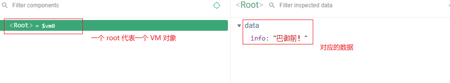

### Vue 的 MVVM 结构

> 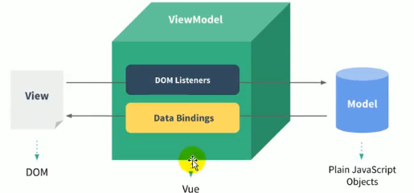

- **Model** === vm 中的 data；数据对象

- **View** === DOM(页面元素)；模板页面

  **vue 中的 view 使用的两种语法**

  - 指令(自定义标签属性)
  - 大括号表达式(显示数据) 

- **ViewModel** === Vue 实例(vm)

  - DOM Listeners：DOM 监听
  - Data Bindings：数据绑定(可以将内存中的数据显式的出现在页面)

- 声明式开发：只需要使用**指定的语法**就可以(vue)

- 命令式开发：需要自定的去完成整个业务的流程(jquery)

## 1.3  模板语法

- 模板的理解
  - 动态的 Html 页面
  - 包含了一些 JS 语法代码
    - 双大括号表达式(JS 表达式，可以写 JS 语法)
    - 指令(以 v- 开头的自定义标签属性)

- 分类

  1. 双大括号表达式
     - 语法：{{ exp }}
     - 功能：向页面输出数据
     - 注意：可以使用 JS 的语法调用对象的方法
  2. 强制数据绑定
     - 功能：执行变化的属性值
     - 语法1：`v-bind:属性名='属性值' ` 属性值会作为**表达式解析执行**
     - 语法2：`:属性名=属性值` 
  3. 绑定事件监听
     - 功能: 绑定指定事件名的 **回调函数**
     - 语法1: `v-on:事件名 = 'xxx':`
     - 语法2: `@事件名 = 'xxx'`
     - 注意：
       - 绑定事件是可以使用(传入参数)也可以不使用()
       - 传入参数时可以使用 JS 表达式调用 data 中的数据
     - 对应的 vm 管理对象中需要配置 **methods** 对象属性，由其来进行 **DOM监听事件** 的管理

- 实例

  ```html
  <!DOCTYPE html>
  <html lang="en">
  <head>
      <meta charset="UTF-8">
      <meta name="viewport" content="width=device-width, initial-scale=1.0">
      <title>02_模板语法</title>
  </head>
  <body>
      <div id="app">
          <h2>1. 双大括号表达式</h2>
              <p>{{msg}}</p> <!-- textContent -->
              <!-- 使用 JS 语法 - 调用对象的方法 -->
              <p>{{msg.toUpperCase()}}</p>
              <!-- v-text:普通的文本 -->
              <p v-text="msg"></p> <!-- textContent -->
              <!-- v-html:HTML 标签 -->
              <p v-html="msg"></p> <!-- innerHTML -->
  
          <h2>2. 指令一：强制数据绑定</h2>
              <!-- 原 HTML 语法 -->
              
              <!-- 将 HTML 语法强制转换成 JS 表达式(绑定数据) -->
              <!-- 1. 使用 v-bind: 前缀-->
              
              <!-- 2. 使用 : 前缀 -->
              
  
              
          <h2>3. 指令二：绑定事件监听</h2>
          <!-- 
              绑定事件是可以使用(传入参数)也可以不使用()；
              传入参数时可以使用 JS 表达式调用 data 中的数据 
          -->
              <!-- 使用 v-on:事件 前缀 -->
              <button v-on:click="test">test</button>
              <!-- 使用 @事件 前缀 -->
              <button @click="test2(msg)">test2()</button>
  
      </div>
  </body>
  <script src="../js/vue.js"></script>
  <script>
      const vm = new Vue({
          el: "#app",
          data: { // data 的所有属性都会成为 vm 对象的属性，而模板页面中可以直接访问
              msg: "<a href='http://www.baidu.com'>百度一下，你就知道</a>",
              imgUrl: "https://cn.vuejs.org/images/logo.png"
          },
          //使用 methods 管理监听事件
          methods: {
              test(){
                  alert("byq");
              },
              test2(value){
                  alert(value)
              }
          }
      });
  </script>
  </html>
  ```

## 1.4 计算属性和监视

> 注意：**谨慎使用箭头函数 () => {} 因为箭头函数的 this 属性是在函数声明是决定的而不是调用**

### 计算属性

- 在 vm 对象中可以配置 computed 属性对象，用来定义 **计算属性** 的方法

- 在页面中可以直接使用 `{{ 方法名 }}` 来显示计算的结果 - 计算属性中对应的方法，返回值都将作为属性值

- 语法：**计算属性名 () {}** 

- 调用的时机：初始化显示 / **相关的 data 属性**数据发生变化时

- ```vue
  <script>
      const vm = new Vue({
          el: "#demo",
          data: {
              firstName : "巴",
              lastName : "御前",
              // fullName1: "巴御前"
          },
          // computed：定义计算属性
          computed: {
              // 执行的时机：初始化显示 / 相关的 data 属性数据发生改变时
              // 计算属性中对应的方法，返回值都将作为属性值
              // 语法：计算属性名(){}
              fullName1 (){
                  console.log("fullName1()...");
                  return this.firstName + " " + this.lastName;
              }
          }
      });
  </script>
  ```

### 监视

- 可以通过 vm 对象的 watch配置 或 $watch() 方法来 **监视指定属性**

- 当属性发生变化时，回调函数就会自动调用，在函数内部进行计算

- 语法

  1. watch 配置：(data)属性名: 回调函数(新的值,旧的值){}
  2. $watch() 方法：vm.$watch("(data)属性名",回调函数(newValue,oldValue){});

- ```vue
  <script>
      const vm = new Vue({
          el: "#demo",
          data: {
              firstName : "巴",
              lastName : "御前",
              fullName2: "巴 御前"
          },
          // 监视语法1：watch-定义监视属性 
          watch: {
              // 语法：(data)属性名: 回调函数(新的值,旧的值){}
              // 调用时机：当监听的数据发生改变时就会触发相应的回调函数
              firstName: function(newValue,oldValue){
                  // 可以只接收一个参数，也可以接收多个参数
                  this.fullName2 = newValue + " " + this.lastName;
                  // 注意：这里不能使用箭头函数 () => {},因为箭头函数的 this 属性是在函数声明是决定的而不是调用
                  console.log(this); // vm 实例对象
              }
          }
      });
  
      // 监视语法2：除了直接在对象中进行配置外，还可以调用 vm 对象的 $watch() 方法进行配置
      // 语法：vm.$watch("(data)属性名",回调函数(newValue,oldValue){});
      vm.$watch("lastName",function(value){
          this.fullName2 = this.firstName + " " + value;
      });
  </script>
  ```

### 计算属性高级

> **回顾：**回调函数：1. 自定义的；2. 没有调用；3. 执行了

-  通过 getter/setter 实现对计算属性数据的显示和监视

  - 定义 get(获取) 回调函数，需要读取当前计算属性的值时，根据相关的数据(data)**计算并返回**当前属性数据的值

    同理：当相关的数据发生改变时也会调用 getter 函数

  - 定义 set(监视) 回调函数，当前计算属性的值发生变化时发生回调，更新相关的数据(data)

  - ```vue
    <script>
        const vm = new Vue({
            el: "#demo",
            // computed：定义计算属性
            computed: {
                // 定义一个计算属性的 get 和 set
                fullName3: {
                    /* 
                    定义 get(获取) 回调函数，当需要读取当前的计算属性值，根据相关的数据计算并返回当前属性的值
                    当相关的数据发生改变时也会执行
                    */
                    get() {
                        return this.firstName + " " + this.lastName;
                    },
                    // 定义 set(监视) 回调函数，当属性值发生改变时发生回调，更新相关的属性数据
                    set(value) {
                        console.log("fullName3.set()...");
                        let names = value.split(" ");
                        this.firstName = names[0];
                        this.lastName = names[1];
                    }
                }
            }
        });
    </script>
    ```

- **计算属性存在缓存，多次读取只调用一次 getter**

  > 缓存使用的时一个对象，key 为计算属性名，value 为值(不知道有没有拥 Map)
  >
  > 在调用过 setter 方法 / 相关的数据(data) 发生改变时才会更新缓存

  ```vue
  <body>
      <!-- 
      1. 计算属性
          - 在 computed 属性对象中定义计算属性的方法
          - 在页面中使用 {{方法名}} 来显示计算的结果
      2. 监视属性
          - 通过 vm 对象的 $watch() 或 watch配置 来监视指定的属性
          - 当属性变化时，回调函数自动调用，在函数内部进行计算
      3. 计算属性高级
          - 通过 getter/setter 实现对属性数据的显示和监视
          - 计算属性存在缓存，多次读取只执行执行一个 getter 计算
  
      -->
      <div id="demo">
          姓：<input type="text" placeholder="First Name" v-model="firstName" /> <br/>
          名：<input type="text" placeholder="Last Name" v-model="lastName" /> <br/>
          姓名3(双线)：<input type="text" placeholder="Full Nmae2" v-model="fullName3" /> <br/>
          <!-- 多次读取，只执行一次 getter -->
          <p>{{fullName1}}</p>
          <p>{{fullName1}}</p>
          <p>{{fullName1}}</p>
      </div>
  </body>
  ```

  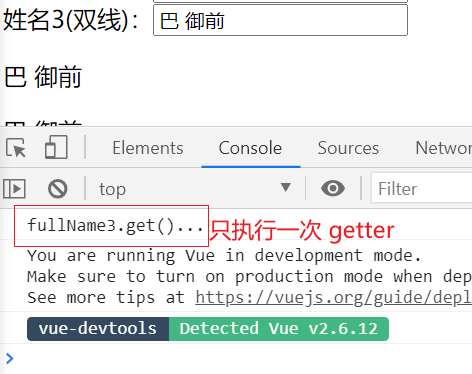

## 1.5 class 与 style 绑定

> 在应用界面中，有些元素的样式是变化的；而 **class/style** 绑定就是专门用来**实现动态样式效果**的技术 

### class 绑定

- 语法：`:class = 'xxx'`; 其中 xxx 的值可以是 **字符串/对象/数组**

- 注意：即使使用了 class 绑定，仍可以使用 class 指定静态的 class 类名

- 实例

  1. 字符串

     - xxx 指定为 data 中对应的属性名即可

     - ```vue
       <!DOCTYPE html>
       <html lang="en">
       <head>
           <meta charset="UTF-8">
           <meta name="viewport" content="width=device-width, initial-scale=1.0">
           <title>04_class与style绑定</title>
           <style>
               .aClass{
                   color: red;
               }
               .bClass{
                   color: blue;
               }
               .cClass{
                   font-size: 30px;
               }
           </style>
       </head>
       <body>
           <div id="demo">
               <h2>1. class绑定：class = 'xxx'</h2>
                   <!-- 仍可以使用 class 定义静态的 class 属性 -->
                   <p class="cClass" :class="a">xxx的值字符串</p>
                   <button @click="update">修改颜色</button>
           </div>
           <script src="../../js/vue.js"></script>
           <script>
               const vm = new Vue({
                   el: "#demo",
                   data: {
                       a: "aClass",
                   },
                   methods: {
                       ////动态的修改 data 数据对应的属性值
                       update(){
                           this.a = "bClass";
                       }
                   }
               });
           </script>
       </body>
       </html>
       ```

  2. 对象

     - 内部语法：`{类名:true/false/data数据[,类名2:.....]}`

     - 建议写成 data 数据，而不是写成一个字面量

     - ```vue
       <!DOCTYPE html>
       <html lang="en">
       <head>
           <meta charset="UTF-8">
           <meta name="viewport" content="width=device-width, initial-scale=1.0">
           <title>04_class与style绑定</title>
           <style>
               .aClass{
                   color: red;
               }
               .bClass{
                   color: blue;
               }
               .cClass{
                   font-size: 30px;
               }
           </style>
       </head>
       <body>
           <div id="demo">
               <h2>1. class绑定：class = 'xxx'</h2>
                   <!-- 以 `key(类名):true/false/data数据,[...]` 的格式定义，建议都写成data数据，而不是写死 -->
                   <p :class="{aClass: isA,bClass: isB,cClass: false}">xxx的值是对象</p>
                   <button @click="update">修改颜色</button>
               <h2>2. style绑定 </h2>
           </div>
           <script src="../../js/vue.js"></script>
           <script>
               const vm = new Vue({
                   el: "#demo",
                   data: {
                       isA: true,
                       isB: false
                   },
                   methods: {
                       //动态的修改 data 数据对应的属性值
                       update(){
                           this.isA = false;
                           this.isB = true;
                       }
                   }
               });
           </script>
       </body>
       </html>
       ```

  3. (不常用)数组

     - 内部语法：`['class类名'/data数据[,....]]`

     - 可以指定多个 class 类名，建议使用 data 的属性名

     - ```vue
       <!DOCTYPE html>
       <html lang="en">
       <head>
           <meta charset="UTF-8">
           <meta name="viewport" content="width=device-width, initial-scale=1.0">
           <title>04_class与style绑定</title>
           <style>
               .aClass{
                   color: red;
               }
               .bClass{
                   color: blue;
               }
               .cClass{
                   font-size: 30px;
               }
           </style>
       </head>
       <body>
           <div id="demo">
               <h2>1. class绑定：class = 'xxx'</h2>
                   <!-- (不常用) 可以指定多个 class 类名，可以使用 data 的属性名 -->
                   <p :class="[a,'cClass']">xxx的值数组</p>
                   <button @click="update">修改颜色</button>
               <h2>2. style绑定 </h2>
           </div>
           <script src="../../js/vue.js"></script>
           <script>
               const vm = new Vue({
                   el: "#demo",
                   data: {
                       a: "aClass",
                   },
                   methods: {
                       //动态的修改 data 数据对应的属性值
                       update(){
                           this.a = "bClass";
                       }
                   }
               });
           </script>
       </body>
       </html>
       ```

### style 绑定

- 语法： `{样式1:data数据[,样式2:data数据2...]}`

- ```vue
  <!DOCTYPE html>
  <html lang="en">
  <head>
      <meta charset="UTF-8">
      <meta name="viewport" content="width=device-width, initial-scale=1.0">
      <title>04_class与style绑定</title>
      <style>
          .aClass{
              color: red;
          }
          .bClass{
              color: blue;
          }
          .cClass{
              font-size: 30px;
          }
      </style>
  </head>
  <body>
      <div id="demo">
          <h2>2. style绑定 </h2>
              <p :style="{color: activeColor,fontSize: fontSize + 'px'}">绑定 style</p>
      </div>
      <script src="../../js/vue.js"></script>
      <script>
          const vm = new Vue({
              el: "#demo",
              data: {
                  activeColor: "red",
                  fontSize: 20 
              },
              methods: {
                  //动态的修改 data 数据对应的属性值
                  update(){
                      this.activeColor = "blue";
                      this.fontSize = 30;
                  }
              }
          });
      </script>
  </body>
  </html>
  ```

## 1.6 条件渲染

- 条件渲染指令

  1. v-if

  2. v-else

  3. v-show

  4. ```vue
     <!DOCTYPE html>
     <html lang="en">
     <head>
         <meta charset="UTF-8">
         <meta name="viewport" content="width=device-width, initial-scale=1.0">
         <title>05_条件渲染</title>
     </head>
     <body>
         <div id="demo">
             <!-- v-if 指定一个 data 数据参数，如果数据为 true 就显示，反之不显示 -->
             <p v-if="ok">成功啦</p>
             <!-- v-esle 可以不指定参数。默认和上面的元素进行匹配 -->
             <p v-else>失败了</p>
     
             <!-- v-show 则需要自己指定要使用的 data 数据参数 -->
             <p v-show="ok">成功了！！</p>
             <p v-show="!ok">失败了！！</p>
             <button @click="ok=!ok">切换</button>
         </div>
         <script src="../../js/vue.js"></script>
         <script>
             const vm = new Vue({
                 el: "#demo",
                 data: {
                     ok: false
                 }
             });
         </script>
     </body>
     </html>
     ```

- 对比 v-if 和 v-show

  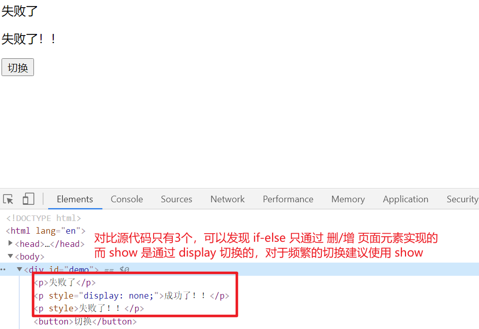

  **总结：如果需要进行频繁的切换，show 会跟好一点**

## 1.7 列表渲染

### 遍历数组

- 语法: `v-for = (元素,索引) in 数组`

- 使用一个额外的指令 `:key` 指定键(好像)

- **vue 的变更方法**

  - 详情可以查看文档：https://cn.vuejs.org/v2/guide/list.html
  - 在 vue 中，如果需要有关于数组的视图更新，就不要直接通过 **[索引]** 去操作数组中的元素，**因为 vue 默认监听的是数组，而不是数组中的元素**
  - 对于数组，vue **包装了原生 JS 中的数组方法**(也就是变更方法)，使我们在调用这些方法时，依然会触发 **视图更新**
  - 变更方法
    - push()
    - pop()
    - shift()
    - unshift()
    - splice()
    - sort()
    - reverse()

- 实例

  ```vue
  <!DOCTYPE html>
  <html lang="en">
  <head>
      <meta charset="UTF-8">
      <meta name="viewport" content="width=device-width, initial-scale=1.0">
      <title>05_列表渲染</title>
  </head>
  <body>
      <div id="demo">
          <h2>测试：v-for 遍历数组</h2>
          <ul>
              <!-- 
                  v-for 语法: (遍历元素,索引) in data数据(数组) 
                  还可以使用一个 :key 用来指定键
              -->
              <li v-for="(p,index) in persons" :key="index">
                  {{index}} --- {{p.name}} --- {{p.age}}
                  --- <button @click="deleteP(index)">删除</button>
                  --- <button @click="updateP(index,{name: 'Cat',age: 22})">修改</button>
              </li>
          </ul>
      </div>
      <script src="../../js/vue.js"></script>
      <script>
          const vm = new Vue({
              el: "#demo",
              data: {
                  persons: [
                      {name:"Dark",age:17}, 
                      {name:"Tom",age:17}, 
                      {name:"Jack",age:17}, 
                      {name:"MiaoNei",age:18}, 
                  ]
              },
              methods: {
                  deleteP: function(index){
                      // 删除指定 index 的元素
                      this.persons.splice(index,1);
                  },
                  updateP: function(index,person){
                      // 修改指定 index 上的元素
                      // this.persons[index] = person; //不能直接操作 index 对数组内部的元素进行修改
                      this.persons.splice(index,1,person); //通过变更方法去修改数组内的元素数据
                  }
              }
          });
      </script>
  </body>
  </html>
  ```

  

### 遍历对象(不常用)

- 语法：`v-for(value,key) in 对象`

- 使用一个额外的指令 `:key` 指定键(好像)

- 实例

  ```vue
  <!DOCTYPE html>
  <html lang="en">
  <head>
      <meta charset="UTF-8">
      <meta name="viewport" content="width=device-width, initial-scale=1.0">
      <title>05_列表渲染</title>
  </head>
  <body>
      <div id="demo">
          <h2>测试：v-for 遍历对象</h2>
          <ul>
              <!-- v-for 语法：(属性值,属性名) in data数据(对象) -->
              <li v-for="(value,key) in persons[1]" :key="key">
                  {{key}} --- {{value}}
              </li>
          </ul>
      </div>
      <script src="../../js/vue.js"></script>
      <script>
          const vm = new Vue({
              el: "#demo",
              data: {
                  persons: [
                      {name:"Dark",age:17}, 
                      {name:"Tom",age:17}, 
                      {name:"Jack",age:17}, 
                      {name:"MiaoNei",age:18}, 
                  ]
              }
          });
      </script>
  </body>
  </html>
  ```

  

### 列表的搜索过滤和排序

```vue
<!DOCTYPE html>
<html lang="en">
    <head>
        <meta charset="UTF-8">
        <meta name="viewport" content="width=device-width, initial-scale=1.0">
        <title>06(2)_列表的搜索和排序</title>
    </head>
    <body>
        <!-- 
			列表过滤
			列表排序
		-->
        <div id="demo">
            <input type="text" placeholder="根据name进行搜索" v-model="searchName" />
            <ul>
                <li v-for="(p,index) in filterPerson" :key="index">
                    {{index}} --- {{p.name}} --- {{p.age}}
                </li>
            </ul>
            <button @click="orderType=1">年龄升序</button> 
            <button @click="orderType=2">年龄降序</button> 
            <button @click="orderType=0">原本顺序</button> 
        </div>
        <script src="../../js/vue.js"></script>
        <script>
            const vm = new Vue({
                el: "#demo",
                data: {
                    searchName: "",
                    orderType: 0, //使用数字区别排序的类型; 0 代表原来顺序，1代表年龄升序，2代表年龄降序
                    persons: [
                        {name:"Dark",age:17}, 
                        {name:"Tom",age:17}, 
                        {name:"Jack",age:17}, 
                        {name:"MiaoNei",age:18}, 
                    ]
                },
                computed: {
                    filterPerson() {
                        //使用解构赋值获取需要的 data 数据
                        const { searchName , persons , orderType } = this;
                        // 遍历原数组中的数据，得到一个新的数组
                        let filterPerson;
                        filterPerson = persons.filter(p => p.name.indexOf(searchName)!==-1);
                        //根据排序的类型不同，进入不同的排序
                        //如果为0就不进行排序
                        if( orderType !== 0 ){
                            filterPerson.sort((p1,p2) => {
                                //如果为1就是升序排序
                                if(orderType === 1){
                                    return p1.age - p2.age;
                                    //如果为2就是降序排序
                                }else{
                                    return p2.age - p1.age;
                                }
                            })
                        }
                        return filterPerson;
                    }
                }
            })
        </script>
    </body>
</html>
```

1. 对于 sort 方法可以自定义排序的规则
   - a 小于 b 返回一个小于0的值，a在b位置的前面
   - a 等于 b 返回一个等于0的值，a、b位置不变
   - a 大于 b 返回一个大于0的值，a在b位置的后面

## 1.8 事件处理

### 绑定监听

1. ```vue
   <!DOCTYPE html>
   <html lang="en">
       <head>
           <meta charset="UTF-8">
           <meta name="viewport" content="width=device-width, initial-scale=1.0">
           <title>07_事件监听</title>
       </head>
       <body>
           <div id="demo">
               <h2>事件监听</h2>
               <!-- 如果不传入参数，默认会传入一个 event(可以通过 target 属性访问当前触发回调函数的 DOM 元素) -->
               <button @click="test1">test1</button>
               <!-- 如果传入一个参数,那么就不会传入默认的 event 对象 -->
               <button @click="test2('巴御前')">test2</button>
               <!-- 如果需要传入参数，又需要操作当前的 DOM 元素，可以显式的传入一个参数 $event,该参数就是 event -->
               <button @click="test3('巴御前',$event)">test3</button>
           </div>
           <script src="../../js/vue.js"></script>
           <script>
               const vm = new Vue({
                   el: "#demo",
                   methods: {
                       test1(event) {
                           alert(event.target.innerHTML);
                       },
                       test2(value) {
                           alert(value + "は一番可愛いよ")
                       },
                       test3(value,event) {
                           alert(event.target.innerHTML + ": " + value + "は私の彼女ですわ");
                       }
                   }
               });
           </script>
       </body>
   </html>
   ```

2. 如果不传入参数，默认会传入一个 event(可以通过 target 属性访问当前触发回调函数的 DOM 元素)

   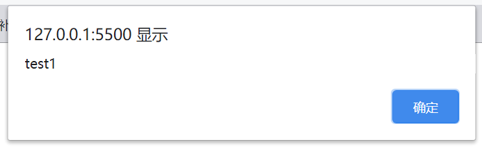

3. 如果传入一个参数,那么就不会传入默认的 event 对象

    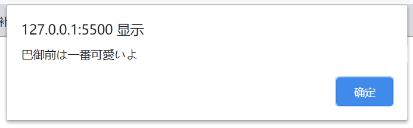

4. 如果需要传入参数，又需要操作当前的 DOM 元素，可以显式的传入一个参数 $event,该参数就是 event

    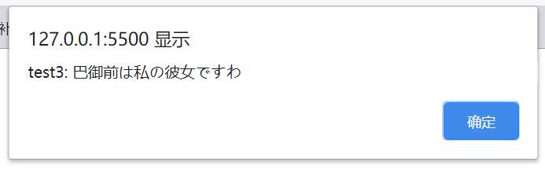

### 事件修饰符

1. 阻止事件的冒泡 - 在绑定数据监听的后面加上 `.stop`  即可

2.  阻止事件的默认行为 - 在绑定数据监听的后面加上 `.prevent` 即可

3. 实例

   ```vue
   <!DOCTYPE html>
   <html lang="en">
       <head>
           <meta charset="UTF-8">
           <meta name="viewport" content="width=device-width, initial-scale=1.0">
           <title>07_事件监听</title>
       </head>
       <body>
           <div id="demo">
               <h2>事件修饰符</h2>
               <!-- 阻止事件的冒泡 -->
               <div style="width: 200px;height: 200px;background-color: red;" @click="test4">
                   <!-- 添加事件修饰符 .stop 即可 -->
                   <div style="width: 100px;height: 100px;background-color:pink;" @click.stop="test5"></div>
               </div>
   
               <!-- 阻止事件的默认行为 - 添加事件修饰符 .prevent -->
               <a href="http://www.baidu.com" @click.prevent="test6">去百度</a>
           </div>
           <script src="../../js/vue.js"></script>
           <script>
               const vm = new Vue({
                   el: "#demo",
                   methods: {
                       test4() {
                           alert("out");
                       },
                       test5() {
                           alert("inner");
                       },
                       test6() {
                           alert("巴御前添加第一!!");
                       }
                   }
               });
           </script>
       </body>
   </html>
   ```

### 按键修饰符

- 可以在键盘事件的后面加上 **.键对应的keyCode / 键名(只有部分键才有用)** ,这样当只有按下对应的键时才会调用对应的回调函数

- **注意：键名只有部分键才可以生效**

- 实例

  ```vue
  <!DOCTYPE html>
  <html lang="en">
      <head>
          <meta charset="UTF-8">
          <meta name="viewport" content="width=device-width, initial-scale=1.0">
          <title>07_事件监听</title>
      </head>
      <body>
          <div id="demo">
              <h2>按键修饰符</h2>
              <!-- 可以在键盘事件的后面加上 .键对应的keyCode / 键名(只有部分键才有) ,这样当只有按下对应的键时才会调用对应的回调函数 -->
              <input type="text" @keyup.13="test7" />
              <input type="text" @keyup.space="test8" />
          </div>
          <script src="../../js/vue.js"></script>
          <script>
              const vm = new Vue({
                  el: "#demo",
                  methods: {
                      test7(event) {
                          alert(event.target.value);
                      },
                      test8(event) {
                          alert(event.target.value);
                      }
                  }
              });
          </script>
      </body>
  </html>
  ```

  

## 1.9 表单的输入绑定

- 对于 `radio` 类型的表单组件，绑定的 value 值是选中组件的 value 值

- 对于 `checkbox` 类型的表单组件，绑定的 v-model 值应该为 **数组**，其中保存的值是选择的组件对应的 value 值

- 对应 `select` 类型的表单组件，绑定的 v-model 的值是内部 option 对应的 value 值

- ```vue
  <!DOCTYPE html>
  <html lang="en">
      <head>
          <meta charset="UTF-8">
          <meta name="viewport" content="width=device-width, initial-scale=1.0">
          <title>08_表单输入绑定</title>
      </head>
      <body>
          <!-- 使用 v-model(双向数据绑定)自动收集数据 -->
          <div id="demo">
              <!-- 使用 .prevent 阻止事件的默认行为 -->
              <form action="/xxx" @submit.prevent="sumbitForm">
                  <span>用户名：</span>
                  <input type="text" v-model="username" /> <br>
  
                  <span>密码：</span>
                  <input type="password" v-model="password" /> <br>
  
                  <!-- 对于 radio 单选框，v-model 是以 value 值进行区别的 -->
                  <span>性别：</span> 
                  <label for="male">男</label>
                  <input type="radio" id="male" value="男" v-model="sex" name="sex"/>
                  <label for="female">女</label>
                  <input type="radio" id="female" value="女" v-model="sex" name="sex"/> <br>
  
                  <!-- 对于 checkbox ，绑定的 v-model 数据值需要使用数组数据类型来接收 
  					其中保存的值是对于组件的 value 值
  				-->
                  <span>爱好：</span>
                  <label for="fgo">FGO</label>
                  <input type="checkbox" value="fgo" id="fgo" v-model="likes">
                  <label for="yys">阴阳师</label>
                  <input type="checkbox" value="yys" id="yys" v-model="likes">
                  <label for="mrfz">明日方舟</label>
                  <input type="checkbox" value="mrfz" id="mrfz" v-model="likes"> <br>
  
                  <span>城市：</span>
                  <!-- 对于 select 标签，绑定的 v-model 是以内部 option 的 value 值进行区别的 -->
                  <select v-model="cityId">
                      <option value="0">未选择</option>
                      <!-- 传输给后端的 value 应该是对于选项的 id，使用 : 前缀将其转换为表达式  -->
                      <option v-for="(city,index) in cityList" :value="city.id">{{city.name}}</option>
                  </select> <br>
  
                  <span>介绍：</span>
                  <textarea rows="10" v-model="desc"></textarea> <br>
  
                  <input type="submit" value="注册">
              </form>
          </div> 
          <script src="../../js/vue.js"></script>
          <script>
              const vm = new Vue({
                  el: "#demo",
                  data: {
                      username: '',
                      password: '',
                      /* radio：可以设定初始值为指定的 value */
                      sex: '男',
                      /* checkbox：可以设定多个数组元素为指定的 value */
                      likes: ['fgo','yys'],
                      /* select：可以设定对应 option 的 value 值设置初始值 */
                      cityId: "0",
                      cityList: [
                          {name:"北京",id: 1},
                          {name:"东京",id: 2},
                          {name:"深圳",id: 3}
                      ],
                      desc: "巴御前天下第一"
                  },
                  methods: {
                      sumbitForm() {
                          console.log(
                              this.username + " " + this.password
                              + " " + this.sex + " " + this.likes 
                              + " " + this.cityId + " " + this.desc
                          );
                      }
                  }
              });
          </script>
      </body>
  </html>
  ```

  

## 1.10 生命周期

- vue 对象的生命周期

  1. 初始化显示阶段
     - beforeCreate()：组件实例还未被创建，组件属性还未定义
     - created()：组件实例创建完成，属性已经绑定，但 DOM 还未生成，`$el` 属性不存在
     - beforeMount()：编译/挂载模板之前
     - **mounted()**：编译/挂载模板之后
  2. 更新阶段
     - beforeUpdate()：组件更新之前
     - updated()：组件更新之后
  3. 销毁 vue 实例: vm.**$destroy()**
     - **beforeDestroy()**：组件销毁前使用
     - destroyed()：组件销毁后使用
  4. 常用的生命周期方法
     - created() /  mounted()：主要负责发送 Ajax 请求，启动定时器等异步任务
     - beforeDestroy()：死亡之前执行，负责做收尾工作，比如清除定时器

- 图解

  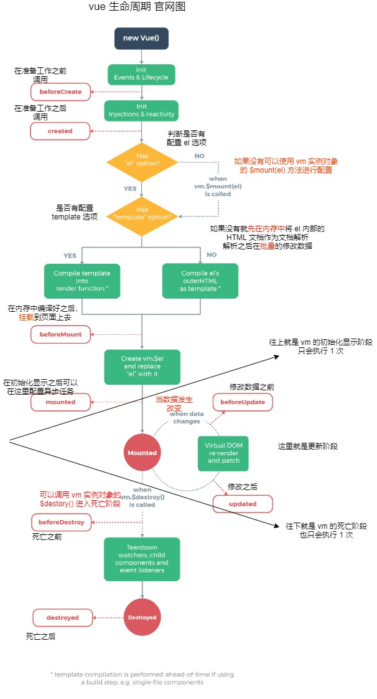

- 实例

  ```vue
  <!DOCTYPE html>
  <html lang="en">
  <head>
      <meta charset="UTF-8">
      <meta name="viewport" content="width=device-width, initial-scale=1.0">
      <title>09_生命周期</title>
  </head>
  <body>
      <!-- 
          1. 初始化显示阶段
              - beforeCreate()
              - created()
              - beforeMount()
              - mounted()
          2. 更新阶段
              - beforeUpdate()
              - updated()
          3. 销毁 vue 实例: vm.$**destory()**
              - beforeDestory()
              - destoryed()
          4. 常用的生命周期方法
              - created() /  mounted()：主要负责发送 Ajax 请求，启动定时器等异步任务
              - beforeDestroy()：死亡之前执行，负责做收尾工作，比如清除定时器
       -->
      <div id="app">
          <button @click="destroyVm">destroy</button>
          <p v-show="isShow">ABCDEFGHIJK...</p>
      </div>
      <script src="../../js/vue.js"></script>
      <script>
          const vm = new Vue({
              el: "#app",
              data: {
                  isShow: true
              },
              // 1. 初始化显示阶段
              beforeCreate() {
                  console.log('初始化显示阶段');
                  console.log("beforedCreate");
              },
              created() {
                  console.log("created");
              },
              beforeMount() {
                  console.log("beforeMount");
              },
              // * mounted 主要负责发送 Ajax 请求，启动定时器等异步任务
              mounted() {
                  console.log("mounted");
                  // 将定时器的唯一标识作为当前 vm 对象的属性
                  this.interId = setInterval(() => {
                      //这里使用箭头函数是因为异步任务调用时，this 为 window 会导致报错
                      //所以使用箭头函数，在声明时固定 this 为 vm 对象
                      this.isShow = !this.isShow;
                  },1000)
              },
              // 更新阶段
              beforeUpdate() {
                  console.log('更新阶段');
                  console.log('beforeUpdate');
              },
              updated() {
                  console.log('updated');
              },
              methods: {
                  destroyVm() {
                      console.log(this);
                      // 调用 vm.$destory() 使其进入死亡阶段
                      this.$destroy();
                  }
              },
              // 死亡阶段
              // * beforeDestroy 主要负责收尾工作，比如关闭定时器等 
              beforeDestroy() {
                  console.log('死亡阶段');
                  console.log('beforeDestroy');
                  clearInterval(this.interId);   
              },
              destroyed() {
                  console.log('destroyed');
              }
          })
      </script>
  </body>
  </html>
  ```

- 效果

  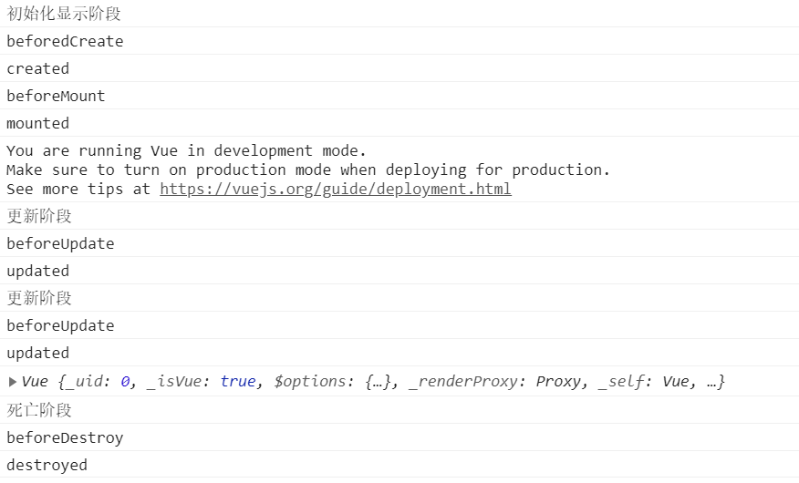

## 1.11 过渡&动画

### 说明

- 实质上时操作 css 的 transition / animation
- vue 会给目标元素**添加 / 移除 特定的 class**
- 基本过渡动画的编码
  - 在目标元素外包裹 `<transition name='xxx'></transition>` 标签，name 属性为自定的
  - 定义 class 样式
    1. 指定过渡样式：transition / animation
    2. 指定隐藏样式：opacity/其它
- 过渡相关的类名(xxx 为包裹在外层的 transition 的 name 属性)
  - xxx-enter-active：指定显示的 transition
  - xxx-leave-avtive：指定隐藏的 transition
  - xxx-enter / xxx-leave-to：指定隐藏时的样式
  - 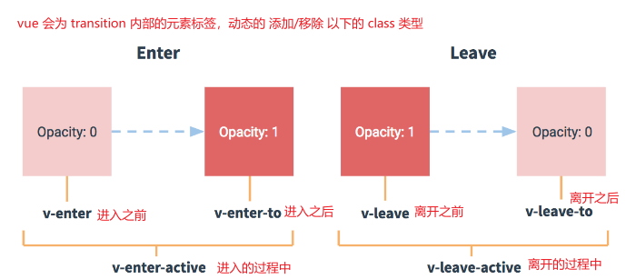

### 实例

- 过渡效果使用 transition

  ```vue
  <!DOCTYPE html>
  <html lang="en">
      <head>
          <meta charset="UTF-8">
          <meta name="viewport" content="width=device-width, initial-scale=1.0">
          <title>10_过渡&动画1</title>
          <style>
              /* 根据规范定义不同状态下的 class 类型 */
              .byq-enter-active,.byq-leave-active{
                  transition: opacity 0.5s;
              }
              .byq-enter,.byq-leave-to{
                  opacity: 0;
              }
  
              .move-enter-active{
                  transition: all 0.5s;
              }
              .move-leave-active{
                  transition: all 1s;
              }
              .move-enter,.move-leave-to{
                  opacity: 0;
                  transform: translateX(20px);
              }
          </style>
      </head>
      <body>
          <!-- 
          	1. 使用 transition 标签包裹目标元素
          	2. 指定 transition 标签的 name 属性值，该属性值为作为添加(移除)的 class 类型前缀
          	3. vue 会动态的为目标元素 添加/移除 class 类名
          	4. 定义 class 样式
          		- 过渡样式: transition / animation
          		- 隐藏样式：opacity/其他
          -->
          <div id="demo">
              <button @click="isShow=!isShow">切换</button>
              <transition name="byq">
                  <p v-show="isShow">巴御前天下第一!</p>
              </transition>
          </div>
  
          <div id="demo2">
              <button @click="isShow=!isShow">切换</button>
              <transition name="move">
                  <p v-show="isShow">巴御前天下第一!</p>
              </transition>
          </div>
  
          <script src="../../js/vue.js"></script>
          <script>
              const vm = new Vue({
                  el: "#demo",
                  /* 使用 data 函数返回初始化值 */
                  data() {
                      return {
                          isShow: true
                      }
                  }
              });
  
              const vm2 = new Vue({
                  el: "#demo2",
                  data: {
                      isShow: true
                  }
              })
          </script>
      </body>
  </html>
  ```

- 过渡效果为 animation

  ```vue
  <!DOCTYPE html>
  <html lang="en">
      <head>
          <meta charset="UTF-8">
          <meta name="viewport" content="width=device-width, initial-scale=1.0">
          <title>10_过渡&动画2</title>
          <style>
              /* 指定过渡效果为自定义的动画 */
              .bounce-enter-active {
                  animation: bounce-in .5s;
              }
              .bounce-leave-active {
                  animation: bounce-in .5s reverse;
              }
              /* 使用 @keyframes 自定义动画 */
              @keyframes bounce-in {
                  0% {
                      transform: scale(0);
                  }
                  50% {
                      transform: scale(1.5);
                  }
                  100% {
                      transform: scale(1);
                  }
              }
          </style>
      </head>
      <body>
          <div id="example-2">
              <button @click="show = !show">Toggle show</button>
              <br />
              <transition name="bounce">
                  <p v-if="show" style="display: inline-block;">Lorem ipsum</p>
              </transition>
          </div>
          <script src="../../js/vue.js"></script>
          <script>
              new Vue({
                  el: '#example-2',
                  data: {
                      show: true
                  }
              })
          </script>
      </body>
  </html>
  ```

  

## 1.12 过滤器

- 功能：对要显示的数据进行 **特定格式化** 后再显示

- 注意：并不会改变原来的数据，而是产生新的对应数据

- 语法

  1. 定义过滤器

     ```vue
     <scirpt>
     	Vue.filter(fiterName,function(参数){进行数据处理})
     </scirpt>
     ```

  2. 使用过滤器：`{{ 数据 | 要使用的过滤器(参数) }}`

- 实例

  - 注意：对于**日期格式化**我们一般会使用另一个扩展的 JS：moment.js

    ```
    可以使用 bootcdn 获取对应的 url：https://www.bootcdn.cn/moment.js/
    ```

  - ```vue
    <!DOCTYPE html>
    <html lang="en">
    <head>
        <meta charset="UTF-8">
        <meta name="viewport" content="width=device-width, initial-scale=1.0">
        <title>11_过滤器</title>
    </head>
    <body>
        <div id="demo">
            <h2>日期格式化显示</h2>
            <p>原数据: {{ date }}</p>
            <!-- 调用过滤器：{{ 数据 | 过滤器名 }} -->
            <p>格式化完整版：{{ date | formatString }}</p>
            <!-- 调用过滤器也可以使用()传入参数 -->
            <p>年月日：{{ date | formatString('YYYY-MM-DD') }}</p>
            <p>时分秒：{{ date | formatString('HH:mm:ss') }}</p>
        </div>
        <script src="../../js/vue.js"></script>
        <!-- 导入日期格式处理的 moment.js -->
        <script src="https://cdn.bootcdn.net/ajax/libs/moment.js/2.29.1/moment.js"></script>
        <script>
            // 使用 Vue 函数对象的 filter() 自定义过滤器 
            // 回调函数可以接收多个参数，第一个为调用过滤器的数据，第二个为调用时传入的参数
            Vue.filter('formatString',function(value,format){
                // 返回格式化后的数据
                return moment(value).format( format || 'YYYY-MM-DD HH:mm:ss');
            });
    
            const vm = new Vue({
                el: "#demo",
                data: {
                    date: new Date()
                }
            });
        </script>
    </body>
    </html>
    ```

## 1.13 指令

### 常用的内置指令

| 指令名  | 效果                                                  |
| ------- | ----------------------------------------------------- |
| v:text  | 更新元素的 texcContent                                |
| v-html  | 更新元素的 innerHTML                                  |
| v-if    | 如果为 true，当前标签才会输出到页面                   |
| v-else  | 如果为 false，当前标签才会输出到页面                  |
| v-show  | 通过控制 **display** 样式来控制显示/隐藏              |
| v-for   | 遍历数组和对象                                        |
| v-on    | 绑定事件监听，**一般可以简写成@**                     |
| v-bind: | 强制绑定解析表达式，**可以省略 v-bind**               |
| v-model | **双向数据绑定**                                      |
| ref     | 指定唯一标识，vue 对象通过 $refs 属性访问这个元素对象 |
| v-clock | 防止闪现，于 css 配合：[v-clock] {display:none}       |

#### ref

- 为内部的元素(组件)指定一个标识，对应的 vue 对象可以通过 `$refs` 属性进行访问

- ```vue
  <!DOCTYPE html>
  <html lang="en">
  <head>
      <meta charset="UTF-8">
      <meta name="viewport" content="width=device-width, initial-scale=1.0">
      <title>12_指令(内置指令)</title>
  </head>
  <body>
      <!-- 补充额外的两个内置指令
              1. ref：指定唯一标识，vue 对象通过 $refs 属性访问这个元素对象
              2. v-clock：防止闪现，于 css 配合：[v-clock] {display:none}
      -->
      <div id="demo">
          <!-- 1. ref 指定唯一标识 -->
          <p ref="head">巴御前天下第一</p>
          <button @click="hint">提示</button>
      </div>
      <script src="../../js/vue.js"></script>
      <script>
          const vm = new Vue({
              el: "#demo",
              methods: {
                  hint(){
                      // 可以通过 vue 对象的 refs.ref标识 访问内部的元素(组件)
                      alert(this.$refs.head.textContent);
                  }
              }
          })
      </script>
  </body>
  </html>
  ```

#### v-cloak

- 对于 vue 的模板渲染，有时候数据不能即使被模板解析，会导致以下的情况出现

  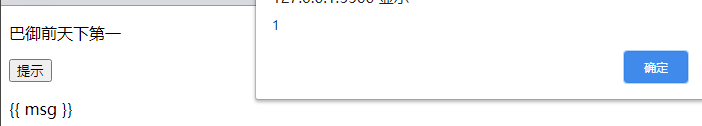

  这样带给用户的体验不好

- 可以通过 开发者调试 查看标签的数据，可以发现 vue 对应的指令都不会存在，可以利用此特性，使用 `v-cloak` 做标识

  配合 css 可以防止此现象出现

- ```vue
  <!DOCTYPE html>
  <html lang="en">
      <head>
          <meta charset="UTF-8">
          <meta name="viewport" content="width=device-width, initial-scale=1.0">
          <title>12_指令(内置指令)</title>
          <style>
              [v-cloak] {
                  display: none
              }
          </style>
      </head>
      <body>
          <div id="demo">
              <!-- 2. v-cloak:也是一个标识，防止闪现 -->
              <p v-cloak>{{ msg }}</p>
          </div>
          <script src="../../js/vue.js"></script>
          <script>
              alert(1);
              const vm = new Vue({
                  el: "#demo",
                  data: {
                      msg: "巴御前"  
                  }
              })
          </script>
      </body>
  </html>
  ```

- 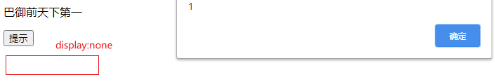

### 自定义指令

```vue
<!DOCTYPE html>
<html lang="en">
<head>
    <meta charset="UTF-8">
    <meta name="viewport" content="width=device-width, initial-scale=1.0">
    <title>12_指令(自定义指令)</title>
</head>
<body>
    <!-- 
        1. 注销全局指令
            语法：Vue.directive('指令名',function(el,binding){数据处理})
            - 注意：指令名不加 v-,v- 是默认的
            - el 指令属性所在的标签对象
            - binding 包含指令相关信息数据的对象
        2. 注册局部指令:只在配置的 vm 对象中才能使用
            语法：directives : {
                '指令名'(el,binding){数据处理}
            }
        3，使用指令
            v-指令名='值'
    -->
    <div id="demo">
        <p v-upper-text="msg"></p>
        <p v-lower-text="msg"></p>
    </div>
    
    <div id="demo2">
        <p v-upper-text="msg"></p>
        <p v-lower-text="msg"></p>
    </div>
    <script src="../../js/vue.js"></script>
    <script>
        /* 自定义全局全局指令 */
        Vue.directive('upper-text',function(el,binding){
            console.log(el,binding);
            // 通过 binding 对象的 value 属性可以访问使用指令时赋值的数据
            el.textContent = binding.value.toUpperCase(); 
        })
        const vm = new Vue({
            el: "#demo",
            data: {
                msg: "This is Game"
            },
            // 局部定义自定义指令 - 只能在当前 vm 实例中才可以使用
            directives: {
                'lower-text'(el,binding){
                    el.textContent = binding.value.toLowerCase();
                }
            }
        });

        const vm2 = new Vue({
            el: "#demo2",
            data: {
                msg: "Go up the river"
            }
        })
    </script>
</body>
</html>
```

## 1.13 插件

### 开发插件

- 编写一个单独的 JS 文件，命名规范：vue-实现功能.js

- ```javascript
  (function(){
      const MyPlugin = {};
      MyPlugin.install = function (Vue, options) {
          // 1. 添加全局方法或 property
          Vue.myGlobalMethod = function () {
              console.log("全局方法执行啦！！");
          }
          
          // 2. 添加全局资源
          Vue.directive('my-directive', (el,binding) => {
              el.textContent = binding.value.toUpperCase();
          })
          
          
          // 3. 添加实例方法
          Vue.prototype.$myMethod = function (methodOptions) {
              console.log('实例对象方法执行啦！！');
          }
      }
  
      // 将对象暴露给 window 全局对象
      window.MyPlugin = MyPlugin;
  })()
  ```

### 使用插件

- 在导入插件前，先导入 vue.js

- ```javascript
  <script src="../../js/vue.js"></script>
  <script src="./vue-myPlugin.js"></script>
  <script>
      // 使用插件
      Vue.use(MyPlugin); //内部会调用 MyPlugin.install(vue)
  
      // 调用 Vue 函数对象的全局方法
      Vue.myGlobalMethod();
  
      const vm = new Vue({
          el: "#demo",
          data: {
              msg: "ko do mo go zen"
          }
      });
  
      // 调用 vm 实例对象的方法
      vm.$myMethod();
  </script>
  ```


# 第二章 Vue 组件化开发

## 2.1 使用 vue-cli 搭建项目

参考 3.2 中的方法

## 2.2 项目主要结构说明

```
|- public：在目录中会包含在 webpack 编译过程中没有加工处理的文件(index.html 除外)
	|-favicon.icon 项目的图标
	|-index.html 应用的模板文件，Vue 应用会通过这个 HTML 页面来运行
				 (这个不是负责管理页面最终展示的模板，而是管理 Vue 应用之外的静态 HTML 文件)
|- src: Vue 应用的核心代码目录
	|- mian.ts: 应用的主入口
	|- App.vue: Vue 应用的根节点组件 
	|- components: 存放自定义组件的目录
	|- assets: 用来存放像 CSS 、图片这种静态资源
|- .browserslistrc: 这个是 Browserslist 的配置文件，可以通过它来控制需要对哪些浏览器进行支持和优化。
|- .eslintrc.js: 这个是 eslint 的配置文件，可以通过它来管理你的校验规则。
|- babel.config.js: babel 配置文件
|- package.json: 整个项目的描述文件
|- tsconfig.json: typescript 配置文件
```

- main.ts

  ```typescript
  // 程序的主入口 ts 文件
  // 引入 createApp 函数，用于将一个组件挂载到一个节点上
  import { createApp } from 'vue'
  // 引入 App 组件(引入组件的父级组价)
  import App from './App.vue'
  // 创建 App 应用返回对应的实例对象，调用 mount 方法进行挂载到指定的选择器元素上
  createApp(App).mount('#app')
  ```

- App.vue

  ```vue
  <!-- 这里主要编写 Html 模板 -->
  <template>
      <!-- 
      Vue2 中的 html 模板中必须要有一对根标签，
      Vue3 中的 html 模板可以没有跟标签 
      -->
      
      <!-- 使用一个子级组件 -->
      <HelloWorld msg="Welcome to Your Vue.js + TypeScript App"/>
  </template>
  
  <!-- 处理 ts/js 逻辑 -->
  <script lang="ts">
      /* 可以在内部定义 TS 代码 */
      // defineComponent函数，该函数主要是定义一个组件，内部可以传入一个配置对象 
      import { defineComponent } from 'vue';
      // 引入一个子级组件
      import HelloWorld from './components/HelloWorld.vue';
  
      // 暴露出一个定义好的组件
      export default defineComponent({
          // 当前组件的名字
          name: 'App',
          // 注册组件
          components: {
              // 注册一个子级组件
              HelloWorld
          }
      });
  </script>
  
  <!-- 样式 -->
  <style>
      #app {
          font-family: Avenir, Helvetica, Arial, sans-serif;
          -webkit-font-smoothing: antialiased;
          -moz-osx-font-smoothing: grayscale;
          text-align: center;
          color: #2c3e50;
          margin-top: 60px;
      }
  </style>
  ```
  
- package.json

  ```json
  {
      "name": "vue3_study",
      "version": "0.1.0",
      "private": true,
      "scripts": {
          // 开启本地服务器进行页面显示
          "serve": "vue-cli-service serve",
          // 打包项目
          "build": "vue-cli-service build",
          // 语法检查
          "lint": "vue-cli-service lint"
      },
      // 定义生产环境需要使用的依赖
      "dependencies": {
          "core-js": "^3.6.5",
          "vue": "^3.0.0"
      },
      // 定义开发环境需要使用的依赖
      "devDependencies": {
          "@typescript-eslint/eslint-plugin": "^2.33.0",
          "@typescript-eslint/parser": "^2.33.0",
          "@vue/cli-plugin-babel": "~4.5.0",
          "@vue/cli-plugin-eslint": "~4.5.0",
          "@vue/cli-plugin-typescript": "~4.5.0",
          "@vue/cli-service": "~4.5.0",
          "@vue/compiler-sfc": "^3.0.0",
          "@vue/eslint-config-typescript": "^5.0.2",
          "eslint": "^6.7.2",
          "eslint-plugin-vue": "^7.0.0-0",
          "typescript": "~3.9.3"
      }
  }
  ```

## 2.3 HelloWorld

> 组件：局部功能界面，包含了要实现这个界面的**所有资源**

1. 编写子级组件

   ```vue
   <template>
   	<p>{{ msg }}</p>
   </template>
   
   <script lang="ts">
       // 暴露一个配置对象(和 Vue 一致)
       export default {
           // 这里的 data 必须写成函数
           data(){
               // 函数中返回一个对象，该对应就是 data 数据
               return {
                   msg: "巴御前天下第一！"
               }
           }
       }
   </script>
   
   <style>
       p {
           font-size: 20px;
           color: red;
       }
   </style>
   ```

   **注意：**script 中必须暴露一个默认的配置对象(和 Vue 一致)，且其中的 data 数据必须写成函数，返回一个包含数据的对象

2. 编写父级组件 - App.vue

   ```vue
   <template>
       
       <!-- 3. 使用子组件 -->
       <HelloWorld/>
   </template>
   
   <script lang="ts">
       /* 1. 导入需要的子级组件 */
       import HelloWorld from "./components/HelloWorld.vue"
       /* 2. 在父组件中注册子组件 */
       export default {
           name: 'App',
           components: {
               // 注册子组件
               HelloWorld
           }
       }
   </script>
   
   <style>
       img {
           width: 200px;
           height: 200px
       }
   </style>
   ```

   **注意：** 看注释

3. 编写 `main.ts` 程序的主入口文件

   ```typescript
   // 程序的主入口 ts 文件
   // 引入 createApp 函数，用于创建对应的应用，产生应用的实例对象
   import { createApp } from 'vue'
   // 引入 App 组件(引入组件的父级组价)
   import App from './App.vue'
   // 创建 App 应用返回对应的实例对象，调用 mount 方法进行挂载到指定的选择器元素上
   createApp(App).mount('#app')
   ```

4. 启动内部服务器，查看效果

## 2.4 项目打包发布

- 使用 `npm run build ` 打包项目

### 发布1：使用静态服务器工具包

1. 安装全局静态服务器 `npm i -g serve`
2. `serve dist`
3. 访问：`http://loaclhost:5050`

### 发布2：使用动态 web 服务器(tomcat)

## 2.5 eslint

### 1) 说明

1. ESLint 是一个代码规范检查工具
2. 它定义了很多特定的规则，一旦代码违背了某一个规则，eslint 就会发出提示
3. 基本已经替换 JSLint
4. 官网：http://eslint.org/

### 2) 提供的支持

1. ES
2. JSX
3. style 检查
4. 自定义错误和提示

### 3) ESLint 提供以下几种校验

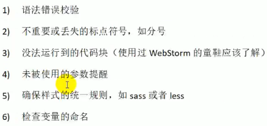

### 4) 规则的错误等级

-  0：关闭规则
-  1：打开规则，并且作为一个警告(信息打印黄色字体)
-  2：打开规则，并且作为一个错误(信息打印红色字体)

## 2.6 组件通信

### 1) 说明

- 组件间通信基本原则
  1. 不要在子组件中直接修改父组件的状态数据
  2. **数据在哪，**更新数据的行为(函数)就应该定义在哪
- vue 组件间通信的方式
  1. props
  2. vue 的自定义事件
  3. 消息订阅与发布(如：pubsub.js 库)
  4. slot
  5. vuex

### 2) 使用 props

1. 父组件在使用子组件标签时

   ```html
   <vue-child :setName='setName'/>
   ```

   语法：`:属性名=‘父组件中对应数据名’`

2. 在子组件中声明 **props**  配置接收

   ```typescript
   // 方式1：只指定名称
   props: ['setName'];
   
   // 方式2：指定名称和类型
   props: {
   	setName: Funtion
   }
   
   // 方式3：指定名称和对应的配置
   props: {
   	setName: {
   		type: Funtion, //类型
   		required: true, //必要性，默认为 false
   		defualt: ... //默认值
   	}
   }
   ```

**注意**

1. 此方法只用于 **父组件 -> 子组件** 使用

2. 所有标签属性都会成为**组件对象**的属性，模板页面可以直接引用

   组件对象：组件暴露的对象，使用方法和 Vm 一样

3. 问题

   - 如果需要向非直接后代组件传递数据**需要多层传递**
   - 兄弟组件间不能直接使用 props 通信，必须通过父组件

### 3) vue 自定义事件

**说明**

- 关于事件的两个概念
  1. 事件绑定监听
  2. 事件触发

**实例**

1. 事件绑定监听 - 在父组件中给子组件标签绑定监听

   ```javascript
   // 方式一：使用 `v-on:自定义事件名=“回调函数”`
   <todo-header  v-on:addItem="addItem" />
   // 方式一可以简写
   <todo-header  @addItem="addItem" />
   
   // 方式二：通过组件对象的 `$on(自定义事件名,回调函数)` 方法
   // 在组件对象的 mounted 配置中进行配置
   mounted (){
   	// 在子组件标签上使用 ref 属性，指定唯一标识
   	// 通过组件对象(vm)的 $refs.唯一标识 访问子组件
   	this.$ref.唯一标识.$on('监听事件名',回调函数)
   }
   ```

   **方式二 在 Vue 3 中已经移除**

2. 触发指定的事件 - 在子组件中触发

   语法：this.$emit('事件名'[,参数1,参数2...])

   ```javascript
   (this as any).$emit('addItem',todo);
   ```

**注意**

1. 此方法只用于**直接子组件和父组件之间**的发送消息(数据)
2. 问题：隔代组件或兄弟组件间通信时此方式不适用

### 4) 消息订阅与发布(PubSubJs 库)

**说明**

- 消息订阅 - 绑定监听事件
- 消息发布 - 触发监听事件

**实例**

1. 下载安装对应的库 `npm install --save pubsub-js`

2. 使用命令查看对应的插件信息 `npm info pubsub-js`'

3. 在需要使用其的组件中引入 **import PubSub from "pubsub-js"**

4. 订阅消息 - 在 **mounted** 中进行配置

   第一个参数为消息名，第二个参数为回调函数(所以用箭头函数)

   回调函数接收多个参数，第一个参数固定为 msg,后面的参数为消息发布时传入的参数

   ```typescript
   PubSub.subscribe('removeItem',(msg: string,index: number) => {
       (this as any).removeItem(index);
   })
   ```

5. 发布消息

   第一个参数对应的消息名,后面的参数为调用消息对应的回调函数时需要的形参

   ```javascript
   PubSub.publish('removeItem',index)
   ```

**注意**

1. **此方法可以在任意关系的组件中使用**

### 5) slot

**说明**

- 此方法用于 **父组件 -> 子组件** 传递**标签数据**

- 在一个组件中可以设置多个不同的**占位**(部分)用于显示内容；

  当需要使用该组件时，可以向指定的部分传递**标签数据**，用于显示(不传就不显示)

**实例**

1. 子组件中定义 '插槽'(slot)

   语法：\<slot name="唯一标识">

   ```html
   <template>
       <div>
         <slot name="xxx">不确定的标签结构1</slot>
           <div>组件确定的标签结构</div>
           <slot name="yyy">不确定的标签结构2</slot>
       </div>
   </template>
   ```

2. 父组件中传入对应的标签数据 

   ```html
<vue-child>
       <!-- 使用 v-slot 指令(好像会因为 eslint 报错) -->
       <template v-slot:info>
           <span>已完成{{completed}}</span> / 全部{{this.todos.length}}
       </template>
       <!-- 可以简化写成 #标识  -->
       <template #selectAll>
           <input type="checkbox" v-model="allChecked"/>
       </template>
   </vue-child>
   ```

**注意：**

1. 在父组件中定义的标签体，对应需要的数据(v-model,计算属性等)都在父组件中定义

## demo1: comment manage

### 1) 组件化开发流程

- 组件化开发流程
  1. 组件拆分
  2. 静态组件
  3. 动态组件
     - 动态初始化显示数据
     - 交互

### 2) 组件拆分

- 静态页面 - 组件拆分

  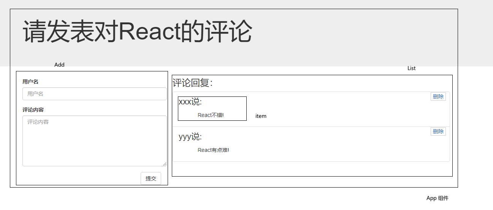

  判断组件的依据：判断数据是 **某些组件**(放在共同的父组件中) / **某个组件**(放在组件中) 中需要使用的

### 3) 初始化显示

1. 先拆分 App , Add , List 为三个不同的组件

   1. Add.vue

      ```vue
      <template>
          <div class="col-md-4">
              <form class="form-horizontal">
                  <div class="form-group">
                      <label>用户名</label>
                      <input type="text" class="form-control" placeholder="用户名">
              	</div>
                  <div class="form-group">
                      <label>评论内容</label>
                      <textarea class="form-control" rows="6" placeholder="评论内容"></textarea>
                  </div>
                  <div class="form-group">
                      <div class="col-sm-offset-2 col-sm-10">
                      <button type="button" class="btn btn-default pull-right">提交</button>
          		</div>
                  </div>
              </form>
          </div>
      </template>
      
      <script>
          export default {};
      </script>
      .....
      ```

   2. List.vue

      ```vue
      <template>
      <div class="col-md-8">
          <h3 class="reply">评论回复：</h3>
          <h2 style='display: none'>暂无评论，点击左侧添加评论！！！</h2>
          <ul class="list-group">
          </ul>
          	<li class="list-group-item">
                  <div class="handle">
                      <a href="javascript:;">删除</a>
                  </div>
                  <p class="user"><span>CJH</span><span>说:</span></p>
                  <p class="centence">巴御前天下第一！</p>
              </li>
          </div>
      </template>
      
      <script>
      </script>
      
      <style>
          .reply {
              margin-top: 0px;
          }
          li {
              transition: .5s;
              overflow: hidden;
          }
          
          .handle {
              width: 40px;
              border: 1px solid #ccc;
              background: #fff;
              position: absolute;
              right: 10px;
              top: 1px;
              text-align: center;
          }
      
          .handle a {
              display: block;
              text-decoration: none;
          }
      
          .list-group-item .centence {
              padding: 0px 50px;
          }
      
          .user {
              font-size: 22px;
          }
      </style>
      ```

   3. App.vue - 在父级组件中引入两个子级组件(List,Add)

      ```vue
      <template>
          <div>
              <header class="site-header jumbotron">
                  <div class="container">
                  <div class="row">
                      <div class="col-xs-12">
                      <h1>请发表对{{name}}的评论</h1>
                      </div>
                  </div>
                  </div>
              </header>
              <div class="container">
                  <Add />
                  <List />
              </div>
          </div>
      </template>
      
      <script lang="ts">
          import Add from "./components/Add.vue"
          import List from "./components/List.vue"
          export default {
              components: {
                  Add,
                  List
              },
              data() {
                  return {
                      name: "Vue",
                  }
              }
          }
      </script>
      ...
      ```

2. 静态组件搭建完成

3. 动态初始化显示数据

   1. 划分 **item** 组件所在的位置 - 由于 Add(添加数据) 和 List(展示数据) 组件中都需要使用该组件，所以将其**需要使用的数据**放在共同的父级组件中

   2. 数据需要由 App 父级组件传递给 List 子级组件用于展示(**组件通信**)

   3. 修改 App.vue

      ```vue
      <template>
      	<div>
              ....
              <div class="container">
                  <Add />
                  <!-- 使用 data 数据属性名作为标签属性将父组件的数据传递给子组件(组件通信) -->
                  <!-- 属性名建议和 data 数据属性相同，且如果需要传入 data 中的数据，还需要在前面加上: -->
                  <List :comments="comments"/>
              </div>
          </div>
      </template>
      <script lang="ts">
          import Add from "./components/Add.vue"
          import List from "./components/List.vue"
          export default {
              components: {
                  Add,
                  List
              },
              data() {
                  return {
                      name: "Vue",
                      /* 存放 item 数据的数组对象 */
                      comments: [
                          {
                              name: "TJH",
                              content: "欸嘿嘿嘿"
                          },
                          {
                              name: "SGL",
                              content: "欸嘿嘿hi"
                          },
                          {
                              name: "CGH",
                              content: "阿巴阿巴阿巴"
                          }
                      ]
                  }
              }
          }
      </script>
      ...
      ```
      
   4. 在 List.vue 子级组件中接收父级组件传递的数据
   
      这里使用在暴露默认接口时，使用 `props` 属性接收数据，该数据成为**组件对象**的属性
   
   > 简略写法: props: ['父组件标签属性名']
   
      >
      >组件对象: 也就是 this，虽然不是 vm，但和 vm 实例对象的使用方法一致

         同时还需要将数据传递给 `Item` 组件
   
      ```vue
      <template>
      	<div class="col-md-8">
              <h3 class="reply">评论回复：</h3>
              <h2 style='display: none'>暂无评论，点击左侧添加评论！！！</h2>
              <ul class="list-group">
                  <!-- 将遍历出来的数据交给 item 组件进行处理 -->
                  <Item v-for="(comment,index) in comments" :key="index" :comment="comment"/>
              </ul>
          </div>
      </template>
      
      <script>
          import Item from "./item"
          export default {
              // 声明接收属性: 这个属性会成为组件对象的属性
              // 组件对象：也就是 this，虽然不是 vm，但和 vm 实例对象的使用方法一致
              props: ['comments'], // 指定简略写法 - 只指定属性名
              components: {
                  Item
              }
          };
      </script>
      
      <style>
          .reply {
              margin-top: 0px;
          }
      </style>
      ```
   
   
   5. 在 item 组件中接收数据并展示
   
   > 复杂写法 - props: {属性名: 属性值类型}
   
      ```vue
      <template>
      	<li class="list-group-item">
          	<div class="handle">
              	<a href="javascript:;">删除</a>
          	</div>
          	<p class="user"><span>{{comment.name}}</span><span>说:</span></p>
          	<p class="centence">{{comment.content}}</p>
          </li>
      </template>
      <script lang="ts">
          export default {
              props: { //声明接收属性(完整写法)：指定属性名和属性值的类型
                  comment: Object
              }
          }
      </script>
      <style>
          li {
              transition: .5s;
              overflow: hidden;
          }
          .handle {
              width: 40px;
              border: 1px solid #ccc;
              background: #fff;
              position: absolute;
              right: 10px;
              top: 1px;
              text-align: center;
          }
      
          .handle a {
              display: block;
              text-decoration: none;
          }
      
          .list-group-item .centence {
              padding: 0px 50px;
          }
      
          .user {
              font-size: 22px;
          }
      </style>
      ```
   
4. 交互添加

   1. 在 Add.vue 中定义 DOM 回调函数 `add()`，在内部定义具体的业务逻辑

      ```javascript
      methods: {
          add() {
              // 1. 校验数据
              const name = this.name.trim();
              const content = this.content.trim();
              if(!name || !content){
                  alert('确保输入的值不为空');
                  return;
              }
              // 2. 封装数据
              const comment = { name,content };
              // 3. 添加到 App 组件的 comments 数组中
              this.addComment(comment);
              // 4. 恢复默认值
              this.name = '';
              this.content = '';
          }
      }
      ```

   2. 在 App.vue 中定义添加到 `comments` 数组的方法

      ```javascript
      methods: {
          addComment(comment: {name: string;content: string}){
              (this as any).comments.unshift(comment);
          }
      }
      ```

   3. 使用 **组件通信** 将 App.vue 中的方法'告诉' 子组件 Add.vue

      ```html
      <Add :addComment="addComment"/>
      ```

   4. 在 Add.vue 中接收该数据

      ```javascript
      props: {
          // 定义接收数据属性的详细属性
          addComment: {
              // 指定类型
              type: Function,
              // 是否具有必要性，默认为 false
              required: true
          }
      }
      ```

   5. 测试

5. 交互删除

   1. 在 item.vue 中定义删除的方法

      ```typescript
      remove(): void {
          const {comment,removeComment,index} = (this as any);
          /* 使用模板字符串 */
          if(window.confirm(`你确定删除${comment.name}的评论吗`)){
              removeComment(index);
          }
      }
      ```

   2. 在 App 传输删除函数 -> List.vue -> item.vue - removeComment() 即可


# 第三章 vue-Ajax

**项目中常用的两个库**

1. vue-resouce

   vue 插件，非官方库，vue1.x 使用广泛

2. axios

   通用的 ajax 请求库，官方推荐
   
   axios 是一个基于 **Promise** 用于浏览器和 nodejs 的 HTTP 客户端。简单的理解就是ajax的封装
   
   本身具有的特征
   
   1. 从浏览器中创建 XMLHttpRequest
   2. 从 node.js 发出 http 请求
   3. 支持 Promise API
   4. 拦截请求和响应
   5. 转换请求和响应数据
   6. 取消请求
   7. 自动转换JSON数据
   8. 客户端支持防止 CSRF/XSRF

## 3.1 axios 的使用

> 官方文档：http://www.axios-js.com/

1. 下载安装对应的库 `npm i -D axios`

2. 在需要使用的组件中引入 `import axios from 'axios'`

3. 调用相应的 API 发送请求

4. 处理返回的 Promise 对象 - 调用 then() & catch() 方法

5. ```vue
   <template>
   <div class="hello">
       <h1>{{name}}</h1>
       <p v-if="!isShow">正在加载中 loading...</p>
       <p v-else>{{info}}</p>
       </div>
   </template>
   
   <script lang="ts">
       import axios from 'axios'
   
       export default {
           name: '巴御前添加第一！',
           props: {
               msg: String,
           },
           data () {
               return {
                   isShow: ''
               }
           },
           // 在 mounted(挂载结束之后) 时发送 Ajax 请求数据
           mounted () {
               // 发送 get 请求
               axios.get("https://api.coindesk.com/v1/bpi/currentprice.json")
               //返回的是 Promise 对象, 使用 then() 方法进行处理
                   .then(response => {(this as any).isShow = response.data.api})
               // 使用 catch 方法进行异常处理
                   .catch(error => console.error(error));
           }
       };
   </script>
   
   <!-- Add "scoped" attribute to limit CSS to this component only -->
   <style scoped>
       h3 {
           margin: 40px 0 0;
       }
       ul {
           list-style-type: none;
           padding: 0;
       }
       li {
           display: inline-block;
           margin: 0 10px;
       }
       a {
           color: #42b983;
       }
   </style>
   
   ```

## demo: pages_list

> 输入用户名，从 github 上搜索返回对应的数据显示

1. 拆分页面

   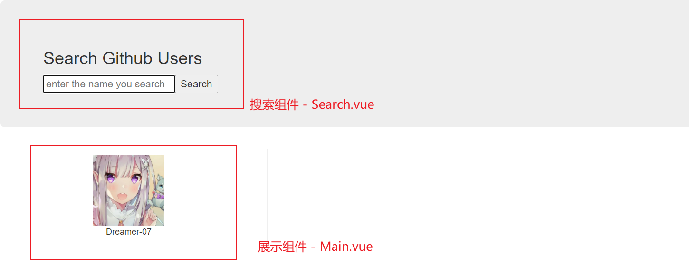

2. 在 `public/` 中导入 `bootstrap.css` 后引入到 index.html 中

3. 在 `src/` components 下编写组件

4. Search.vue

   ```vue
   <template>
       <section class="jumbotron">
         <h3 class="jumbotron-heading">Search Github Users</h3>
         <div>
           <input type="text" placeholder="enter the name you search" v-model="searchName"/>
           <button @click="search">Search</button>
         </div>
       </section> 
   </template>
   
   <script lang="ts">
       import PubSub from 'pubsub-js'
       export default {
         data () {
           return {
             searchName: ''
           }
         },
         methods: {
           search () {
             const searchName  = (this as any).searchName.trim();
             if(searchName){
               // 发布消息
               PubSub.publish('search',(this as any).searchName)
             }
           }
         }
       }
   </script>
   ```

   **使用 PubSub 进行组件通信**

5. Main.vue

   ```vue
   <template>
       <h2 v-if="firstView">请输入用户名</h2>    
       <h2 v-if="loading">Loading...</h2>
       <h2 v-if="errorMsg">{{errorMsg}}</h2>
       <div class="row">
         <div class="card" v-for="(user,index) in userList" :key="index">
           <a :href="user.url" target="_blank">
             
           </a>
           <p class="card-text">{{user.name}}</p>
         </div>
       </div>
   </template>
   
   <script lang="ts">
       import PubSub from 'pubsub-js'
       import axios from 'axios'
       export default {
           data () {
               return {
                   firstView: true,
                   loading: false,
                   userList: null,
                   errorMsg: ''
               }
           },
           mounted() {
             // 订阅消息
             PubSub.subscribe('search',(msg: string,searchName: string) => {
               const that = (this as any)
               const URL = `https://api.github.com/search/users?q=${searchName}`
               // 更新状态
               that.firstView = false;
               that.loading = true;
               that.userList = null;
               that.errorMsg = '';
               // 发送 Ajax 请求
               axios.get(URL)
               // 响应成功
               .then(response => {
                 that.loading = false;
                 const result = response.data;
                 that.userList = result.items.map((item: any) => ({
                   //  user.url: 用户主页地址
                   url: item.html_url,
                   //  user.img_url: 用户头像图片地址
                   imgUrl: item.avatar_url!,
                   //  user.name: 用户名
                   name: item.login
                 }))
               // 响应失败
               }).catch(error => {
                 that.loading = false;
                 that.errorMsg = error.message;
               })
             });
           },
       }
   </script>
   
   <style>
       .card {
       float: left;
       width: 33.333%;
       padding: .75rem;
       margin-bottom: 2rem;
       border: 1px solid #efefef;
       text-align: center;
       }
   
       .card > img {
       margin-bottom: .75rem;
       border-radius: 100px;
       }
   
       .card-text {
       font-size: 85%;
       }
   </style>
   ```

   箭头函数的返回值如果是一个**对象**，需要在外层加上 ()

   使用 `axios` 进行 Ajax 请求

6. App.vue

   ```vue
   <template>
     <div class="container">
       <Search />
       <user-main />
     </div>
   </template>
   
   <script lang="ts">
     import Search from './components/Search.vue'
     import Main from './components/Main.vue'
     export default {
       components: {
         Search,
         UserMain: Main
       }
     }
   </script>
   ```

   如果组件标签和 HTML 标签重名，就需要额外指定，类型为对于的组件即可

# 第四章 vue-UI 组件库

## 4.1 常用的 UI 库

1. Mint UI
   - 饿了么开源的基于 Vue2.x 开发的 **移动端** UI 组件
   - 官方文档：http://mint-ui.github.io/docs/#/zh-cn2
2. Elment
   - 饿了么开源的基于 Vue3.x 开发的 **PC 端** UI 组件
   - 官方文档：https://element.eleme.cn/#/zh-CN
3. 更多可以参考: https://segmentfault.com/a/1190000021876315

## 4.2 Mint UI

> 可以使用 vue2.x 的版本，目前许多 UI 库还不能兼容 vue3.x

1.  `npm i mint-ui -S` 安装 mint-ui

2. `npm i -D babel-plugin-component`  安装这个插件完成 **按需加载**

3. 修改 **babel.config.js** 文件

   ```js
   module.exports = {
       presets: [
           '@vue/cli-plugin-babel/preset'
       ],
       plugins: [
           [
               "component",
               {
                   "libraryName": "mint-ui",
                   "style": true
               },
               "mint-ui"
           ]
       ]
   }
   ```

4. 如果是移动端,需要修改 index.html 

   ```html
   <!-- 适配手机屏幕 -->
   <meta name="viewport" content="width=device-width, initial-scale=1, maximum-scale=1, minimum-scale=1, user-scalable=no" /> 
   <!-- 解决移动端点击异常 -->
   <script src="https://as.alipayobjects.com/g/component/fastclick/1.0.6/fastclick.js"></script>
   <script> 
       if ('addEventListener' in document) { 	
           document.addEventListener('DOMContentLoaded', function() { 
               FastClick.attach(document.body); 
           }, false); 
       }if(!window.Promise) {
           document.writeln('<script src="https://as.alipayobjects.com/g/component/es6-promise/3.2.2/es6-promise.min.js" '+'>'+'<'+'/'+'script>'); 
       } 
   </script>
   ```

5.  在 **mian.ts** 中引入 mint-ui 組件

    ```typescript
    // 引入 UI 组件
    import { Button } from 'mint-ui'
    // 注册成全局标签，第一个参数为标签名，建议使用自带的 组件.name; 第二个参数为对应的组件
    Vue.component(Button.name,Button)
    ```

6.  在 **App.vue** 中使用对应的 UI 组件

    ```vue
    <template>
      <div id="app">
        <mt-button type="default">default</mt-button>
      </div>
    </template>
    ```

7.  运行项目，查看效果

    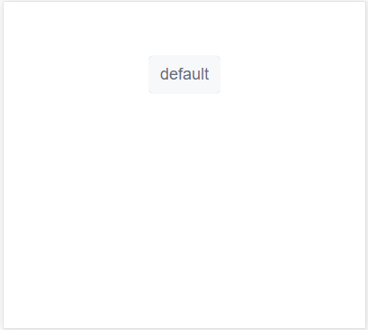

8.  添加对应的事件监听

    建议加上 `.native` 修饰符，代表使用 **原生的 JS 事件**，而不是 vue 包装的

    对于**非标签组件**，建议在组件中局部注册

    ```vue
    <template>
    	<div id="app">
        	<mt-button type="default" @click.native="testToast">default</mt-button>
        </div>
    </template>
    
    <script lang="ts">
        import { Component, Vue } from 'vue-property-decorator';
        // 导入使用的 非标签组件
        import { Toast } from 'mint-ui'
        export default {
            methods: {
                testToast() {
                    Toast('巴御前天下第一!!');
                }
            }
        }
    </script>
    ```

9.  测试

    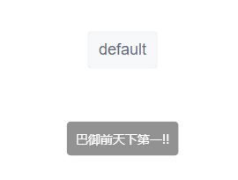

## 4.3 Element UI

1. `npm i -S element-ui` 安装

2. 在 **mian.ts** 中完成引入

   ```typescript
   // 引入 ElementUI 的全部組件
   import ElementUI from 'element-ui'
   // 还需要单独的引入样式文件
   import 'element-ui/lib/theme-chalk/index.css'
   // 注册插件
   Vue.use(ElementUI)
   
   // 引入部分组件
   import {Button , Select} from 'element-ui'
   // 注册全局组件
   Vue.component(Button.name,Button);
   Vue.component(Select.name,Select)
   ```

3. 安装 `abel-plugin-component` 配置 **按需引入**(安装方式和 mint-ui 一样)

4. 修改 babel.config.js

   ```js
   {
     "presets": [["es2015", { "modules": false }]],
     "plugins": [
       [
         "component",
         {
           "libraryName": "element-ui",
           "styleLibraryName": "theme-chalk"
         }
       ]
     ]
   }
   ```

5. 参考官方文档在组件中使用即可

# 第五章 vue-Router

> 使用 vue3.x 和 vue-router 4.x

## 5.1 基本説明

1. **SPA 应用**：单页应用，一共应用中只有一个真实页面。

   浏览器一开始会加载必需的HTML、CSS和JavaScript，之后所有的操作都在这张页面上完成，这一切都由JavaScript来控制。

3. 路由链接：点击时不会向后台发起请求，而是加载对应的 **路由组件**，由对应的组件完成各自的请求

4. 路由器：管理路由

5. 路由：一对 key 和 value

   - key 为对应的 path(路径) 

   - value 在前台中为对应的 **组件**

     ​			   后台中为 **处理请求的回调函数**

6. vue - router 文档：https://router.vuejs.org/zh/installation.html

7. **注意：** 如果使用的是 vue3.x ，需要使用 vue-router / vuex 时需要安装相应的 `alpha` 版本

   参考博客：https://zhuanlan.zhihu.com/p/138444490

## 5.2 相关的 API 说明

1. 使用 vue-cli 创建项目时可以使用自带的 vue-router，也可以自己进行配置

2. 修改 `package.json` 的 dependencies 项

   ```json
   "dependencies": {
       ...
       "vue-router": "^4.0.0-0" //主要是这个
   }
   ```

   输入 `npm install` 安装相应的依赖

3. 配置路由

   ```typescript
   const routes = [
       // 配置一般路由
       {
           path: '路由链接',
           component: 路由组件
       },
       // 配置自动跳转路由
       {
           path: '/',
           redirect: '路由链接'
       }
   ]
   ```

4. 配置路由器

   ```typescript
   // 配置路由器
   const router = createRouter({ // 路由器配置对象
       history: createWebHistory(), //createWebHistory - 可以设置路由的 history 模式
       routes // 路由配置对象
   })
   ```

   

## 5.3 基本路由

**说明**

- 对于 **路由组件** 通常放在 `src/views` 文件夹下
- 对于 **路由配置** 通常放在 `src/router` 文件夹下
- 对于 **非路由组件** 通常放在 `src/components` 文件夹下

**使用**

1. 在 views 下创建路由组件

2. 在 router 下创建 `index.ts` 文件

   ```typescript
   /* 导入 vue-router
       1. createRouter - 负责创建路由器
       2. createWebHistory - 可以设置路由的 history 模式
   */
   import { createRouter , createWebHistory } from "vue-router"
   
   // 导入需要使用的 路由组件
   import About from '../views/About.vue'
   import Home from '../views/Home.vue'
   
   // 配置路由
   const routes = [
       // 配置一般路由
       {
           path: '/home',
           component: Home
       },
       {
           path: '/about',
           component: About
       },
       // 配置自动跳转路由
       {
           path: '/',
           redirect: Home
       }
   ]
   
   // 配置路由器
   const router = createRouter({
       history: createWebHistory(),
       routes
   })
   
   export default router
   ```

3. 在 `mian.ts` 中导入并注册插件

   ```typescript
   import { createApp } from 'vue'
   import App from './App.vue'
   import router from './router'
   
   createApp(App).use(router).mount('#app')
   ```

4. 在 `App.vue` 中使用路由标签

   ```vue
   <template>
     
     <header>
       <!-- 定义路由链接 -->
       <router-link to="/home"> home </router-link>
       <br />
       <router-link to="/about"> About </router-link>
     </header>
     <!-- 用来显示当前路由组件的页面 -->
     <router-view></router-view>
   </template>
   ```

5. 可以先运行项目，查看切换路由时，对应路由链接的 `class` 类名变化

   被选中的路由链接会添加类名 `router-link-active`,配置相应的样式

6. 可以在配置路由器时修改

   ```typescript
   // 配置路由器
   const router = createRouter({
       history: createWebHistory(),
       routes,
       linkActiveClass: 'router-link-active'
   })
   ```

7. 启动，查看运行效果

## 5.4 嵌套路由

> 在路由内使用路由

1. 设计路由组件 News & Messages

   优化 v-for

   ```vue
   <template>
       <ul>
           <!-- 优化 v-for
                   1. 如果遍历时不使用第二个参数(索引)，可以直接去除()
                   2. 如果遍历的数据本身具有标识符，建议 :key 使用其
           -->
           <li v-for="message in messages" :key="message.id">
               <a href="">{{message.title}}</a>
           </li>
       </ul>
   </template>
   ....
   ```

2. 注册路由

   1. 在对应的父路由组件中添加 `children` 配置项

   2. ```typescript
      ....;
      
      import News from '../views/News.vue'
      import Messages from '../views/Messages.vue'
      
      // 配置路由
      const routes = [
          // 配置一般路由
          {
              path: '/home',
              component: Home,
              children: [
                  // 配置子路由
                  {
                      // path: '/news', //任何情况下，/ 都代表根路径
                      path: '/home/news', //可以直接配置绝对路径 
                      component: News
                  },
                  {
                      path: 'messages', //也可以配置相对路径(参考父路由组件路径)
                      component: Messages
                  }
              ]
          },
          ...
      ]
      
      ```

3. 在父路由组件中使用路由标签

## 5.5 向路由组件传递数据

### 方式一：路由路径携带数据参数(params/query)

> params：通过请求地址携带数据
>
> query：通过配置请求参数携带数据

1. 配置路由

   ```typescript
   {
       path: 'messages', // 也可以配置相对路径(参考父路由组件路径)
           component: Messages,
               children: [
                   {
                       // 对于路径上不确定的值，可以使用 :占位符 用来匹配任意的值
                       path: '/home/messages/detail/:id',
                       // path: '/home/messages/detail',
                       component: MessageDetail
                   }
               ]
   }
   ```

2. 定义路由链接

   ```vue
   <ul>
       <!-- 优化 v-for
       	1. 如果遍历时不使用第二个参数(索引)，可以直接去除()
       	2. 如果遍历的数据本身具有标识符，建议 :key 使用其
       -->
       <li v-for="message in messages" :key="message.id">
           <!-- 使用 `` 定义动态的链接，通过路径参数传递数据 -->
           <router-link :to="`/home/messages/detail/${message.id}`">
           <!-- <router-link :to="`/home/messages/detail?id=${message.id}`"> -->
               {{message.title}}
           </router-link>
       </li> 
   </ul>
   <hr />
   <router-view />
   ```

3. 可以通过在 `devtools` 中查看路由组件 `$route` 数据属性，该属性代表当前路由

   (通过控制台也可以查看基本信息)
   
   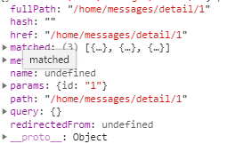
   
4. 在路由组件中通过 `$route.(params / query).key` 访问数据

   key 为指定的 路径占位符/参数名；获取的 value 是 `string` 类型的
   
5. 注意

   - 路由组件中可以通过监听 `$route` 属性，及时更新数据
   - 路由组件应该在 **mounted** 时，初始化页面信息；如果不设置可能会导致用户通过网址访问时会导致路由数据显示不正确

### 方式二：\<router-view> 属性携带数据参数

- 路由组件通过 **props** 属性接收(和组件间通信一致)

- ```html
  <!-- 通过 router-view 传递路由数据 -->
  <router-view msg="巴御前天下第一！！"></router-view>
  ```

## 5.6 缓存路由组件

**说明**

1. 默认情况下，切换路由组件时，被切换的路由组件对象就会死亡释放，再次切换回来时是重新创建的
2. 对于用户的某些的数据(例如搜索框的数据等)，可以进行缓存**路由组件对象**，提高用户体验
3. 仅适用于 **实时性低** 的应用
4. **vue2.x 和 vue3.x 的使用方法不太相同**

**使用**

> 参考：https://blog.csdn.net/m0_46309087/article/details/109403655

1. 在 \<router-view /> 标签中添加 \<keep-alive> 标签

2. 指定其属性 `include` 为缓存的路由组件名

   ```html
   <!-- 用来显示当前路由组件的页面 -->
   <router-view msg="巴御前天下第一！！" v-slot="{ Component }">
       <!-- 可以通过 keep-alive 标签缓存路由组件对象 -->
       <keep-alive include="about,home">
           <component class="view" :is="Component" />
       </keep-alive>
   </router-view>
   ```

3. 在对应的路由组件中配置暴露对象时，指定 `name` 属性值

   ```typescript
   export default {
       name: 'about',
       props: {
           msg: String
       }
   }
   ```

4. **对于 component 标签会在后面学习，这里先用**

## 5.7 编程式路由导航

> 编程式：这里指通过 JS 完成路由链接的跳转

### 1) SPA 单页应用

- 只通过一个 html 文件，显示整个网站的所有内容
- 页面交互**无刷新** & 页面跳转 **无刷新**
- 实现技术：前后端分离(Ajax&Json) + 前端路由(更新视图但不重新请求页面)
- 前端路由的实现原理：**匹配不同的 url 路径**，进行解析，加载不同的组件后动态的渲染 html 页面的内容
- vue-router 默认是 `hash` 模式，另一种就是 `history `

### 2) 两种模式

1. **hash - H5之前**

   - 只改变 # 后面的 url 片段(即 hash 值)。hash 值的变化，**并不会导致游览器向服务器发出请求**

     同时每改变一次 # 后的部分，都会在游览器的访问历史中增加一个记录

   - 每次 hash 值的变化，都会触发 `hashchange` 事件，可以通过监听其来实现更新页面部分的操作

   - hash 模式的工作原理就是 `hashchange` 事件，可以在 window 监听 hash 的变化

     ```typescript
     window.onhashchange = function (event: {}) {
         /* 
         HashChangeEvent {oldURL: "http://localhost:8080/#/home/news", newURL: "http://localhost:8080/#/home/about",....}
         该对象包含了 oldURL(跳转前的页面) 和 newURL(跳转后的页面) 属性
         */
         console.log(event);
         /* 当前游览器地址，包含了 hash 值 */
         console.log(location);
         /* hash 值：地址中 # 后面的数据(包括 #) */
         console.log(location.hash);
     }
     ```

2. **history - H5之后**

   - hash 只能更改 # 后面的 url 片段，而 history api 则给前端完全的自由(可以自由的修改 path)

   - 可以丢掉丑陋的 #，同样在页面跳转时无需重新加载页面，也不会向服务端发送请求

   - 但这种模式还需要**后台配置支持**，由于应用是单页客户端应用，如果后台没有正确的配置，当用户在游览器访问 URL 时就会出现 404；需要服务端增加一个覆盖所有情况的候选资源，在 URL 匹配不到任何静态资源时，返回一个 `index.html` 页面

     注意：**刷新**和**首次访问**还是向服务端发送请求的

### 3) $router

> 组件的配置对象(Vm实例)中的属性，可以通过 this 访问
>
> $route：表示当前路由对象；$router：表示当前路由器对象

- `this.$router.push(path)` 相当于点击路由链接(仍可以返回当前路由)
- `this.$router.replace(path)` 用新路由替换当前路由(不可以返回当前路由)
- `this.$router.back()`请求返回上一个路由
- `this.$router.go(num)`请求 前进(+)/返回(-) 个路由

****

# 第六章 Vuex

> vue3 中引入的新的概念用来替换 Vuex，参考博客：https://zhuanlan.zhihu.com/p/114783130

## 6.1 理解

> 建议参考 demo 的第一部分

**vuex是什么**

- 官方中文文档：https://vuex.vuejs.org/zh/
- 为 vue 应用中的**多个组件的共享状态**进行**集中式**的管理(读/写)

**vue应用: 状态自管理应用**

- 图示

  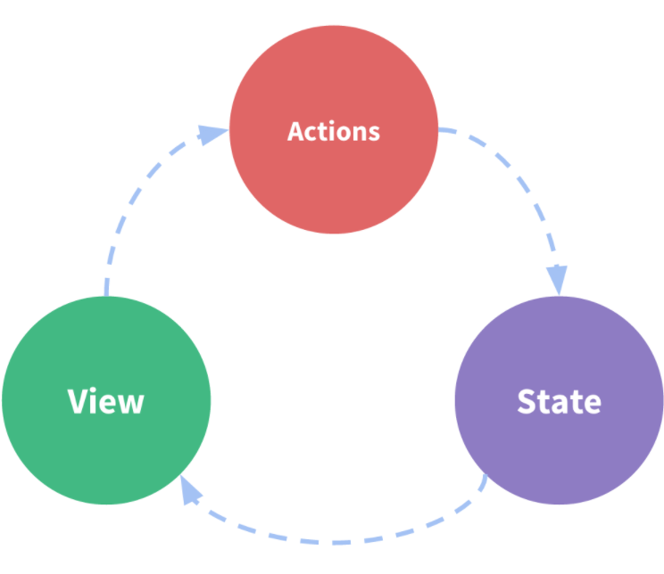

- 说明 - 单向数据流

  1. `state` 相当于data，是驱动应用的数据源
  2. `view` 以声明方式(按照指定的代码语法编写)将 `state` 映射到视图
  3. `actions` 负责响应 view 所需要状态更新(包含 n 个更新状态的方法)

**多组件共享状态的问题**

1. 多个视图依赖于同一状态(state)
2. 来自不同视图的行为需要变更同一状态
3. 之前的解决方法
   1. 将数据以及操作数据的行为都定义在父组件中
   2. 将数据以及操作数据的行为传递给需要的各个子组件(有可能需要多级传递)
   3. 这种解决方法只适用于简单应用，不适用于复杂应用(维护性太低)
4. **vuex 就是来解决这个问题的**

## 6.2 核心概念 & API

### 1) state

1. vuex 管理的状态对象(Vm 对象中的 data)
2. 具有 **唯一性**

### 2) mutations

1. 包含多个直接更新 state 的方法(回调函数)的对象

2. 由 action 中通过 `commit(mutation 名称)` 触发调用

3. 只能包含同步代码，不能包含写异步代码

   ```typescript
   const mutations = {
   	byq(state,{data}){
           //更新 state 的某个属性
       }
   }
   ```

### 3) actions

1. 包含多个接收组件通信触发 mutation 调用间接更新 state 的方法的对象

2. 通过 `commit(mutation 名称)` 调用指定的回调函数，简介更新 state

3. 由 component 的 `$store.dispatch('action 名称')` 触发调用

   如果传递的数据有多个，使用 {} 封装成对象即可

4. 可以包含异步代码

   ```typescript
   const actions = {
       bxdy ({commit,state},{data1}) {
       	commit(data1,{data1})
       }
   }
   ```

### 4) getters

1. 包含多个 getter 计算属性的对象
2. 由组件通过 `$store.getters.xxx` 获取指定的计算属性值

### 5) modules

1. 包含多个 module
2. 一个 module 是一个 store 的配置对象
3. 与一个组件(包含共享数据)对应

### 6) 向外暴露 store 对象

```typescript
// 导入需要使用的函数：createStore() 创建 Store 对象
import { createStore } from 'vuex'

// 导入 / 定义需要使用的模块(属性)
const state = {};
const actions = {};
const mutations = {};
const getters = {};

// 导入创建的 Store 对象
export default createStore({
  state, // 状态对象
  actions, // 包含多个接收组件通信触发 mutation 调用间接更新 state 的方法的对象
  mutations, // 包含多个更新 state 回调函数的对象
  getters, // 包含多个 getter 计算属性的对象
})
```

### 7) 组件中使用 

1. 可以在组件中使用 vuex 的辅助函数 `mapState、mapGetters、mapActions` 

2. ```typescript
   /* 
     导入 vuex 辅助函数
       导入的 mapXxxx 函数都是返回一个对象，对象中具有指定的数据属性
         - 如果不需要定义局部的属性，可以直接将其赋值给对应的属性
         - 如果需要定义局部的属性，就需要使用 ...(对象/数组 展开运算符) 将对象的属性展开保存到当前对应的对象
   */
   import { mapState,mapGetters,mapActions } from 'vuex'
   export default {
       // 不要使用 data，因为不会得到数据，而是得到函数对象的字符串
       // 需要定义局部的属性，使用 ... 将 map辅助函数的返回结果 => computed
       computed : { 
           // 当映射的属性名和 store 中定义的相同时，可以直接传入一个字符串数组
           ...mapState(['count']),
           // 当映射的属性名和 store 中定义的不同时，就需要传入一个对象
           ...mapGetters({
               // 映射的属性名: store 中定义的
               evenOrOdd2: 'evenOrOdd'
           },),
           local () {
               return '局部变量';
           }
       },
       // 如果不需要定义局部的属性，直接将 map辅助函数的返回结果 => methods
       methods: mapActions(['increment','decrement','incrementIfOdd',"incrementAsync"]),
   }
   ```

   

### 8) 映射 store

```typescript
import { createApp } from 'vue'
import App from './App.vue'
import store from './store'

createApp(App).use(store).mount('#app')
```

### 9) store 对象

1. 所有用 vuex 管理的组件都会多一个属性 `$store`，它就是一个 store 对象
2. 属性
   - state: 可以获取注册的 state 对象
   - getters: 可以获取注册的 getters 对象
3. 方法
   - dispatch(actionName,data)：分发调用 action

## demo1: 计数器

### 1) 不使用 Vuex

1. 完成如下效果

   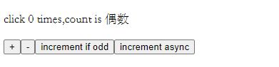

2. App.vue

   ```vue
   <template>
     <main>
       <p>click {{count}} times,count is {{evenOrOdd}}</p>
       <div>
         <button @click="increment">+</button>
         <button @click="decrement">-</button>
         <button @click="incrementIfOdd">increment if odd</button>
         <button @click="incrementAsync">increment async</button>
       </div>
     </main>
   </template>
   
   <script lang="ts">
     export default {
       data () {
         return {
           count: 0
         }
       },
       computed : {
         evenOrOdd () {
           return (this as any).count % 2 === 0 ? '偶数' : '奇数';
         }
       },
       methods: {
         increment () {
           (this as any).count++;
         },
         decrement () {
           (this as any).count--;
         },
         incrementIfOdd () {
           (this as any).count % 2 === 0 ? (this as any).count++ : '';
         },
         incrementAsync () {
           setTimeout(() => {
             (this as any).count++;
           }, 1000);
         },
       },
     }
   </script>
   ```

### 2) 使用 vuex

1. 安装 vuex4.0

   可以在使用 vue-cli 创建项目时选择 vuex

   1. 在项目的 package.json 文件的 dependencies 中添加一行 **"vuex": "^4.0.0"**
   2. 切换到命令行, 使用 `npm i ` 安装相关依赖

2. 规范

   - 应用层级的状态应该集中到单个 store 对象中。
   - 提交 **mutation** 是更改状态的唯一方法，并且这个过程是同步的。
   - 异步逻辑都应该封装到 **action** 里面。

   只要你遵守以上规则，如何组织代码随你便。如果你的 store 文件太大，只需将 action、mutation 和 getter 分割到单独的文件。

   (大型项目结构示例)

   ```
   ├── index.html
   ├── main.js
   ├── api
   │   └── ... # 抽取出API请求
   ├── components
   │   ├── App.vue
   │   └── ...
   └── store
       ├── index.js          # 我们组装模块并导出 store 的地方
       ├── actions.js        # 根级别的 action
       ├── mutations.js      # 根级别的 mutation
       └── modules
       	├── ... 模块
   ```

3. 根据 **核心概念 & API** 中的第六项和第八项分别配置 `store/index.ts` 和 `main.ts`

4. 由于是在 main.ts 中注册的 vuex，所以所有的组件都可以使用 `$store` 访问 Store 对象

5. 修改 App.vue 和 store/index.ts

   1. 将需要的 **data** 数据和 **computed** 计算属性数据保存为 Store 对象的 `state `和 `getters `属性

      ```typescript
      // 状态对象
      const state = {
        // 初始化出局
        count: 0
      
      // 包含多个 getter 计算属性的对象
      const getters = {
        // 定义 getter 计算属性
        evenOrOdd (state: {count: number}) {
          return state.count % 2 === 0 ? '偶数' : '奇数'
        }
      };
      ```

   2. 在组件中通过 `$store.state/getters.xxx` 访问它们

   3. 修改 **methods** 中的事件回调函数的具体逻辑为`使用 this.$store.dispatch()分发相应的 action`

      ```typescript
      export default {
          methods: {
              increment () {
                  // 通过 $store.dispatch 分发 action
                  (this as any).$store.dispatch('increment')
              },
              decrement () {
                  // 通过 $store.dispatch 分发 action
                  (this as any).$store.dispatch('decrement')
              },
              incrementIfOdd () {
                  // 通过 $store.dispatch 分发 action
                  (this as any).$store.dispatch('incrementIfOdd')
              },
              incrementAsync () {
                  // 通过 $store.dispatch 分发 action
                  (this as any).$store.dispatch('incrementAsync')
              },
          },
      }
      ```

   4. 定义响应的 `action`，负责处理事件回调以及`调用 mutation 更新 state`

      ```typescript
      // 包含多个事件回调函数的对象 
      const actions = {
          // 定义事件回调函数 - action
          increment ( { commit }: any ) {
              // 调用对应的更新事件(回调函数)更新state
              commit('addCount');
          },
          decrement ({ commit }: any) {
              commit('reduceCount');
          },
          incrementIfOdd ( { commit , state }: any ) {
              if(state.count % 2 === 0){
                  // 如果符合条件判断就执行相应的更新函数
                  commit('addCount');
              }
          },
          incrementAsync ({ commit }: any) {
              setTimeout(() => {
                  commit('addCount');
              }, 1000);
          }
      };
      ```

   5. 定义更新 `state` 的 `mutataion`

      ```typescript
      // 包含多个更新 state 回调函数的对象
      const mutations = {
        addCount ( state: {count: number} ) {
          state.count++;
        },
        reduceCount ( state: {count: number} ) {
          state.count--;
        }
      };
      ```

### 3) 使用 vuex(优化)

> 使用 Vuex 的辅助函数 mapState、mapGetters、mapActions 简化代码

```typescript
/* 
  导入 vuex 辅助函数
    导入的 mapXxxx 函数都是返回一个对象，对象中具有指定的数据属性
      - 如果不需要定义局部的属性，可以直接将其赋值给对应的属性
      - 如果需要定义局部的属性，就需要使用 ...(对象/数组 展开运算符) 将对象的属性展开保存到当前对应的对象
*/
import { mapState,mapGetters,mapActions } from 'vuex'
export default {
    // 不要使用 data，因为不会得到数据，而是得到函数对象的字符串
    // 需要定义局部的属性，使用 ... 将 map辅助函数的返回结果 => computed
    computed : { 
        // 当映射的属性名和 store 中定义的相同时，可以直接传入一个字符串数组
        ...mapState(['count']),
        // 当映射的属性名和 store 中定义的不同时，就需要传入一个对象
        ...mapGetters({
            // 映射的属性名: store 中定义的
            evenOrOdd2: 'evenOrOdd'
        },),
        local () {
            return '局部变量';
        }
    },
    // 如果不需要定义局部的属性，直接将 map辅助函数的返回结果 => methods
    methods: mapActions(['increment','decrement','incrementIfOdd',"incrementAsync"]),
}
```

**注意看注解**

## 6.4 结构分析

**官方图示**

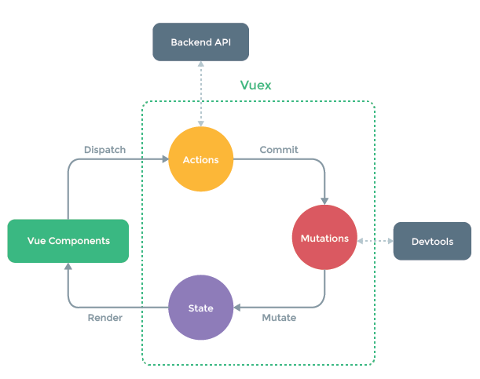

1. Vuex 辅助管理 state、actions、mutations 三个部分
2. Vue Components 依然依赖与 state 作为数据源
3. Vue Components 依然通过 Actions 的方法更新 State；但 Actions **不会直接更新** State，而是通过 Mutations 间接更新

**完整版 - 学习后再看**

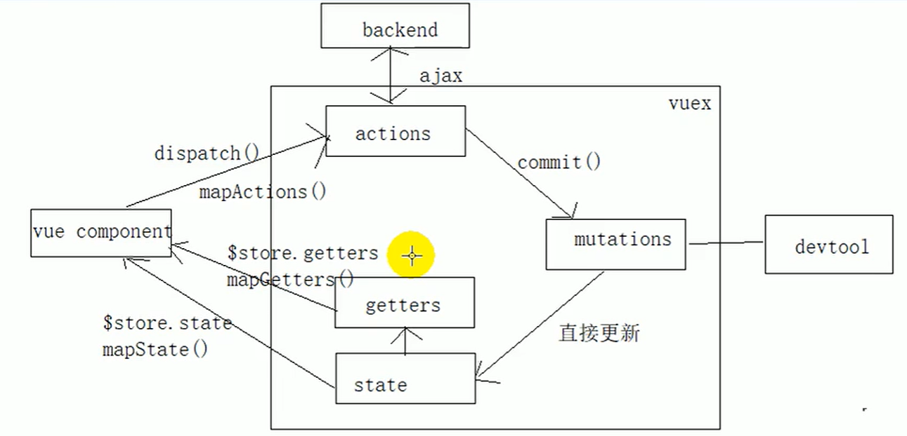


# 第七章 Vue 源码分析

> 基于 Vue2.x

## 7.1 说明

1. 不是直接分析 vue 的源码
2. 而是分析 vue 作为一个 mvvm 框架的基本实现原理
   - 数据代理
   - 模板解析
   - 数据绑定
3. 可以剖析某大佬在 github 上访 vue 实现的 mvvm 库：https://github.com/DMQ/mvvm

## 7.2 准备知识

1. Array.prototype.slice.call(arr)

   - 作用：将伪数组转换为真数组

   - 说明

     1. slice([begin,end]): 返回一个新的数组对象，这一对象是一个由 begin 和 end 决定的原数组的**浅拷贝**（包括 begin，不包括end）。原始数组不会被改变。

        **浅拷贝：只拷贝指针，不拷贝对象本身**

     2. call(): 将一个函数作为指定对象的方法执行

     3. **this 只能在函数执行时确定，而不是函数定义(箭头函数除外)**

   - 代码

     ```javascript
     // 得到一个伪数组(具有下标和length属性)
     const lis = document.getElementsByTagName('li'); 
     console.log(lis instanceof Array,lis.filter); // false undefined
     // ES6 中的语法
     const lis2 = Array.from(lis);
     console.log(lis2 instanceof Array,lis2.filter); // true function...
     // ES5 的语法
     const li3 = Array.prototype.slice.call(lis); 
     console.log(li3 instanceof Array,li3.filter); // true function...
     ```

2. node.nodeType

   - 作用：得到节点类型

   - 说明

     1. 最大的 node 节点类型：`document(HTML 文档对象)`
     2. 常见的节点类型：`Element(元素)、Attr(属性)、Text(文本)`
     3. 该属性得到的对应的节点类型的 **数字**

        PS：在自己写代码的时候很少用上，写库的时候就要视情况使用

   - ```javascript
     // 元素节点
     const elementNode = document.getElementById("test");
     // 属性节点
     const AttrNode = elementNode.getAttributeNode('id');
     // 文本节点
     const textNode = elementNode.firstChild;
     console.log(elementNode.nodeType,AttrNode.nodeType,textNode.nodeType); //1 2 3
     ```

3. Object.defineProperty(obj,propertyName,{})

   - 作用：给对象添加属性(指定描述符)

   - 说明

     1. 属性描述符：一个对象，可以让我们精确的添加/修改另一个对象的属性。

        通常将该对象的属性分为两种类型：1.  数据描述符  2. 访问描述符

        这两种类型所能定义的属性会有所不同

     2. 可选属性

        - `configurable`: 是否可以重新定义，默认值是 false
        - `enumerable`: 是否可以枚举，默认值是 false
        - `value`: 初始值，默认值是 undefined
        - `writable`: 是否可以修改属性值，默认值时 false
        - `get`: 回调函数，可以根据其他相关的属性动态计算得到当前属性的值
        - `set`: 回调函数，监视当前的属性，可以更新其他相关的属性值

     3. 数据描述符：

        - 可以定义 `configurable、enumerable、value、writeable` 属性

     4. 访问描述符：

        - 可以定义 `configurable、enumerable、get、set` 属性

        PS：由于该语法属于 ES5 的内容，不兼容 IE8 ，间接导致了 Vue 不兼容 IE8

   - 代码

     ```javascript
     const obj = {
         firstName: 'Stephen',
         lastName: 'Curry'
     }
     // 定义一个 fullName 属性,实现和 firstName & lastName 的双向绑定
     Object.defineProperty(obj , 'fullName' , {
         // 定义属性描述符对象
         // 访问描述符
         get () {
             return this.firstName + " " + this.lastName
         },
         set (newName) {
             const names = newName.split(' ');
             this.firstName = names[0];
             this.lastName = names[1];
         }
     })
     // --- 可以发现 fullName 并不会显示，因为其访问描述符 enumerable 为 false(不可被枚举)
     console.log(obj); // {firstName: "Stephen", lastName: "Curry"}
     obj.fullName = '巴 御前';
     console.log(obj); // {firstName: "巴", lastName: "御前"}
     
     // --- Cannot redefine property fullName 不可以重新定义 fullName 属性，因为其数据描述符 configurable 为 false
     // Object.defineProperty(obj , 'fullName' , { configurable: true })
     ```

4. Object.keys(obj)

   - 作用：得到对象自身可枚举属性名组成的数组

   - 代码

     ```javascript
     const keys = Object.keys(obj);
     console.log(keys); // ["firstName", "lastName"]
     ```

5. obj.hasOwnProperty(propName)

   - 作用：判断对应的 prop 是否是obj**自身**的属性

   - 代码

     ```javascript
     console.log(obj.hasOwnProperty('fullName') , obj.hasOwnProperty('toString')); // true false
     ```

6. DocumentFragment

   - 作用：文档碎片(高效批量更新多个节点)

   - 说明：

     1. 和 `document` 的区分
        - `document`：对应整个显示的 HTML 页面，包含了 n 个 element 元素节点，一旦更新了其中的一个。就会再更新整个页面
        - `documentFragment`：内存中保存了 n 个 element 元素节点的容器对象(不与界面相关联)，如果更新其中的某个元素节点，界面也不会更新
     2. 使用
        1. 创建一个 fragment 对象
        2. 将需要操作的 element 保存到 fragment 中
        3. 更新 fragment 鸿的 element
        4. 将 fragment 插入到页面中

   - 代码

     ```javascript
     // 6.1 创建一个 fragment 对象
     const fragment = document.createDocumentFragment();
     /* 6.2 将需要操作的 element 保存到 fragment 中 
           - 由于一个子节点只能有一个父节点，所以当父节点改变时，子节点会不存在于原来的父节点中
       */
     const ul = document.getElementById('fragment_test');
     let child;
     // 得到 ul 的第一个子节点(标签元素，文本...)
     while(child = ul.firstChild){
         fragment.appendChild(child); //这里会将 child 添加到 fragment 中，并从 ul 节点中移除
     }
     // 6.3 更新 fragment 中的节点元素
     // 如果需要使用 forEach() 遍历的话需要转换成真数组
     Array.prototype.slice.call(fragment.childNodes).forEach(node => {
         if(node.nodeType === 1){
             node.innerHTML = '巴御前天下第一！！'
         }
     });
     
     // 6.4 将 fragment 插入到 ul 中
     ul.appendChild(fragment);
     ```

     PS: 可以使用 `fragment.children` 代替· `fragment.childNodes`,前者该属性获取的是所有的子元素节点，而后者是获取所有的子节点

## 7.3 数据代理

### 1) 拓展：chrome debug 调试

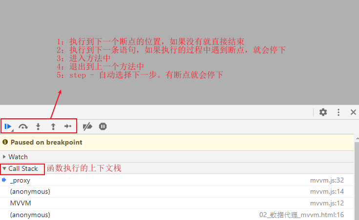

- **注意：**第五个按钮也会执行到下一条语句，但如果当前语句是**函数**就会进入到函数内部执行
- 第六个按钮可以暂时使所有断点失效

### 2) 说明

1. 数据代理：通过一个对象代理完成对另一个对象的属性的读写操作
2. vue 数据类型：通过 vm 对象来代理完成对 data 对象的所有属性操作
3. 好处：更方便操作 data 数据
4. 基本实现流程
   1. 创建 vm 对象时，遍历 data 对象所有属性，通过 `Object.defineProperty()` 该 vm 对象添加与 data 对象同属性名的属性以及对应的属性描述符
   2. 所有的属性描述符都会使用 **访问描述符(具有 get & set)**
   3. 而 get 和 set 内部都是去访问 data 对象中的属性数据

### 3) 测试代码

```html
<script type="text/javascript" src="js/mvvm/compile.js"></script>
<script type="text/javascript" src="js/mvvm/mvvm.js"></script>
<script type="text/javascript" src="js/mvvm/observer.js"></script>
<script type="text/javascript" src="js/mvvm/watcher.js"></script>
<script type="text/javascript">
    const vm = new MVVM({
        el: "#test",
        data: {
            msg: "诶嘿嘿嘿"
        }
    })
    // vm 对象代理了 data 对象属性的读取操作
    console.log(vm.msg,vm); // 诶嘿嘿嘿 Vue 
    // vm 对象代理了 data 对象属性的存取操作
    vm.msg = "巴御前天下第一"
    // 访问在内部的 data 对象 - 通过 _data 属性
    console.log(vm._data.msg,vm.msg); // 巴御前天下第一 巴御前天下第一
</script>
```

### 4) 源码分析

```javascript
// 相当于 Vue 
function MVVM(options) {
  // 保存配置对象
  this.$options = options;
  // 初始化 vm 对象的 _data 属性为配置对象中的 data 对象
  var data = this._data = this.$options.data;
  // 保存 vm 对象
  var me = this;
  // 遍历 data 对象的所有可枚举的属性名
  Object.keys(data).forEach(function (key) { // key == propName
    // 为每一个属性(名)实现代理
    me._proxy(key);
  });
  observe(data, this);
  this.$compile = new Compile(options.el || document.body, this)
}

// 原型对象
MVVM.prototype = {
  $watch: function (key, cb, options) {
    new Watcher(this, key, cb);
  },
  // 实现数据代理
  _proxy: function (key) {
    // 保存 vm 对象
    var me = this;
    // 使用 Object.defineProperty() 添加属性并指定 属性描述符
    Object.defineProperty(me, key, {
      // 访问描述符
      configurable: false, // 不可修改
      enumerable: true, // 可枚举
      get: function proxyGetter() { // 访问属性时
        // 读取data中一样对应属性值返回(实现代理读操作)
        return me._data[key];
      },
      set: function proxySetter(newVal) { // 监视属性的更新
        // 将最新的值保存到data中对应的属性上(实现代理写操作)
        me._data[key] = newVal;
      }
    });
  }
};
```

## 7.4 模板解析

### 1) 说明

#### 模板解析的基本流程

1. 将 el 的所有子节点取出，添加到一个新建的 fragment 对象中
2. 将 fragment 中所有层次子节点递归进行编译解析处理
   - 对元素节点的指令属性进行解析(事件指令解析/一般指令解析)
   - 对表达式文本节点进行解析(大括号表达式)
3. 将解析后的 fragment 添加到 el 中显示

#### 大括号表达式解析

> 运行的流程和 v-text 太大区别

1. 根据正则对象匹配到对应的大括号表达式字符串，并通过 `RegExp.$1` 获取对应的子匹配的值
2. 以子匹配的值为属性名获取 vm._data 中的属性值
3. 将属性值替换成对应节点的 textContent 属性值

#### 事件指令解析

1. 从指令名中获取事件名(`on:xxx -> xxx`)

2. 通过表达式(指令值)获取保存在 vm 的配置对象($options) 的 methods 中对应的函数

3. 给当前节点绑定对应的 DOM 事件和回调函数

   **注意：回调函数必须通过.bind(vm) 方法强制绑定 this 为 vm 对象**

4. 绑定成功后，移除对应的 `attr` 属性节点

#### 一般指令解析

1. 得到指令名和表达式(指令值)
2. 根据表达式得到在 data 中对应的值
3. 根据指令名确定需要操作的 node 的属性
   - text - textContent
   - html - innerHTML
   - class - className
4. 将表达式得到的值赋值在 node 对应的属性上
5. 移除对应的 `attr` 属性节点

### 2) 测试代码

#### 大括号表达式

```html
<div id="test">
    <p>{{}}</p>
</div>
...
<script type="text/javascript">
    new MVVM({
        el: '#test',
        data: {
            name: 'to mo e go zen'
        }
    })
</script>
```

#### 事件指令

```html
<div id="test">
    <button v-on:click="byq">测试</button>
</div>
...
<script type="text/javascript">
    new MVVM({
        el: '#test',
        data: {
            msg: '巴御前天下第一'
        },
        methods: {
            byq () {
                alert(this.msg)
            }
        }
    })
</script>
```

#### 一般指令

```html
<div id="test">
    <p v-text="msg"></p>
    <p v-html="msg"></p>
    <p v-class="myClass" class="byq">巴御前天下第一</p>
</div>

<script type="text/javascript" src="js/mvvm/compile.js"></script>
<script type="text/javascript" src="js/mvvm/mvvm.js"></script>
<script type="text/javascript" src="js/mvvm/observer.js"></script>
<script type="text/javascript" src="js/mvvm/watcher.js"></script>
<script type="text/javascript">
    new MVVM({
        el: '#test',
        data: {
            msg: '<a href="http://www.bilibili.com">哔哩哔哩动画</a>',
            myClass: 'aclass'
        }
    })
</script>
```

### 3) 源码解析

#### 大括号表达式

```javascript
/* 编译对象构造函数 */
function Compile(el, vm) {
    // 保存 vm 对象
    this.$vm = vm;
    /* 
        将 el 对应的元素对象保存
            - isElementNode()：是否为元素节点
            - 如果 el 是元素就保存，如果不是再通过 document.querySelector 查找对应元素节点
        */
    this.$el = this.isElementNode(el) ? el : document.querySelector(el);

    // 如果对应的元素节点($el)存在
    if (this.$el) {
        // 将 el 元素中的所有子节点保存的 fragment 中(2 is to)
        this.$fragment = this.node2Fragment(this.$el);
        // 初始化：编译 fragment 中所有层次子节点
        this.init();
        // 将编译后的 fragment 添加到页面的 el 元素中
        this.$el.appendChild(this.$fragment);
    }
}

Compile.prototype = {
    constructor: Compile,
    node2Fragment: function(el) {
        var fragment = document.createDocumentFragment(),
            child;

        // 将原生(子)节点拷贝到fragment
        while (child = el.firstChild) {
            fragment.appendChild(child);
        }

        // 返回
        return fragment;
    },

    init: function() {
        // 编译 this.$fragment 中所有层次的节点
        this.compileElement(this.$fragment);
    },

    compileElement: function(el) {
        // 获取 el 对象的所有子节点(这里的 el 是 fragment)
        var childNodes = el.childNodes,
            // 保存当前对象(complie 实例对象)
            me = this;
        // 遍历所有的子节点
        [].slice.call(childNodes).forEach(function(node) {
            // 获取当前节点的 textContent(获取当前节点及其所有后代文本内容)
            var text = node.textContent;
            /* 
                创建正则对象：匹配 {{xxx}}
                    - 通过 () 可以进行'子匹配'，可以额外匹配内部的值
                */
            var reg = /\{\{(.*)\}\}/;
            // 是否为元素节点
            if (me.isElementNode(node)) {
                // 编译元素节点 - 解析元素上的 Attr(指令)
                me.compile(node);
                // 是否为 文本节点 && 符合正则规则({{xxx}})
            } else if (me.isTextNode(node) && reg.test(text)) {
                /* 
                    编译大括号表达式文本节点
                        - 可以通过 RegExp 访问 $num 属性获取子匹配的数据
                    */
                me.compileText(node, RegExp.$1.trim());
            }
            // 判断当前节点是否有子节点，如果有就执行 递归调用
            if (node.childNodes && node.childNodes.length) {
                me.compileElement(node);
            }
        });
    },
   	...
    compileText: function(node, exp) {
        // {{}} 本质上和 v-text 指令没有区别，这里通过 编译工具(CompileUtil) 解析
        compileUtil.text(node, this.$vm, exp);
    },
   	...
    // 是否为元素节点
    isElementNode: function(node) {
        // 通过 nodeType 属性判断
        return node.nodeType == 1;
    },

    isTextNode: function(node) {
        return node.nodeType == 3;
    }
};

// 包含多个解析指令的方法的对象：以指令名作为对应的 key(属性名)
var compileUtil = {

    text: function(node, vm, exp) {
        this.bind(node, vm, exp, 'text');
    },

    html: function(node, vm, exp) {
        this.bind(node, vm, exp, 'html');
    },
    ...
    /**
         * 绑定数据
         * @param {*} node 节点
         * @param {*} vm vm 对象
         * @param {*} exp 数据
         * @param {*} dir 指令名
         */
    bind: function(node, vm, exp, dir) {
        // 获取对应的指令的修改器(函数)
        var updaterFn = updater[dir + 'Updater'];

        // 如果存在就执行对应的修改器(函数) - 传入对应的 node 节点和数据(通过 _getVMVal(获取))
        updaterFn && updaterFn(node, this._getVMVal(vm, exp));

        new Watcher(vm, exp, function(value, oldValue) {
            updaterFn && updaterFn(node, value, oldValue);
        });
    },

    // 从 vm 中得到表达式所对应的值
    _getVMVal: function(vm, exp) {
        // 保存 vm
        var val = vm;
        // 切割数据(这里是大括号表达式)，也就是可能存在嵌套调用 a.b.c
        exp = exp.split('.');
        // 遍历
        exp.forEach(function(k) {
            /* 
                第一次会从 vm 中获取数据，并替换 vm 保存
                如果有第二个，就会继续遍历，然后从第一个数据中获取对应的属性值
                以此循环
                */
            val = val[k];
        });
        // 返回 val
        return val;
    },
    ...
};

// 包含多个更新节点的方法的工具对象
var updater = {
    // 更新节点的 textContent 属性值
    textUpdater: function(node, value) {
        // 如果数据的类型不为 undefined 就替换当前节点的 textContent 属性
        node.textContent = typeof value == 'undefined' ? '' : value;
    },

    // 更新节点的 innetHTML 属性值
    htmlUpdater: function(node, value) {
        node.innerHTML = typeof value == 'undefined' ? '' : value;
    },

    // 更新节点的 className 属性值
    classUpdater: function(node, value, oldValue) {
        var className = node.className;
        className = className.replace(oldValue, '').replace(/\s$/, '');

        var space = className && String(value) ? ' ' : '';

        node.className = className + space + value;
    },

    // 更新节点的 value 属性值
    modelUpdater: function(node, value, oldValue) {
        node.value = typeof value == 'undefined' ? '' : value;
    }
};
```

#### 事件指令

```javascript
/* 编译对象构造函数 */
function Compile(el, vm) {
    // 保存 vm 对象
    this.$vm = vm;
    /* 
    将 el 对应的元素对象保存
        - isElementNode()：是否为元素节点
        - 如果 el 是元素就保存，如果不是再通过 document.querySelector 查找对应元素节点
    */
    this.$el = this.isElementNode(el) ? el : document.querySelector(el);

    // 如果对应的元素节点($el)存在
    if (this.$el) {
        // 将 el 元素中的所有子节点保存的 fragment 中(2 is to)
        this.$fragment = this.node2Fragment(this.$el);
        // 初始化：编译 fragment 中所有层次子节点
        this.init();
        // 将编译后的 fragment 添加到页面的 el 元素中
        this.$el.appendChild(this.$fragment);
    }
}

Compile.prototype = {
    ....

    init: function() {
        // 编译 this.$fragment 中所有层次的节点
        this.compileElement(this.$fragment);
    },

    compileElement: function(el) {
        // 获取 el 对象的所有子节点(这里的 el 是 fragment)
        var childNodes = el.childNodes,
        // 保存当前对象(complie 实例对象)
            me = this;
        // 遍历所有的子节点
        [].slice.call(childNodes).forEach(function(node) {
            // 获取当前节点的 textContent(获取当前节点及其所有后代文本内容)
            var text = node.textContent;
            /* 
            创建正则对象：匹配 {{xxx}}
                - 通过 () 可以进行'子匹配'，可以额外匹配内部的值
            */
            var reg = /\{\{(.*)\}\}/;
            // 是否为元素节点
            if (me.isElementNode(node)) {
                // 编译元素节点 - 解析元素上的 Attr(指令)
                me.compile(node);
            } 
            ...
            // 判断当前节点是否有子节点，如果有就执行 递归调用
            if (node.childNodes && node.childNodes.length) {
                me.compileElement(node);
            }
        });
    },

    // 编译对应的元素节点(解析指令)
    compile: function(node) {
        // 获取所有的属性节点
        var nodeAttrs = node.attributes,
        // 保存 this
            me = this;

        // 遍历所有的属性节点
        [].slice.call(nodeAttrs).forEach(function(attr) {
            // 获取属性名
            var attrName = attr.name;
            // 判断是否是指令属性
            if (me.isDirective(attrName)) {
                // 获取对应的属性值 - 表达式
                var exp = attr.value;
                /* 
                获取指令名(v-on:xxx -> on:xxx)
                    - substring(index[,end]): 从第 index 开始截取到 end(不包含)
                */
                var dir = attrName.substring(2);
                // 判断是否为事件指令
                if (me.isEventDirective(dir)) {
                    // 通过编译工具进行事件处理
                    compileUtil.eventHandler(node, me.$vm, exp, dir);
                    // 普通指令
                } else {
                    compileUtil[dir] && compileUtil[dir](node, me.$vm, exp);
                }

                // 删除对应的指令属性
                node.removeAttribute(attrName);
            }
        });
    },

    ....

    // 是否是指令属性 - 是否以 v- 开头
    isDirective: function(attr) {
        return attr.indexOf('v-') == 0;
    },

    // 是否是事件指令 - 是否以 on 开头
    isEventDirective: function(dir) {
        return dir.indexOf('on') === 0;
    },

    // 是否为元素节点
    isElementNode: function(node) {
        // 通过 nodeType 属性判断
        return node.nodeType == 1;
    },
    ...
};

// 包含多个解析指令的方法的对象：以指令名作为对应的 key(属性名)
var compileUtil = {
    
    ...

    // 事件处理
    eventHandler: function(node, vm, exp, dir) {
        // 获取指令名中的 事件名(on:xxx -> xxx)
        var eventType = dir.split(':')[1],
            // 通过表达式获取 vm 配置对象的 methods 对象中保存的函数
            fn = vm.$options.methods && vm.$options.methods[exp];

        // 如果事件名和对应的函数都存在
        if (eventType && fn) {
            // 为节点绑定上指定的 DOM事件回调函数(其中回调函数的 this 被强制绑定为 vm)
            node.addEventListener(eventType, fn.bind(vm), false);
        }
    },

    ...
};

...
```

#### 一般指令

```javascript
/* 编译对象构造函数 */
function Compile(el, vm) {
    ...
    if (this.$el) {
        // 将 el 元素中的所有子节点保存的 fragment 中(2 is to)
        this.$fragment = this.node2Fragment(this.$el);
        // 初始化：编译 fragment 中所有层次子节点
        this.init();
        // 将编译后的 fragment 添加到页面的 el 元素中
        this.$el.appendChild(this.$fragment);
    }
}

Compile.prototype = {
    ...

    init: function() {
        // 编译 this.$fragment 中所有层次的节点
        this.compileElement(this.$fragment);
    },

    compileElement: function(el) {
        // 获取 el 对象的所有子节点(这里的 el 是 fragment)
        var childNodes = el.childNodes,
        // 保存当前对象(complie 实例对象)
            me = this;
        // 遍历所有的子节点
        [].slice.call(childNodes).forEach(function(node) {
            // 获取当前节点的 textContent(获取当前节点及其所有后代文本内容)
            var text = node.textContent;
            /* 
            创建正则对象：匹配 {{xxx}}
                - 通过 () 可以进行'子匹配'，可以额外匹配内部的值
            */
            var reg = /\{\{(.*)\}\}/;
            // 是否为元素节点
            if (me.isElementNode(node)) {
                // 编译元素节点 - 解析元素上的 Attr(指令)
                me.compile(node);
            // 是否为 文本节点 && 符合正则规则({{xxx}})
            }
            ...
            // 判断当前节点是否有子节点，如果有就执行 递归调用
            if (node.childNodes && node.childNodes.length) {
                me.compileElement(node);
            }
        });
    },

    // 编译对应的元素节点(解析指令)
    compile: function(node) {
        // 获取所有的属性节点
        var nodeAttrs = node.attributes,
        // 保存 this
            me = this;

        // 遍历所有的属性节点
        [].slice.call(nodeAttrs).forEach(function(attr) {
            // 获取属性名
            var attrName = attr.name;
            // 判断是否是指令属性
            if (me.isDirective(attrName)) {
                // 获取对应的属性值 - 表达式
                var exp = attr.value;
                /* 
                获取指令名(v-on:xxx -> on:xxx)
                    - substring(index[,end]): 从第 index 开始截取到 end(不包含)
                */
                var dir = attrName.substring(2);
                // 判断是否为事件指令
                if (me.isEventDirective(dir)) {
                    ...
                    // 普通指令
                } else {
                    // 判断编译工具中是否有对应的处理函数，如果有就执行
                    compileUtil[dir] && compileUtil[dir](node, me.$vm, exp);
                }

                // 删除对应的指令属性
                node.removeAttribute(attrName);
            }
        });
    },

    compileText: function(node, exp) {
        // {{}} 本质上和 v-text 指令没有区别，这里通过 编译工具(CompileUtil) 解析
        compileUtil.text(node, this.$vm, exp);
    },

    // 是否是指令属性 - 是否以 v- 开头
    isDirective: function(attr) {
        return attr.indexOf('v-') == 0;
    },

    // 是否是事件指令 - 是否以 on 开头
    isEventDirective: function(dir) {
        return dir.indexOf('on') === 0;
    },

    // 是否为元素节点
    isElementNode: function(node) {
        // 通过 nodeType 属性判断
        return node.nodeType == 1;
    },

    ...
};

// 包含多个解析指令的方法的对象：以指令名作为对应的 key(属性名)
var compileUtil = {
    // 处理 v-text/{{}} 
    text: function(node, vm, exp) {
        this.bind(node, vm, exp, 'text');
    },
    // 处理 v-html
    html: function(node, vm, exp) {
        this.bind(node, vm, exp, 'html');
    },

   	...
    // 处理 v-class
    class: function(node, vm, exp) {
        this.bind(node, vm, exp, 'class');
    },

    /**
     * 绑定数据
     * @param {*} node 节点
     * @param {*} vm vm 对象
     * @param {*} exp 数据
     * @param {*} dir 指令名
     */
    bind: function(node, vm, exp, dir) {
        // 获取对应的指令的修改器(函数)
        var updaterFn = updater[dir + 'Updater'];

        // 如果存在就执行对应的修改器(函数) - 传入对应的 node 节点和数据(通过 _getVMVal(获取))
        updaterFn && updaterFn(node, this._getVMVal(vm, exp));

        new Watcher(vm, exp, function(value, oldValue) {
            updaterFn && updaterFn(node, value, oldValue);
        });
    },

    ...

    // 从 vm 中得到表达式所对应的值
    _getVMVal: function(vm, exp) {
        // 保存 vm
        var val = vm;
        // 切割数据(这里是大括号表达式)，也就是可能存在嵌套调用 a.b.c
        exp = exp.split('.');
        // 遍历
        exp.forEach(function(k) {
            /* 
            第一次会从 vm 中获取数据，并替换 vm 保存
            如果有第二个，就会继续遍历，然后从第一个数据中获取对应的属性值
            以此循环
            */
            val = val[k];
        });
        // 返回 val
        return val;
    },

    ...
};

// 包含多个更新节点的方法的工具对象
var updater = {
    // 更新节点的 textContent 属性值
    textUpdater: function(node, value) {
        // 如果数据的类型不为 undefined 就替换当前节点的 textContent 属性
        node.textContent = typeof value == 'undefined' ? '' : value;
    },

    // 更新节点的 innetHTML 属性值
    htmlUpdater: function(node, value) {
        node.innerHTML = typeof value == 'undefined' ? '' : value;
    },

    // 更新节点的 className 属性值
    classUpdater: function(node, value, oldValue) {
        // 获取 node 的静态 class 类名
        var className = node.className;
        // 将静态的 class 和动态的 class 拼接再一次后赋值给 className 属性
        node.className = className + (className ? ' ' : '') + value;
    },

    ...
};
```

## 7.5 数据绑定

- 一旦更新了 data 中的某个属性数据，所有界面上直接(大括号表达式等)和间接(计算属性)使用了此属性的节点都会**自动更新**

### 1) 数据劫持

- 数据劫持是 vue **实现**数据绑定的一种技术

- 基本思想：通过 `definePropty()` 来监视 data 中的(所有层次)属性的变化，一旦发生变化就去更新界面

- 源码解析 - 在创建 MVVM 对象时就会实施数据劫持

  ```javascript
  // mvvm.js
  // 相当于 Vue 
  function MVVM(options) {
    // 保存配置对象
    this.$options = options;
    // 初始化 vm 对象的 _data 属性为配置对象中的 data 对象
    var data = this._data = this.$options.data;
    // 保存 vm 对象
    var me = this;
    // 遍历 data 对象的所有可枚举的属性名
    Object.keys(data).forEach(function (key) { // key == propName
      // 为每一个属性(名)实现代理
      me._proxy(key);
    });
    // 实施数据劫持
    observe(data, this);
    // 创建编译对象，传入 配置对象中的 el 属性(如果没有就传入 document.body) 和 当前对象(vm)
    this.$compile = new Compile(options.el || document.body, this)
  }
  ...
  
  // observe.js
  function Observer(data) {
      // 为实例对象保存 data
      this.data = data;
      // 开始
      this.walk(data);
  }
  
  Observer.prototype = {
      constructor: Observer,
      walk: function(data) {
          var me = this;
          // 遍历所有属性(名)
          Object.keys(data).forEach(function(key) {
              // 为对应的属性进行 convert(转换)
              me.convert(key, data[key]);
          });
      },
      convert: function(key, val) {
          // Reactive - 响应式属性：当属性发生变化时，更新界面上对应的元素节点
          this.defineReactive(this.data, key, val);
      },
  
      defineReactive: function(data, key, val) {  
          var dep = new Dep();
          // 间接递归调用：对于嵌套的属性(如对象)，还需要对其属性完成数据劫持
          var childObj = observe(val);
          // 实施数据劫持 - 设置一个 set 方法监视该属性的变化
          Object.defineProperty(data, key, {
              enumerable: true, // 可枚举
              configurable: false, // 不能再define
              get: function() {
                  if (Dep.target) {
                      dep.depend();
                  }
                  return val;
              },
              set: function(newVal) {
                  if (newVal === val) {
                      return;
                  }
                  val = newVal;
                  // 新的值是object的话，进行监听
                  childObj = observe(newVal);
                  // 通知订阅者
                  dep.notify();
              }
          });
      }
  };
  
  function observe(value, vm) {
      // 如果值为 undefined 或者类型不为 object 就直接返回
      if (!value || typeof value !== 'object') {
          return;
      }
      // 创建一个 Observer(观察者)
      return new Observer(value);
  };
  ```
  

PS：这里的 Dep 下面会说，这里只要知道 **在创建 MVVM 对象时就会实施数据劫持**

### 2) Dep - Dependency

### 说明

1. Dep 实例的创建：在初始化时为 data 属性实施 **数据劫持** 时创建

2. Dep 实例的个数与 data 中的属性个数相同(所有层次)

3. Dep 实例的结构

   ```javascript
   function Dep() {
       this.id = uid++; // 标识
       this.subs = []; // 相关的 watcher 容器
   }
   ```

### 3) Watcher 

#### 说明

1. Watcher 实例的创建：

   在初始化进行模板解析时，如果是**一般指令/大括号表达式**，vue 还会为其准备一个 **Watcher(监视者)**

   ```javascript
   /**
   * 绑定数据
   * @param {*} node 节点
   * @param {*} vm vm 对象
   * @param {*} exp 数据
   * @param {*} dir 指令名
   */
   bind: function(node, vm, exp, dir) {
       // 初始化显示
       // 获取对应的指令的修改器(函数)
       var updaterFn = updater[dir + 'Updater'];
   
       // 如果存在就执行对应的修改器(函数) - 传入对应的 node 节点和数据(通过 _getVMVal(获取))
       updaterFn && updaterFn(node, this._getVMVal(vm, exp));
   
       /*
       更新显示：
       	这里会为表达式添加一个 Watcher(监听者)，实现节点的更新显示
       		(回调函数应该关注的三个点：this是谁，什么时候调用，用来做什么)
       		- 在对应的表达式的值发生变化时，就会调用指定的回调函数
       		- 该回调函数的作用就是更新对应的元素节点的属性
       */
       new Watcher(vm, exp, function(value, oldValue) {
           updaterFn && updaterFn(node, value, oldValue);
       });
   },
   ```

2. Watcher 实例的个数：与使用的表达式(不包含事件指令)个数相同

3. Watcher 实例的结构

   ```javascript
   function Watcher(vm, expOrFn, cb) {
       this.cb = cb; // 回调函数
       this.vm = vm; // vm 对象
       this.expOrFn = expOrFn; // 表达式 OR 函数
       this.depIds = {}; // 包含了 n 个相关 dep 的容器对象
   
       if (typeof expOrFn === 'function') {
           this.getter = expOrFn;
       } else {
           this.getter = this.parseGetter(expOrFn.trim());
       }
   
       this.value = this.get(); // 当前表达式的值
   }
   ```

### 4) Dep 和 Watcher 的关系

- 更新 data 数据的流程

  ```
  vm.name='xxx' ->(数据劫持) 调用 name 属性值的 set() -> 调用对应的 dep.notify() 通知所有订阅者(subs) ->
  watcher 调用 updaterFn() 回调函数 -> 更新界面
  ```

- Dep 和 Watcher 之间的关系：**多对多**

  - name  -> dep -> n 个 watcher(当name对应的表达式被多次使用时: {{name}},v-text="name"...)

    **将 watcher 添加到 dep 中是为了用于更新**

  - exp(表达式) -> watcher -> n 个 dep(当 exp 是多个表达式对应多个属性时: 'a.b.c' )

    **将 dep 添加到 watcher 中是否了防止重复建立关系**

- Dep 和 Watcher 关系的确认时间：**在为表达式创建 watcher 时**

  1. 实施数据劫持的时间早于编译指令的，所以当 vue 为表达式配置 watcher 时，也就是 `new Watcher()` 时，由于其需要保存当前表达式的值，所以需要获取表达式对应的值

  2. 在 watcher 初始化保存表达式时，会设置对应的处理函数

     ```javascript
     function Watcher(vm, expOrFn, cb) {
         this.expOrFn = expOrFn; // 表达式 OR 函数
         ...
     
         // 判断表达式是否是函数
         if (typeof expOrFn === 'function') {
             this.getter = expOrFn;
         } else {
             // 如果不是函数就获取对应表达式的 getter 方法
             this.getter = this.parseGetter(expOrFn.trim());
         }
     
         this.value = this.get(); // 获取表达式的值
     }
     ...
     parseGetter: function(exp) {
         if (/[^\w.$]/.test(exp)) return; 
     
         var exps = exp.split('.');
     
         return function(obj) {
             ...
         }
     }
     ```

  3. 当通过 `watcher.get()` 获取表达式的值是，就会调用相应的处理函数

     ```javascript
     get: function() {
         // 设置 Dep 全局属性 target 为当前的 watcher
         Dep.target = this;
         // 通过该表达式的 getter() 获取其在 vm 中保存的 data 数据值
         var value = this.getter.call(this.vm, this.vm);
         // 设置回 null
         Dep.target = null;
         return value;
     }
     ```

     这里会设置 Dep 全局属性 target 为当前的 watcher

  4. 当我们通过处理函数访问对应的表达式的值时，会触发对应属性值的 get() 函数

     ```javascript
     parseGetter: function(exp) {
         if (/[^\w.$]/.test(exp)) return; 
     
         // 分隔表达式为数组
         var exps = exp.split('.');
     
         return function(obj) {
             for (var i = 0, len = exps.length; i < len; i++) {
                 if (!obj) return;
                 /* 
                 从对象中获取该表达式对应的值
                 	{
                     	exps - 表达式：可能是嵌套表达式
                         obj - 传入的对象
                     }
                     这里的 obj 是 vm 对象，从其中获取属性值的会触发相应的 get() 方法
                     由于实施数据劫持早于编译指令，所以会调用对应的 data 属性的 get() 方法 - 查看 observe.js.32
                     */
                 obj = obj[exps[i]];
             }
             return obj;
         }
     }
     ```

  5. 来找 **observer.js.32** 可以看到对应的 get() 函数

     ```javascript
     get: function() {
         // 当前 Dep(对应一个属性)的 target(操作目标) 存在的话(watcher)
         if (Dep.target) {
             // 建立 Dep 和 Dep.target(watcher) 的依赖
             dep.depend();
         }
         return val;
     }
     ```

     如果是通过 watcher 访问时，其 `Dep.target` 都会设置对应的 watcher 对象

  6. 通过 `dep.depend()` 建立 Dep 和 Watcher 的依赖

     ```javascript
     depend: function() {
         // 建立 watcher 和 当前dep 的依赖 - watcher.js.31
         Dep.target.addDep(this);
     }
     ```

  7. 回到 **watcher.js.31** 可以看到对应的 addDep() 函数

     ```javascript
     addDep: function(dep) {
             /* 
             判断是否建立过依赖
                 - watcher.depIds: 与当前 watcher 相关的 dep 的容器对象
             */
             if (!this.depIds.hasOwnProperty(dep.id)) {
                 // 为 dep 添加 watcher - 用于更新
                 dep.addSub(this);
                 // 为 watcher 添加 dep - 用于防止重复建立关系
                 this.depIds[dep.id] = dep;
             }
         }
     ```

- 确立关系后 - 更新 data 数据自动更新界面

  1. 当重新设置 data 中的属性时都会触发相应的 set() 函数

     ```javascript
     set: function(newVal) {
         if (newVal === val) {
             return;
         }
         val = newVal;
         // 新的值是object的话，进行监听
         childObj = observe(newVal);
         // 通知所有相关的订阅者(watchers)
         dep.notify();
     }
     ```

  2. 该函数会通过 `dep.notify()` 通知所有**订阅**的 watcher

     ```javascript
     notify: function() {
         this.subs.forEach(function(sub) {
             sub.update();
         });
     }
     ```

  3. 而 watcher 就会调用对应的回调函数 `updaterXXX()`

     ```javascript
     update: function() {
         this.run();
     },
     run: function() {
         var value = this.get(); // 获取当前表达式的值
         var oldVal = this.value; // 获取旧的值
         if (value !== oldVal) {
             this.value = value;
             // 调用保存的回调函数，this 指定为 vm 对象
             this.cb.call(this.vm, value, oldVal);
         }
     },
     ```

## 7.6 MVVM 结构图

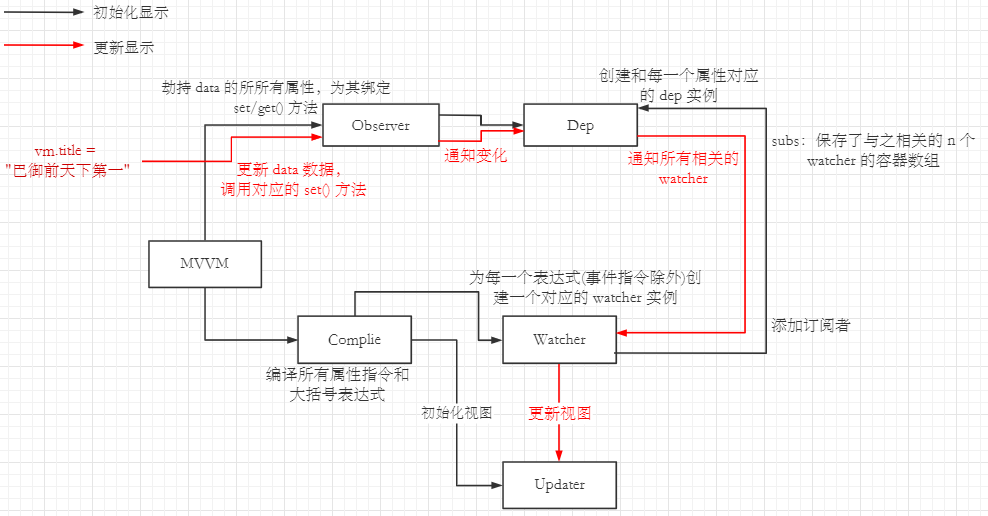

## 7.7 双向数据绑定

- 双向数据绑定是建立在单向数据绑定(model -> view)的基础之上的

- 基本实现流程

  1. 在解析 v-model 指令时，添加对应的 DOM 监听事件(如 input)
  2. 当触发对应的回调函数时，更新对应的 data 属性值
  3. 触发 set() 函数，通知 dep -> 通知所有相关的 watcher 更新视图

- ```javascript
  model: function(node, vm, exp) {
      // 用于初始化显示和创建对应的 watcher
      this.bind(node, vm, exp, 'model');
  
      // 保存当前对象(complie 实例)
      var me = this,
          // 获取当前表达式对应的值 
          val = this._getVMVal(vm, exp);
      // 为节点绑定 DOM 事件监听
      node.addEventListener('input', function(e) {
          // 获取新的值
          var newValue = e.target.value;
          // 如果值没有改变就返回
          if (val === newValue) {
              return;
          }
          // 更新 data 中对应表达式的值(会被劫持，触发 set() 函数)
          me._setVMVal(vm, exp, newValue);
          // 保存新的值
          val = newValue;
      });
  }
  ```

  

# 第八章 Vue 3

## 8.1 准备工作

### 1) 基本介绍

**相关信息**

- Vue3 支持大多数 Vue2x 的特性
- 更好的支持 **TypeScirpt**

**性能提升**

- 打包大小减少 &  初次渲染加快 & 更新渲染加快 & 内存减少

- 使用 **Proxy** 代替 **defineProperty** 实现数据响应式
- 重写 **虚拟DOM** 的实现和 **Tree-Shaking**

**新增特性**

- **Composition(组合) API**
- setup
  - ref 和 reactive
  - computed 和 watch
  - 新的生命周期函数
  - provide 和 inject
  - ...
- 新组件
  - Fragment - 文档碎片
  - Teleport - 瞬移组件的位置
  - Suspense - 异步加载组件的 loading 界面
- 其他 API 更新
  - 全局 API 的修改
  - 将原来的全局 API 转移到应用对象
  - 模板语法的变化

### 2) 创建 Vue3 项目

#### 使用 vue-cli 创建

1. 下载 vue-cli : **npm install -g @vue/cli**

   下载后可以使用 **vue -V** 查看版本，确保版本在 4.5.0 以上

2. 创建项目 **vue create 项目名**

3. 选择自定义配置

   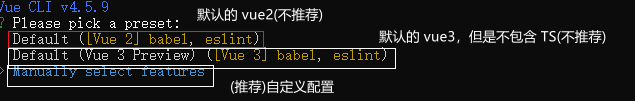

4. 注意：使用 **空格** 表示需要的选择的配置

   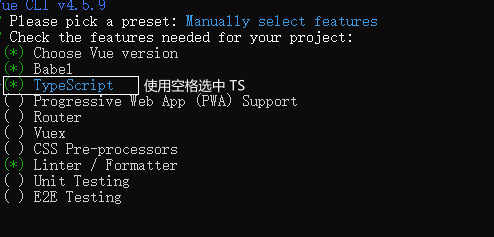

5. 选中 3.0

   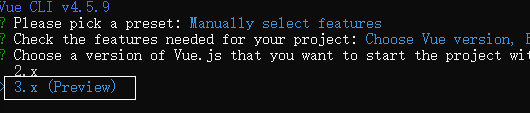

6. 接下载的直接 enter 即可

7. 安装之后，进入项目的根目录，使用 **npm run serve** 启动项目

   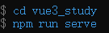

8. 游览器网址进行访问

   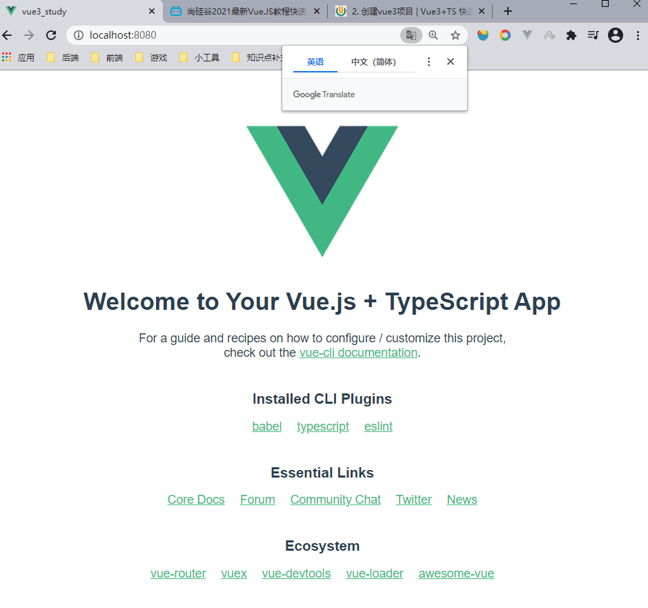

#### 使用 vite 创建

**说明**

- vite 是一个由原生 ESM 驱动的 Web 开发构建工具。在开发环境下基于原生 ES imports 开发
- 它主要做到了 **本地快速开发启动**，在开发生产下基于 Rollup 包
  - 快速的冷启动，不需要等待打包时间
  - 即时的热模块更新，替换性能和模块数量的解耦让更新飞起；
  - 真正的按需编译，不再等待整个应用编译完成，这是一个巨大的改变。

**构建项目**

- 使用 **npm init vite-app \<project-name>**  命令

- 进入到项目的根目录 **cd \<project-name>**

- 安装依赖 **npm install**

- 启动项目 **npm run dev**

- 游览器网址访问项目

  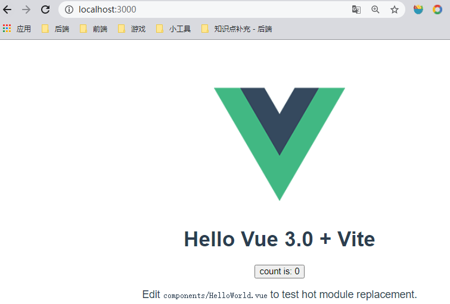

## 8.2 Composition API(常用部分)

> vue3 官方中文文档：[Vue3](https://v3.cn.vuejs.org/guide/migration/introduction.html)

### 1) setup

- 新的 `option`,所有的组件 API 函数都在此使用，只在初始化时执行一次
- 函数如果返回对象，对象中的方法、属性，模板中都可以直接使用

### 2) ref

- 作用：定义一个**基本类型**的响应式数据(数据变化，视图更新)

- 语法：`const xxx = ref(初始值)`

  - 创建一个包含响应式数据的 Ref(reference) 对象
  - 在 TS/JS 中如果需要操作对应的数据，需要通过 `.value` 属性进行访问
  - 在模板中直接访问对应的 Ref 对象即可
  - 记得先从 vue 中引入哟

- 代码(和 setup 一起使用)

  ```vue
  <template>
    <h2>setup 和 ref 的使用 - 实现点击按钮修改数据</h2>
    <p>{{count}}</p>
    <button @click="updater">增加 count</button>
  </template>
  
  
  <script lang="ts">
  import { defineComponent, ref } from 'vue';
  export default defineComponent({
    // 组件名
    name: 'App',
    // vue2 中的写法
    // data () {
    //   return {
    //     count: 0
    //   }
    // },
    // methods: {
    //   updater () {
    //     this.count++
    //   }
    // }
  
    // vue3 的写法
    // 定义 setup() 函数，该函数是组合 API 的入口函数
    setup() {
      // let count = 0; // 普通的变量
  
      /* 
      使用 ref() 函数设置响应式数据：
        - ref() 函数可以定义一个响应式数据，返回一个 Ref 的对象，该对象中有一个 value 属性
          TS/JS 可以通过该属性访问数据
        - 但 html 模板中可以不访问 value，直接访问 Ref 对象即可
        - 通常用来定义一个 "基本类型" 的响应式数据
      */
      const count = ref(0)
      function updater () {
        // 如果不设置响应式数据，那么及时数据修改了，视图也不会更新
        console.log(count);
        count.value++;
      }
      // 如果返回一个对象，那么模板中可以直接访问其中的属性/方法
      return {
        count,
        updater
      }
    }
  });
  </script>
  ```

### 3) reactive

- 作用：定义响应式的引用数据

- 语法：`const proxyObj = reactive(obj)` 接收一个引用类型的数据后返回一个响应式代理对象

  返回的对应是一个 `Proxy` 类型的代理对象，而被代理的对象就是传入的引用数据

- 特点

  1. 响应式的转换是 **深层的**，会影响对象内部所有嵌套的属性
  2. 无论是否有代理对象，直接操作源对象的属性，是不会触发视图更新的

- **内部是基于 ES6 的 Proxy 实现的，通过代理对象操作源对象内部数据都是响应式的**

- 代码

  ```vue
  <template>
  <h2>reactive 的基本使用 - 展示用户数据，点击按钮更新</h2>
  <p>{{user.name}}</p>
  <p>{{user.age}}</p>
  <p>{{user.identity}}</p>
  <button @click="updater">更新数据</button>
  </template>
  
  
  <script lang="ts">
      import { defineComponent, reactive } from 'vue';
      export default defineComponent({
          setup() {
              const obj = {
                  name: '诶嘿嘿',
                  age: 17,
                  identity: {
                      name: '阿梓喵',
                      id: '100 144 302 921',
                      servants: ['T','J','H']
                  }
              };
              /* 
              reactive() 函数的作用：定义响应式的引用数据
                - 通过 reactive() 函数传入一个引用对象，可以得到该引用对象的响应式代理对象
                - 响应式转换是 '深层的'，会影响原对象内部所有嵌套的属性
                - 返回的是一个 Proxy 的代理对象，而被代理的对象就是传入的对象
              */
              const user = reactive(obj);
  
              const updater = () => {
                  // obj.identity.name = "哇嘎嘎嘎" // 即使有代理对象，直接修改原对象也是不能更新界面的
                  user.name += '嘿嘿嘿'
                  user.age++;
                  // 通过代理对象以下标的形式操作深度的数组属性
        			user.identity.servants[0] = 'C'
                  console.log(user); // Proxy 
              };
  
              return {
                  user,
                  updater
              }
          }
      });
  </script>
  ```

### 4) ★ vue2 和 vue3 的响应式区别

#### vue2 的响应式

- 核心
  1. 对象：通过 `defineProperty` 对 data 中的所有属性进行**数据劫持**
  2. 数组：通过重写数组的一些更新元素的方法来完成对元素的劫持
- 问题
  1. 对象直接添加的新属性/删除已有属性，界面不会自动更新
  2. 直接通过下标操作元素/更新 length,界面不会自动更新

#### vue3 的响应式

- 核心

  - 通过 [Proxy](https://developer.mozilla.org/zh-CN/docs/Web/JavaScript/Reference/Global_Objects/Proxy) 代理，拦截对 data 任意属性的任意操作(13种：增删改查等)
  - 通过 [Reflect](https://developer.mozilla.org/zh-CN/docs/Web/JavaScript/Reference/Global_Objects/Reflect)(反射)：动态对被代理对象的相应属性进行特定的操作

- 简述

  - Proxy 用于创建一个对象(target)的代理对象,同时定义对应的处理器对象(handler)用来监视数据和其相关操作
- 处理器对象中包含指定的函数用来处理代理对象的操作(增删改查等)
  
  - 函数体中通过 `Reflect` 的静态方法访问/操作源对象中的属性
  
- 代码

  ```javascript
  // 定义一个源对象
  const obj = {
      name: '秋山澪',
      info: '贝斯手',
      wife: [
          {
              name: '田井中律',
              info: '鼓手'
          }
      ]
  };
  /* 
  定义一个代理对象: new Proxy(target,handler)
  	- target: 源对象
      - handler: 处理器对象，当进行某些操作时触发对应的处理器
  */
  const qysn = new Proxy(obj,{
      // 当需要读取目标对象中的某个属性时
      get(target,prop) {
          console.log('get方法执行了');
          // 通过 Reflect 对象操作 target 对象
          return Reflect.get(target,prop)
      },
      // 监视目标对象的属性(更新/修改)
      set(target,prop,val) {
          console.log('set方法执行了');
          return Reflect.set(target,prop,val)
      },
      // 删除目标对象的属性
      deleteProperty(target,prop) {
          console.log('deleteProperty方法执行了');
          return Reflect.deleteProperty(target,prop)
      } 
  })
  // 通过代理对象得到源对象的属性
  console.log(qysn.name); // 秋山澪
  // 通过代理对象修改源对象的属性
  qysn.wife.info = '厉害的鼓手'
  // 通过代理对象添加源对象的属性
  qysn.guitar = {
      name: '呆唯',
      info: '吉他手'
  }
  console.log(qysn);
  // 通过代理对象删除源对象的属性
  delete qysn.guitar.info
  console.log(qysn);
  ```

### 5) setup 细节

#### 拓展: VSC 用户片段

1. 选中用户片段

   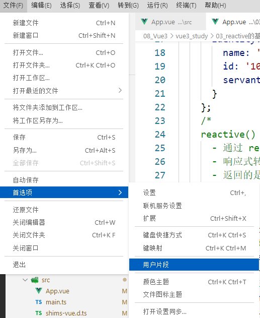

2. 选择

   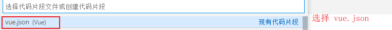

3. 添加以下片段

   ```json
   "Print to console": {
       "prefix": "vv3", // 快捷键
       "body": [ // 对应的代码块
           "<template>",
           "\t<div>",
           "\t<div>",
           "</template>\n",
   
           "<script lang=\"ts\">",
           "\timport { defineComponent } from 'vue'",
           "\texport default defineComponent({",
           "\t\tname: 'App'",
           "\t})",
           "</script>"
       ],
       "description": "Log output to console"
   }
   ```

4. 在 vue 中使用对应的快捷键即可

#### setup 执行的时机

- 在 `beforeCreate()` 生命钩子函数之前执行(且只执行一次)

- 对应的**组件实例还未被创建**(this is undefined),所以不能通过 this 去访问 data/computed/methods/props 等属性

- 其实所有的 `composition API` 相关的回调函数也都不可能访问 this

- 代码

  ```vue
  <template>
      <h2>Child</h2>
      <p>msg: {{msg}}</p>
  </template>
  
  <script lang="ts">
      import { defineComponent } from 'vue'
      export default defineComponent({
          name: 'Child',
          props: ['msg'],
          // beforeCrate() 生命钩子函数，该函数在创建组件实例前执行
          beforeCreate() {
              console.log('beforeCreate()方法调用了');
          },
          /* 
          setup 执行的时机：在 beforeCreate() 生命周期钩子函数之前执行了(且执行只执行一次)
              - 代表连对应的组件实例都未创建，this is undefined
              - 所以不可以通过 this 去访问 data/computed/props/methods 属性
          */
          setup() {
              console.log('setup()方法调用了',this); // undefined
              return {}
          }
      })
  </script>
  ```

#### setup 的返回值

- `setup()` 函数的返回值一般是一个对象，该对象中的属性和方法都可以直接在模板中使用

- 该对象中的属性会和 `data` 中的属性合并成为 vm 实例对象的属性

- 该对象中的方法会和 `methods` 中的函数合并成为 vm 实例对象的方法

  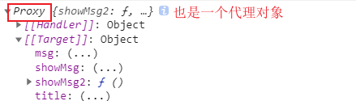

- 注意：

  1. 不推荐 data/methods 和 setup 混合使用; data/methods 中可以访问 setup 中的数据，但反之不行(setup的执行时机！)
  2. 如果出现键重复的情况(属性名/方法名重复), setup 的优先，且会导致 data/methods 中对应的属性/方法报错
  3. setup 不能是一个 async 修饰的函数，会导致返回的对象为 Promise 类型的，html 模板无法直接解析获取数据

- 代码

  ```vue
  <template>
      <h2>Child</h2>
      <p>msg: {{msg}}</p>
      <p>title: {{title}}</p>
  </template>
  
  <script lang="ts">
      import { defineComponent } from 'vue'
      export default defineComponent({
          name: 'Child',
          props: ['msg'],
          setup() {
              const showMsg = () => {
                  console.log('setup 中的 showMsg 函数执行了');
  
              }
              /* 
              setup 的返回值
                  一般 setup() 函数的返回值都是一个对象，html 模板可以直接访问其中的属性和方法
                      - 返回对象的属性会和 data 函数的返回值对象合并成为 vm 实例对象的属性
                      - 返回对象的方法会话 methods 中的函数合并成为 vm 实例对象的方法
                      - 注意：
                          1. 如果有重名的情况，setup() 优先(会导致 methods/data 报错：Duplicated key 'xxx')
                          2. 不建议混合使用 data/methods + setup
                          3. setup 不能是一个 async 修饰的函数，不然其的返回会变成 Promise 导致模板无法获取其中的数据
              */
              return {
                  showMsg
              }
          },
          data() {
              return {
                  title: 'OHHHH',
                  // msg: '诶嘿嘿' // Duplicated key 'msg'
              }
          },
          methods: {
              // 会导致键重复报错
              // showMsg() {
              //     console.log('methods 中的 showMsg() 函数执行了'); 
              // }
              showMsg2() {
                  console.log('methods 中的 showMsg2() 函数执行了');
              }
          },
          mounted() {
              console.log(this); //[[Target]].msg && [[Target]].title
              this.showMsg();
          }
      })
  </script>
  ```

#### setup 参数

- 可以接受 `(props,context)` 作为 setup 函数的参数(明确需要的属性后也可以使用解构赋值)

- props：包含了配置的 props 数组中从父组件中获取的数据的对象

- context：包含了 `attrs,props,emit,expose,slots` 属性的对象

  1. attrs：包含了子组件标签上的所有属性，通过 `.属性名` 即可访问(即使没有在 props 中配置)
  2. props：和第一个参数一样
  3. emit：负责调用分发事件的函数
  4. expose：不知道
  5. slots：插槽

- 代码

  ```vue
//---------- 父组件
  <template>
    ...
  
      <Child :msg="msg" msg2="巴御前！" @byq="byq"/>
  </template>
  
  <script lang="ts">
      import { defineComponent, ref } from 'vue'
      import Child from './components/Child.vue'
      export default defineComponent({
          name: 'App',
          setup() {
              const msg = ref('巴御前天下第一');
              const byq = (text: string) => {
                  console.log(text);
              }
              return {
                  msg,
                  byq
              }
          },
          // 注册子组件
          components: {
              Child
          }
      })
  </script>
  
  // 子组件
  <template>
      <h2>Child</h2>
      <p>msg: {{msg}}</p>
      <button @click="showByq">触发 byq 函数</button>
  </template>
  
  <script lang="ts">
      import { defineComponent } from 'vue'
      export default defineComponent({
          name: 'Child',
          props: ['msg'],
          setup(props,context) {
  
              /* 
              setup 的参数: props & context
                  - props: 包含了配置的 props 数组中从父组件中获取的数据的对象
                  - context：包含了 attrs、emit、expose、props、slots 的属性的对象
                      1. attrs: 获取当前子组件标签上的所有属性(包括 props 中没有配置获取的)
                      2. emit: 赋值调用分发事件的函数
                      3. expose: 不知道
                      4. props: 和第一个参数 props 相同
                      5. slots: 插槽
              */
              console.log("--------setup 参数");
              console.log(props,context);
              console.log(props.msg , context.attrs.msg2);	
              console.log(context.expose);
              
              const showByq = () => {
                  context.emit('byq','通过 emit 调用分发事件')
              }
  
              return {
                  showMsg,
                  showByq
              }
          },
          ...
      })
  </script>
  ```

### 6) ref 和 reactive 的细节问题

**说明**

1. Vue3 的 composition Api 中的两个响应式 Api(ref & reactive)

2. ref 用来数据基本数据类型，reactive 用来处理引用数据类型

3. 但 ref 也可以用来处理引用数据，

​       内部会自动使用 reactive 将 value 属性转换为对应的代理对象

4. ref 内部(基本数据类型)会给 value 属性添加对应的 get/set 进行数据劫持

5. reactive 内部使用 Proxy 实现对对象内部数据的劫持，并通过 Reflect 操作源对象内部数据

6. 即使 ref 内部的 value 是 Proxy ，在模板中也不需要通过 .value 访问，直接访问属性名即可

**代码**

```vue
<template>
<h2>ref 和 reactive 的细节问题</h2>
<p>m1: {{m1}}</p>
<p>m2: {{m2}}</p>
<p>m3: {{m3}}</p>
<p>m3.servant: {{m3.servant}}</p>
<button @click="updater">更新</button>
</template>

<script lang="ts">
    import { defineComponent, reactive, ref } from 'vue'
    export default defineComponent({
        name: 'App',
        setup() {
            /* 
              总结：
                1. Vue3 的 composition Api 中的两个响应式 Api(ref & reactive)
                2. ref 用来数据基本数据类型，reactive 用来处理引用数据类型
                3. 但 ref 也可以用来处理引用数据，
                   内部会自动使用 reactive 将 value 属性转换为对应的代理对象
                4. ref 内部(基本数据类型)会给 value 属性添加对应的 get/set 进行数据劫持
                5. reactive 内部使用 Proxy 实现对对象内部数据的劫持，并通过 Reflect 操作源对象内部数据
                6. 即使 ref 内部的 value 是 Proxy ，在模板中也不需要通过 .value 访问，直接访问属性名即可
              */
            // 通过 ref 创建基本数据类型的响应式数据
            const m1 = ref('巴御前！');
            // 通过 reactive 创建引用数据类型的响应式数据
            const m2 = reactive({
                name: 'test1',
                servant: {
                    info: 'saber'
                }
            });
            // 通过 ref 创建引用数据类型的响应式数据
            const m3 = ref({
                name: 'test2',
                servant: {
                    info: 'Archer'
                }
            });
            // 通过 reactive 无法创建基本数据类型的响应式数据
            // const m4 = reactive('test3') // rgument of type 'string' is not assignable to parameter of type 'object'

            const updater = () => {
                m1.value += "!!";
                m2.name = 'test2';
                // 通过 ref 创建的引用数据的响应式数据访问时仍要加上 .value 
                m3.value.servant.info = "Lancer";
                // 内部仍会进行深度监视
                console.log(m3.value,m3.value.servant); //Proxy{name: "test2",servant: {…}} Proxy{info: "Lancer"}
            }

            return {
                m1,
                m2,
                m3,
                updater
            }
        },
        mounted() {
            console.log(this);
        }
    })
</script>
```

### 7) 计算属性与监视

**计算属性: computed()**

- 函数可以传入一个参数，用于对应计算属性的 get() 方法
- 也可以传入一个对象，对象有对应计算属性的 get()/set() 方法
- 函数的返回结果就是对应的计算属性

**监视 watch()**

- 第一个参数为要监视的属性，可以使用 `[]` 监视多个属性
- 第二个参数为对应的回调函数
- 第三个参数为该监视的配置(默认执行，深度监视)
- 注意：**如果监视的属性不是响应式属性的话就要使用回调函数**

**监视 watchEffect()**

- 和 `watch()` 函数相识，都是监视一个/多个属性
- 默认会执行一次，用于收集回调函数依赖的响应式属性
- 当依赖的响应式属性发生改变时会调用对应的回调函数
- 无法通过参数获取旧值/新值

**代码**

```vue
<template>
<h2>计算属性和监视</h2>
<fieldset>
    <legend>用户输入</legend>
    姓氏：<input type="text" placeholder="请输入姓氏" v-model="user.firstName" /> <br />
    名字：<input type="text" placeholder="请输入名字" v-model="user.lastName" /> <br />
    </fieldset>
<fieldset>
    <legend>数据显示</legend>
    计算属性get:      <input type="text" placeholder="计算属性get" v-model="fullName" /> <br />
    计算属性get/set:  <input type="text" placeholder="计算属性get/set" v-model="fullName2"/> <br />
    监视watch显示:    <input type="text" placeholder="监视watch显示" v-model="fullName3"/> <br />
    </fieldset>
</template>

<script lang="ts">
    import { computed, defineComponent, reactive, ref, watch, watchEffect } from 'vue'
    export default defineComponent({
        name: 'App',
        setup() {
            const user = reactive({
                firstName: '巴',
                lastName: '御前'
            });
            /* 
      		computed() 函数的使用：返回一个计算属性
        		- 如果只传入一个函数，代表对应计算属性的 get() 方法
        		- 可以传入一个对象，对象中有对应的 get和set 方法
      		*/
            const fullName = computed(() => {
                return user.firstName + " " + user.lastName
            });
            const fullName2 = computed({
                get(){
                    return user.firstName + " " + user.lastName
                },
                set(val: string){
                    const names = val.split(" ");
                    user.firstName = names[0];
                    user.lastName = names[1];
                }
            });

            /* 
      		watch() 函数的使用：完成对指定数据的监视
        		- 第一个参数为要监视的属性，可以使用 [] 监视多个属性
        		- 第二个参数对应监视的回调函数
        		- 第三个为监视的配置(深度监视，初始化调用一次等)
        		注意：如果监视的不是响应式数据的话需要使用箭头函数
      		*/
            const fullName3 = ref('')
            watch(user,({firstName,lastName}) => {
                fullName3.value = firstName + " " + lastName
            },{
                deep: true, // 开启深度监视
                immediate: true // 初始化调用一次监视函数
            })
            // 监视非响应式数据时 - 需要使用回调函数
            watch([()=>user.firstName,()=>user.lastName],([firstName,lastName]) => {
                console.log(firstName,lastName);
            })

            /* 
      		watchEffect() 函数：完成对指定数据的监视
        		- 默认会执行一次，用于收集依赖
        		- 会自动收集依赖，只要回调函数中引用了响应式的属性
        		  当这些属性发生变动时，回调就会执行的
        		- 无法获取旧的值
      		*/
            watchEffect(()=>{
                console.log('watcgEffect');
                const names = fullName3.value.split(" ");
                user.firstName = names[0];
                user.lastName = names[1];
            })
            return {
                user,
                fullName,
                fullName2,
                fullName3
            }
        }
    })
</script>
```

### 8) 生命周期

**vue2 与 vue3 生命周期图示对比**

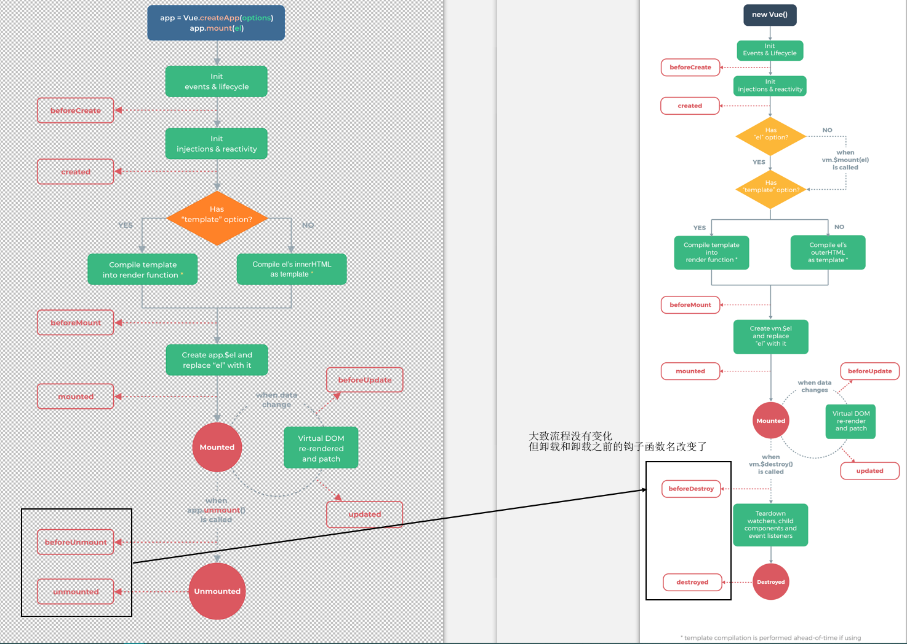

**vue2 的生命周期钩子函数对应的 vue3 组合式 API**

- ~~beforeCreate~~ ->  `setup()` 
- ~~created~~ ->  `setup()`
- `beforeMount` -> `onBeforeMount`
- `mounted` -> `onMounted`
- `beforeUpdate` -> `onBeforeUpdate`
- `updated` -> `onUpdated`
- `beforeUnmount` -> `onBeforeUnmount`
- `unmounted` -> `onUnmounted`
- `errorCaptured` -> `onErrorCaptured` (不常用)
- `renderTracked` -> `onRenderTracked` (测试 debug 用)
- `renderTriggered` -> `onRenderTriggered` (不常用)

**代码对比**

App.vue

```vue
<template>
    <h2>vue2 生命周期钩子函数和 vue3 的组合式 API 对比</h2>
    <button @click="isShow = !isShow">挂载/卸载</button>
    <hr />
    <Child v-if="isShow"/>
</template>

<script lang="ts">
    import { defineComponent, ref } from 'vue'
    import Child from './components/Child.vue'
    export default defineComponent({
        name: 'App',
        setup() {
            const isShow = ref(true);
            return {
                isShow
            }
        },
        components: {
            Child
        }
    })
</script>
```

Child.vue

```vue
<template>
    <h2>Child</h2>
    <span>{{msg}}</span> <br />
    <button @click="msg=!msg">修改数据</button>
</template>

<script lang="ts">
    import { defineComponent, onBeforeMount, onBeforeUnmount, onBeforeUpdate, onMounted, onUnmounted, onUpdated, ref } from 'vue'
    export default defineComponent({
        name: 'App',
        // 使用 vue2 中的生命钩子函数
        beforeCreate() {
            console.log('vue2.x 中的 beforeCreate() 函数执行了');
        },
        created() {
            console.log('vue2.x 中的 created() 函数执行了');
        },
        beforeMount() {
            console.log('vue2.x 中的 beforeMount() 函数执行了');
        },
        mounted() {
            console.log('vue2.x 中的 mounted() 函数执行了');
        },
        beforeUpdate() {
            console.log('vue2.x 中的 beforeUpdate() 函数执行了');
        },
        updated() {
            console.log('vue2.x 中的 updated() 函数执行了');
        },
        // 在 vue3 中使用了 beforeUnmount & unmount 代替了 beforeDestroy & destroy
        beforeUnmount() {
            console.log('vue2.x 中的 beforeUnmount() 函数执行了');
        },
        unmounted() {
            console.log('vue2.x 中的 unmounted() 函数执行了');
        },

        setup() {
            console.log('vue3.0 中的 setup() 函数执行了'); // 组合 API 中使用 setup 代替了 beforeCreate() & created()

            const msg = ref(true)
            // 通过 vue3 的 Composition API 访问生命周期的钩子函数
            onBeforeMount(() => {
                console.log('vue3.0 的 onBeforeMount() 函数执行了');
            });
            onMounted(() => {
                console.log('vue3.0 的 onMounted() 函数执行了');
            });
            onBeforeUpdate(() => {
                console.log('vue3.0 的 onBeforeUpdate() 函数执行了');
            });
            onUpdated(() => {
                console.log('vue3.0 的 onUpdated() 函数执行了');
            });
            onBeforeUnmount(() => {
                console.log('vue3.0 的 onBeforeUnmount() 函数执行了');
            });
            onUnmounted(() => {
                console.log('vue3.0 的 onUnmounted() 函数执行了');
            });
            /* 
            总结：可以发现 vue3.0 的组合 API 都会早于 vue2.x 中的生命钩子函数执行
            */
            return {
                msg
            }
        }
    })
</script>
```

**总结：**

1. vue3.0 中使用 `setup()` 替换了 beforeCreate() & created()
2. vue3.0 的组合式 API 都早于对应的 vue2.x 中的生命周期钩子函数

### 9) 自定义 hook 函数

- 使用 vue3 的组合 API 封装的可复用功能函数，就是将需要重复使用的功能函数抽离出来

- 自定义 hook 的作用类似于 vue2.x 中的 mixin 技术(混入)

- 代码1：收集用户鼠标点击的页面位置

  App.vue

  ```vue
  <template>
      <h2>自定义 hook 函数操作</h2>
      <p>
          <span>x: {{x}}</span>
          <span>y: {{y}}</span>
      </p>
  </template>
  
  <script lang="ts">
      import { defineComponent } from 'vue'
      import useMousePosition from './hooks/useMousePosition'
      export default defineComponent({
          name: 'App',
          setup() {
              const { x , y } = useMousePosition()
              return {
                  x,
                  y
              }
          }
      })
  </script>
  ```

  hooks/useMousePosition.ts(hook 功能函数的文件通常以 use 开头)

  ```typescript
  import { onMounted, onUnmounted, ref } from 'vue'
  export default function(){
      const x = ref(-1);
      const y = ref(-1);
  
      // 在挂载结束之后绑定 window 全局点击事件
      const clickHandler = (event: MouseEvent) => {
          x.value = event.pageX;
          y.value = event.pageY;
      };
      onMounted(() => {
          window.addEventListener('click',clickHandler)
      });
      // 在页面卸载之后删除 window 的 DOM 监听事件
      onUnmounted(() => {
          window.removeEventListener('click',clickHandler);
      })
      return {
          x,
          y
      }
  }
  ```

- 代码2:  发送 Ajax 请求获取数据

  利用 TS 泛型强化类型检查

  hooks/useRequest.ts

  ```typescript
  //2. 封装 Ajax 
  import axios from 'axios'
  import { ref } from 'vue'
  // 指定泛型 T 用来确定请求成功后的数据类型
  export default function<T>(url: string){
      // 定义是否在请求中的标识位变量
      const loading = ref(true);
      // 定义请求成功后获取的数据 - <T | null> 约束该变量的数据类型为 T | (字面量)null
      const data = ref<T | null>(null);
      // 定义请求失败是的提示信息
      const errorMsg = ref('');
  
      // 利用 axios 发送 Ajax 请求
      axios.get(url).then(
          (value) => {
              loading.value = false;
              data.value = value.data
          },
          (reason) => {
              loading.value = false;
              errorMsg.value = reason.message || '未知错误信息';
          }
      );
  
      // 返回请求的数据
      return {
          loading,
          data,
          errorMsg
      }
  }
  ```

  App.vue

  ```vue
  <template>
      <h2>自定义 hook 函数操作</h2>
      <h3>案例1：收集用户点击的页面坐标</h3>
      <p>
          <span>x: {{x}}</span>
          <span>y: {{y}}</span>
      </p>
      <hr />
      <h3>案例2: 发送 Ajax 请求获取数据</h3>
      <p v-if="loading">正在加载中</p>
  
      <!-- 如果存在 length 属性就代表是数组 -->
      <ul v-else-if="data.length" v-for="item in data" :key="item.id">
          <h5>获取数组数据</h5>
          <li>id: {{item.id}}</li>
          <li>name: {{item.name}}</li>
          <li>price: {{item.price}}</li>
      </ul>
  
      <!-- 如果不存在就代表是对象 -->
      <ul v-else-if="data">
          <h5>获取对象数据</h5>
          <li>id: {{data.id}}</li>
          <li>city: {{data.city}}</li>
          <li>distance: {{data.distance}}</li>
      </ul>
  
      <p v-else>出错了！errorMsg: {{errorMsg}}</p>
  </template>
  
  <script lang="ts">
      // 1. 定义数据类型
      interface Address {
          id: string;
          city: string;
          distance: number;
      }
      interface Phone {
          id: string;
          name: string;
          price: number;
      }
      import { defineComponent } from 'vue'
      import useMousePosition from './hooks/useMousePosition'
      // 引入对应的 hook 函数
      import useRequest from './hooks/useRequest'
      export default defineComponent({
          name: 'App',
          setup() {
              const { x , y } = useMousePosition()
              /* 
        3. 在页面挂载结束时候发送请求获取数据
          - 根据请求的数据类型不同，传入对应的类型即可
        */
              // const { loading, data, errorMsg } = useRequest<Address>('data/address.json');
              const { loading, data, errorMsg } = useRequest<Phone[]>('data/phone.json');
              return {
                  x,
                  y,
                  loading,
                  data,
                  errorMsg
              }
          }
      })
  </script>
  ```

  **记得在 public 文件夹下创建对应的 data 文件夹和文件**

### 10) toRefs

- 可以将一个响应式对象转换成普通对象，该对象的每一个属性都会是一个响应式数据 ref

- **应用**：在 hook 函数返回响应式对象(**reactive 对象取出的属性值都是非响应式的**)时，可以在不丢失响应式的情况下，使使用的组件可以直接进项分解使用

- 代码

  ```vue
  <template>
      <h2>toRefs() 函数的使用</h2>
      <p>name: {{name}}</p>
      <p>info: {{info}}</p>
      <hr />
      <p>name2: {{name2}}</p>
      <p>info2: {{info2}}</p>
  </template>
  
  <script lang="ts">
  
      import { defineComponent, onMounted, reactive, toRefs } from 'vue'
  
      /* 模拟一个 hook 函数 */
      function useHook(){
          const M3 = reactive({
              name2: '巴御前',
              info2: 'あいしている'
          });
          return {
              title: '模拟 hook 函数',
              // 如果希望返回的数据不丢失响应式，且容易被使用，建议使用 toRefs()
              ...toRefs(M3)
          }
      }
  
      export default defineComponent({
          name: 'App',
          setup() {
              const M = reactive({
                  name: '巴御前',
                  info: 'あいしている'
              });
  
              /* 
          使用 toRefs() 函数将一个响应式对象转换为普通对象，该普通对象的所有属性都是 ref 类型的响应式数据
            - 主要作用于：当 hook 函数返回响应式对象时，可以在不丢失响应式的情况下将返回的对象进行分解使用
            - TS 中访问普通对象的属性时，注意是 ref 类型的
        */
              const M2 = toRefs(M);
              onMounted(() => {
                  setInterval(() => {
                      M.name += "!!!";
                      console.log(M2); // {name: ObjectRefImpl, info: ObjectRefImpl} 
                      // 由于属性的类型都是 ref，TS 中访问时需要使用 .value 
                      M2.name.value += "!!!";
                  },1000)
              })
  
              // 使用模拟的 hook 函数,使用解构赋值获取需要的数据
              const { name2 , info2 } = useHook()
  
              return {
                  // M // 如果直接返回对象的话，模板中访问时还需要访问对象
                  // ...M // 如果使用 ES6 中的 ...扩展运算符，由于 reactive 返回的响应式代理对象中的属性并非响应式数据，会导致无法进行视图更新
                  ...M2,
                  name2,
                  info2
              }
          }
      })
  </script>
  ```

### 11) ref 获取元素

- ref() 函数还有一个作用，就是获取组件中的标签元素

- 代码

  ```vue
  <template>
      <h2>ref() 函数获取页面标签元素</h2>
      <!-- vue 的 html 模板中的标签可以通过定义 ref 属性快速定位 -->
      <input type="text" ref="inputRef">
  </template>
  
  <script lang="ts">
      import { defineComponent, onMounted, ref } from 'vue'
      export default defineComponent({
          name: 'App',
          setup() {
              // setup 在页面挂载前执行，所以默认值设置为 null
              const inputRef = ref<HTMLElement | null>(null); //  选择合适的数据类型能更助于开发效率
              // 挂载结束后执行相应操作
              onMounted(() => {
                  inputRef.value && inputRef.value.focus(); //自动获取焦点
              })
              return {
                  inputRef
              }
          }
      })
  </script>
  ```

## 8.3 Composition API(其他部分)

### 1) shallowReactive & shallowRef

- shallowReactive：只监视对象内最外层的数据，其他层的数据变化时不会触发视图更新

- shallowRef：只有对应的 `.value` 属性发生改变时才会触发视图更新，就算调用时传入对象，内部也不会使用 `reactive` 进行处理

- 使用

  1. 一般情况下 `ref`  和 `reactive` 使用即可
  2. 如果有一个对象数据，结构较深，且只更新最外层数据，建议使用 shallowReactive()
  3. 如果有一个数据，后面会产生新的数据来替换(也就是基本数据类型才建议使用)，建议使用 shallowRef()

- 代码

  ```vue
  <template>
      <h2>shallowReactive & shallowRef 的使用</h2>
      <p>{{m1}}</p>
      <p>{{m2}}</p>
      <p>{{m3}}</p>
      <p>{{m4}}</p>
      <button @click="updater">更新数据</button>
  </template>
  
  <script lang="ts">
      import { defineComponent, reactive, ref, shallowReactive, shallowRef } from 'vue'
      export default defineComponent({
          name: 'App',
          setup() {
  
              const m1 = ref({
                  name: 'ref',
                  isDeep: true,
                  info: {
                      A: '嵌套对象属性'
                  }
              });
  
              const m2 = reactive({
                  name: 'reactive',
                  isDeep: true,
                  info: {
                      A: '嵌套对象属性'
                  }
              });
  
              const m3 = shallowRef({
                  name: 'shallowRef',
                  isDeep: false,
                  info: {
                      A: '嵌套对象属性'
                  }
              });
  
              const m4 = shallowReactive({
                  name: 'shallowReactive',
                  isDeep: false,
                  info: {
                      A: '嵌套对象属性'
                  }
              });
  
              const updater = () => {
                  console.log(m1);
                  // m1.value.name += "===";
                  // m1.value.info.A += "===";
  
                  // console.log(m2);
                  // m2.name += "===";
                  // m2.info.A += "===";
  
                  console.log(m3); // 可以通过打印发现其 value 属性甚至不是一个 Proxy 对象
                  // m3.value.name += "===";
                  // m3.value.info.A += "===";
                  // 对于 shallowRef() 创建的响应式数据，无论修改哪一层数据都不会发生视图更新，只有修改 .value 属性值才可以
                  m3.value = {
                      name: 'shallowRef',
                      isDeep: false,
                      info: {
                          A: 'ともえちゃん可愛くなりたい'
                      }
                  }
  
  
                  // console.log(m4);
                  // m4.name += "===";
                  // 对于 shallowReactive() 创建的响应式数据，不会进行深度监视(更新第一层之外的数据不会更新视图)
                  // m4.info.A += "===";
              }
              return {
                  m1,
                  m2,
                  m3,
                  m4,
                  updater
              }
          }
      })
  </script>
  ```

### 2) readonly 和 shallowReadonly 的基本使用

- readonly()：获取对应的**深**只读代理对象

  - 接收一个 普通对象/响应式对象/ref 数据，进行只读代理转换
  - 只读代理是深层的，任意层的 prop 都仅仅是只读的

- shallowReadonly：获取对应的**浅**只读代理对象

  - 只有最外层进行只读代理，额外的 prop 可以进行修改(不执行嵌套数据的只读转换)

- 注意：

  1. 返回的对象是以传入对象为 target 的只读代理对象(可能会出现代理嵌套)
  2. 如果传入一个原始对象/数据，那么(shallowReadonly)修改时不会更新视图

- 应用场景：在某些特定情况下，不希望数据被修改，就可以生成对应的只读代理对象用来读取数据

- 代码

  ```vue
  <template>
      <h2>readonly和shallowReadonly的基本使用</h2>
      <p>state: {{state}}</p>
      <button @click="updater">更新数据</button>
  </template>
  
  <script lang="ts">
      import { defineComponent, reactive, readonly, shallowReadonly } from 'vue'
      export default defineComponent({
          name: 'App',
          setup() {
              const obj = {
                  name: '测试嘞',
                  childObj: {
                      name: '深度属性'
                  }
              };
              /* 
              使用 readonly() 函数获取对应的只读代理对象
                  - 接收一个 普通对象/响应式对象/ref 数据
                  - 只读代理是深层的，任意层的 prop 都仅仅是只读的
              */
              // const state = readonly(obj);
  
              /* 
              使用 shallowReadonly() 函数获取对应的只读代理对象
                  - 接收一个 普通对象/响应式对象/ref 数据
                  - 只有最外层进行只读代理，额外的 prop 可以进行修改(不执行嵌套数据的只读转换)
              */
              const state = shallowReadonly(reactive(obj));
  
              function updater(){
                  console.log(reactive(obj));
                  console.log(state);
  
                  // 报错：Cannot assign to 'name' because it is a read-only property.
                  // state.name += "====";
                  // 报错：Cannot assign to 'name' because it is a read-only property
                  // state.childObj.name += "====";
  
                  // 报错：Cannot assign to 'name' because it is a read-only property
                  // state.name += "====";
                  // 可以修改非最外层的数据
                  state.childObj.name += "====";
              }
  
              return{
                  state,
                  updater
              }
          }
      })
  </script>
  ```

### 3) toRaw 与 markRaw 的基本使用

- toRaw

  - 返回由 `reactive` / `readonly` 转换的代理对象的普通对象
  - 可以用于 **临时读取**，访问不会被代理/跟踪，写入时也不会触发更新
  - 得到的普通对象和转换前的是同一个对象

- markRaw

  - 标记一个对象，使其不会再被代理，返回对象本身
  - 应用场景
    1. 有些值不适合设置为响应式，例如第三方类实例或 Vue 组件对象
    2. 当渲染具有不可变数据源的大列表时，通过代理转换可以提高性能(?)

- 代码

  ```vue
  <template>
      <h2>toRaw和markRaw的基本使用</h2>
      <p>obj: {{obj}}</p>
      <button @click="toRawUpdate">使用 toRaw 修改数据</button> <br />
      <button @click="markRawUpdate">使用 markRaw 修改数据</button>
  </template>
  
  <script lang="ts">
      import { defineComponent, markRaw, reactive, toRaw } from 'vue'
      interface UserInfo{
          name: string;
          age: number;
          childObj?: {name: string};
      }
      export default defineComponent({
          name: 'App',
          setup() {
              const eido = {
                  name: 'toRaw和markRaw的基本使用',
                  age: 17
              };
              const obj = reactive<UserInfo>(eido)
              /* 
              通过 toRaw() 返回响应式对象对应的普通的对象
                  - 操作普通对象时，即使数据变化，界面也不会更新
                  - 转换后的对象和转换前的对象是同一个
              */
              function toRawUpdate() {
                  console.log('toRawUpdate()...');
                  const testObj = toRaw(obj);
                  // 操作普通对象时，即使数据变化，界面也不会更新
                  testObj.name += "====";
                  // 转换后的对象和转换前的对象是同一个
                  console.log(eido == testObj,testObj); // true {...}
              }
              /* 
              通过 markRaw() 可以标记一个原始对象，使其无法再成为响应式对象
                  - 返回对象本身
              */
              function markRawUpdate() {
                  console.log('markRawUpdate()...');
                  const childObj = {
                      name: '哔哩哔哩'
                  };
                  // 标记一个原始对象，使其无法成为响应式对象
                  // childObj = markRaw(childObj)
                  obj.childObj = childObj;
                  setInterval(() => {
                      if(obj.childObj){
                          console.log("-----");
                          obj.childObj.name += "====";
                          console.log(obj,obj.childObj);
                      }
                  },1000)
              }
              return {
                  obj,
                  toRawUpdate,
                  markRawUpdate
              }
          }
      })
  </script>
  ```

### 4) toRef 的基本使用

- 可以为指定的响应式对象上的某个属性创建一个 ref 对象

- 和 `ref` 的不同：二者内部操作的是同一份数据，更新时二者同步(ref 更新时互不影响)

- 应用场景：当要将某个 prop 传递给 hook 函数时，可以使用 toRef 将其转换为(提高可用性吧算是)

- 代码

  App.vue

  ```vue
  <template>
      <h2>toRef() 函数的使用</h2>
      <p>obj: {{obj}}</p>
      <p>name: {{name}}</p>
      <p>age: {{age}}</p>
      <button @click="updater">更新数据</button>
      <hr />
      <!-- 注意：组件间通信时使用 prop 的方式传递的是值而不是对象 -->
      <Child :name="name" />
  </template>
  
  <script lang="ts">
      import { defineComponent, ref, toRef } from 'vue'
      import Child from './components/Child.vue'
      export default defineComponent({
          name: 'App',
          setup() {
              const obj = {
                  name: '巴御前',
                  age: 16
              };
              /* 
              通过 toRef() 可以为指定的响应式对象上的某个属性创建一个 ref 对象
                  - 二者内部操作的是同一份数据，更新时二者同步
              */
              const name = toRef(obj,'name');
              /* 
              也可以使用 ref 为指定的响应式对象上的某个属性创建一个 ref 对象 
                  - 但这样二者内部操作的就不是同一份数据，更新时相互不影响
              */
              const age = ref(obj.age);
  
              // 更新函数
              const updater = () => {
                  name.value += "!!!";
                  age.value += 1;
              }
              return {
                  obj,
                  name,
                  age,
                  updater
              }
          },
          components: {
              Child
          }
      })
  </script>
  ```

  Child.vue

  ```vue
  <template>
      <h2>Child 子组件</h2>
      <p>name: {{name}}</p>
      <p>length: {{length}}</p>
  </template>
  
  <script lang="ts">
      import { defineComponent, toRef } from 'vue'
      // 导入一个 hook 函数
      import useRefValueLength from "../hooks/useRefValueLength"
      export default defineComponent({
          name: 'App',
          props: {
              name: {
                  type: String,
                  requried: true // 是否是必要的
              }
          },
          setup(props) {
              // 将 props 中的属性转换为 ref 类型后传递给 hook 函数得到需要的数据
              const length = useRefValueLength(toRef(props,'name'))
              return {
                  length
              }
          }
      })
  </script>
  ```

  useRefValueLength.ts

  ```typescript
  import { computed, Ref } from 'vue'
  // 得到一个 ref.value 的计算属性数据
  export default function(ref: Ref){
      return computed(() => {
          return ref.value.toString().length;
      })
  }
  ```

### 5) customRef 的基本使用

- 可以自定义一个 ref，并通过 `track` 和 `trigger()` 完成数据跟踪和视图更新

- 代码

  App.vue

  ```vue
  <template>
      <h2>customRef</h2>
      <input type="text" v-model="inputText">
      <p>inputText: {{inputText}}</p>
  </template>
  
  <script lang="ts">
      import { defineComponent } from 'vue'
      import useDebounceRef from "./hooks/useDebounceRef"
      export default defineComponent({
          name: 'App',
          setup() {
              const inputText = useDebounceRef<string>('',500);
              return {
                  inputText
              }
          }
      })
  </script>
  ```

  useDebounceRef.ts

  ```typescript
  import { customRef } from 'vue';
  /**
   * 返回一个防抖的 ref
   * @param value 数据
   * @param delay 防抖时间(毫秒),默认值 200
   */
  export default function<T>(value: T, delay = 200) {
      /* 
      使用 customRef() 自定义一个 ref
          - 该函数接收两个参数 tarck & trigger    
              track：用来跟踪收集依赖
              trigger：用来触发响应(更新视图)
      */
      return customRef<T>((tarck,trigger) => {
          let timeoutId: number    
          return {
              get(): T {
                  // 通知 Vue 进行依赖跟踪
                  tarck();
                  return value;
              },
              set(newValue: T): void {
                  // 先清除定时器
                  clearTimeout(timeoutId);
                  timeoutId = setTimeout(() => {
                      value = newValue;
                      // 通知 vue 更新视图
                      trigger();
                  },delay);    
              }
          }
      });
  }
  ```

#### 拓展：函数防抖和函数节流

### 6) provide 和 inject

- 提供跨多层级的组件间通信

- 代码

  App.vue

  ```vue
  <template>
      <h2>provide和inject的基本使用</h2>
      <p>当前颜色：{{color}}</p>
      <button @click="color='red'">红色</button>
      <button @click="color='blue'">蓝色</button>
      <button @click="color='yellow'">黄色</button>
      <hr>
      <Son />
  </template>
  
  <script lang="ts">
      import { defineComponent, provide, ref } from 'vue'
      import Son from './components/Son.vue'
      export default defineComponent({
          name: 'App',
          setup() {
              const color = ref('red');
              /* 
              通过 provide() 提供数据
                  - 第一个参数为数据标识
                  - 第二个参数为对应的数据
              */
              provide('color',color);
              return {
                  color
              }
          },
          components: {
              Son
          }
      })
  </script>
  ```

  Son.vue

  ```vue
  <template>
      <h2>Son 子级组件</h2>
      <hr />
      <GrandSon />
  </template>
  
  <script lang="ts">
      import { defineComponent } from 'vue'
      import GrandSon from './GrandSon.vue'
      export default defineComponent({
          name: 'Son',
          components: {
              GrandSon
          }
      })
  </script>
  ```

  GrandSon.vue

  ```vue
  <template>
      <h2 :style="{color}">GrandSon 孙级组件</h2>
  </template>
  
  <script lang="ts">
      import { defineComponent, inject } from 'vue'
      export default defineComponent({
          name: 'GrandSon',
          setup() {
              // 通过 inject() 传入对应的数据标识即可得到对应的数据
              const color = inject('color');
              return {
                  color
              }
          }
      })
  </script>
  ```

  PS: 传递的数据最好是响应式数据

### 7) 响应式数据的判断

1. `isRef` 判断一个值是否为 Ref 对象

2. `isReactive` 判断一个值是否是由 reative() 创建的响应式代理对象

3. `isReadonly` 判断一个值是否是由 readonly() 创建的只读代理对象

4. `isProxy` 判断一个值是否是由 reactive() / readonly() 创建的 Proxy 对象

5. 代码

   ```vue
   <template>
       <h2>响应式数据的判断</h2>
   </template>
   
   <script lang="ts">
       import { defineComponent, isProxy, isReactive, isReadonly, isRef, reactive, readonly, ref, shallowReactive, shallowReadonly, shallowRef } from 'vue'
       export default defineComponent({
           name: 'App',
           setup() {
               // 1. `isRef` 判断一个值是否为 Ref 对象
               console.log(isRef(ref({}))); // true
               console.log(isRef(shallowRef({}))); // true
   
               // 2. `isReactive` 判断一个值是否是由 reative() 创建的响应式代理对象
               console.log(isReactive(reactive({}))); // true
               console.log(isReactive(shallowReactive({}))); // true
   
               // 3. `isReadonly` 判断一个值是否是由 readonly() 创建的只读代理对象
               console.log(isReadonly(readonly({}))); // true
               console.log(isReadonly(shallowReadonly({}))); // true
   
               // 4. `isProxy` 判断一个值是否是由 reactive() / readonly() 创建的 Proxy 对象
               console.log(isProxy(reactive({}))); // true
               console.log(isProxy(readonly({}))); // true
               console.log(isProxy(shallowReadonly({}))); // true
               return {
                   
               }
           }
       })
   </script>
   ```

## 8.4 手写组合 API

> 只实现数据劫持，不实现视图更新

### 1) shallowReactive 和 reactive

```javascript
// shallowReactive & reactive
// reactive 响应式代理对象的处理器对象
const reactiveHandler = {
    get(target, prop){
        // 如果访问的属性时 _is_reactive 就返回 true
        if(prop === '_is_reactive') return true;
        console.log('get 进行读取数据劫持:' + prop);
        return Reflect.get(target,prop);
    },
    set(target, prop, value){
        console.log('set 进行修改/新增数据劫持:' + prop);
        return Reflect.set(target,prop,value);
    },
    deletProperty(target, prop){
        console.log('deleteProperty 进行删除数据劫持: ' + prop);
        return Reflect.deleteProperty(target,prop)
    }
}

// shallowReactive(浅数据劫持)
function shallowReactive(target) {
    // 1. 判断是否是对象
    if(target && typeof target === 'object'){
        // 2. 创建代理对象后返回
        return new Proxy(target,reactiveHandler)
    };
    return target;
}

function reactive(target) {
    // 1. 判断是否是对象
    if(target && typeof target === 'object'){
        // 2. 判断是否是数组
        if(Array.isArray(target)){
            // 2.1 如果是就遍历数组，进行深度监视
            target.forEach((item,index) => {
                target[index] = reactive(item); 
            });
        }else {
            // 3. 判断是否是对象
            // 3.1 如果是对象也要遍历，进行深度监视
            Object.keys(target).forEach(key => {
                target[key] = reactive(target[key]);
            });
        }
        // 4. 创建代理对象后返回
        return new Proxy(target,reactiveHandler)
    };
    return target;
}
```

注意：这里有个弊端，就是深劫持(reactive)是直接修改源对象上的属性的，而不是修改对应的代理对象的属性

但为了测试方便观察，就先这样写了

### 2) shallowRef 和 ref

```javascript
// shallowRef - 浅数据劫持
function shallowRef(target) {
    // 返回对象
    return {
        // 使用一个属性保存 target
        _value: target,
        // 设置 set & get 方法，使外部通过 .value 属性访问 target
        get value() {
            console.log('get 进行读取数据时的劫持');
            return this._value;
        },
        set value(value) {
            console.log('set 进行修改数据时的劫持');
            this._value = value;
        }
    }
}

// ref
function ref(target) {
    // 防止 target 中有嵌套对象，先将其进行 reactive 处理
    proxyTarget = reactive(target);
    return {
        // 设置一个表示 ref 类型的属性
        _is_ref: true,
        // 使用一个属性保存 target
        _value: proxyTarget,
        // 设置 set & get 方法，使外部通过 .value 属性访问 target
        get value() {
            console.log('get 进行读取数据时的劫持');
            return this._value;
        },
        set value(value) {
            console.log('set 进行修改数据时的劫持');
            this._value = value;
        }
    } 
}
```

注意：对应 ref(深度劫持) 内部需要使用 reactive 进行转换

### 3) shallowReadonly 和 readonly

```javascript
// readonly 只读代理对象的处理器对象
const readonlyHandler = {
    get(target, prop){
        // 如果访问的属性名是 _is_readonly 就返回 true
        if(prop === '_is_readonly') return true;
        console.log('get 进行读取数据时的劫持：' + prop);
        return Reflect.get(target,prop)
    },
    set(){
        console.warn('set 不能对只读属性进行修改！！');
        return false;
    },
    deleteProperty(){
        console.warn('delete 不能对只读属性进行修改！！');
        return false;
    }
}

// shallowReadonly(浅数据劫持)
function shallowReadonly(target) {
    // 1. 判断是否是对象/数组
    if (target && typeof target === 'target') {
        // 2. 进行只读代理
        return new Proxy(target,readonlyHandler)
    };
    // 不是直接返回
    return target;
}

// readonly
function readonly(target) {
    // 1. 判断是否是对象/数组
    if (target && typeof target === 'object') {
        // 2. 判断是否是数组
        if(Array.isArray(target)){
            // 2.1 如果是就遍历数组，进行深度监视
            target.forEach((item,index) => {
                target[index] = readonly(item); 
            });
        }else {
            // 3. 判断是否是对象
            // 3.1 如果是对象也要遍历，进行深度监视
            Object.keys(target).forEach(key => {
                target[key] = readonly(target[key])
            });
        }
        // 4. 进行只读代理
        return new Proxy(target,readonlyHandler)
    };
    // 不是则直接返回
    return target;
}
```

### 4) isRef、isReactive、isReadonly

```javascript
// 判断响应式数据
function isRef (obj) {
    return obj && obj._is_ref
};
function isReactive (obj) {
    return obj && obj._is_reactive
};
function isReadonly (obj) {
    return obj && obj._is_readonly
};
function isProxy (obj) {
    return isReactive(obj) || isReadonly(obj)
};
```

## 8.5 其他新组合和 API

### 1) 新组合

#### Fragment(片段)

- 在 Vue2 中，组件**必须**要有一个根标签
- 在 Vue3 中，组件可以没有根标签，内部会将多个标签包含在一个 **Fragment** 虚拟元素
- 好处：**减少标签层级、减小内存占用**

#### Teleport(瞬移)

- 提供了一种**干净**的方法，让指定的标签可以在父组件的指定标签下插入显示

- 代码

  App.vue

  ```vue
  <template>
      <h2>Teleport 组件的使用</h2>
      <hr />
      <Child />
  </template>
  
  <script lang="ts">
      import { defineComponent } from 'vue'
      import Child from './components/Child.vue'
      export default defineComponent({
          name: 'App',
          components: {
              Child
          }
      })
  </script>
  ```

  Child.vue

  ```vue
  <template>
      <h2>Child 子级组件</h2>
      <button @click="isShow=true">显示对话框</button>
      <hr />
      <!-- 使用 Teleport 标签: to 属性指定要插入的指定标签 -->
      <Teleport to='body' >
          <div v-if="isShow" class="model">
              <h4>This is 会话框 です</h4>
              <button @click="isShow=false">关闭会话框</button>
          </div>
      </Teleport>
  
  </template>
  
  <script lang="ts">
      import { defineComponent, ref } from 'vue'
      export default defineComponent({
          name: 'App',
          setup() {
              const isShow = ref(false)
              return {
                  isShow
              }
          }
      })
  </script>
  
  <style>
      /* 样式仍可以·定义在原组件中 */
      .model {
          color: red;
      }
  </style>
  ```

#### Suspense(不确定的)

- 允许我们的应用在等待异步组件时渲染一些后备内容，创建一个**平滑**的用户体验

- 注意：如果 `setup()` 返回的是一个 Promise 对象，则对应的组件就是**异步组件**，这时就可以使用 Suspense

- 代码

  App.vue

  ```vue
  <template>
      <h2>Suspense 标签的使用</h2>
      <hr />
      <!-- 对于异步组件，可以使用 Suspense 标签使其在加载的过程中显的更加平滑 -->
      <Suspense>
          <!-- 指定异步组件的插槽为 default -->
          <template #default>
              <Child />
          </template>
          <!-- 指定等待组件的插槽为 fallback -->
          <template v-slot:fallback>
              <h2>loading....</h2>
          </template>
      </Suspense>
  </template>
  
  <script lang="ts">
      import { defineComponent } from 'vue'
      import Child from './components/Child.vue'
      export default defineComponent({
          name: 'App',
          components: {
              Child
          }
      })
  </script>
  ```

  Child.vue

  ```vue
  <template>
      <h2>Child 异步组件</h2>
      <p>msg: {{msg}}</p>
  </template>
  
  <script lang="ts">
      import { defineComponent } from 'vue'
      import axios from 'axios'
      export default defineComponent({
          name: 'Child',
          /* 
          通过 async 修饰 setup 函数，使其执行异步任务
              - 使当前组件成功一个异步组件
          */
          async setup() {
              // 执行异步任务
              const result = await axios.get('/data/address.json');
              // 依然返回一个对象，该对象中的数据可以为对应的 promise 成功的值
              return {
                  msg: result.data
              }
          }
      })
  </script>
  ```

  注意看注释

### 2) 其他新的 API